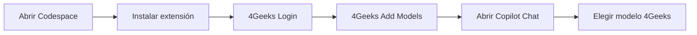

# Tus modelos de IA de la academia en Codespaces — 4Geeks Student + Copilot Chat

_These instructions are also available in [English](./4geeks-student-extension.md)._

Gracias a **4Geeks**, tienes **dos conjuntos de modelos** en **Copilot Chat** mientras trabajas en **GitHub Codespaces** — no necesitas una suscripción aparte de Copilot:

- **Modelos de Copilot** — versiones de GPT y Codex
- **Modelos de 4Geeks** — reconocidos modelos Open Source que te ayudan a **ahorrar tokens** sin renunciar al rendimiento

**Elige con criterio**: usa el conjunto que encaje con la tarea — trabajo exigente o de frontera con Copilot cuando lo necesites, y modelos 4Geeks en el día a día cuando estés programando o realizando tareas más automáticas o repetitivas, así extenderás tu presupuesto de tokens.

---

## Qué vas a lograr

Habilitar modelos de IA adicionales proporcionados por 4Geeks Academy siguiendo estos pasos:

- Instalar la extensión **4Geeks Student** dentro de tu Codespace.
- Iniciar sesión con tu cuenta 4Geeks (OAuth).
- Registrar los modelos LLM asignados a tu academia.
- Seleccionar un modelo 4Geeks en Copilot Chat y chatear con normalidad.



---

## Importante — repite esto en cada Codespace

En el curso trabajas sobre todo en **GitHub Codespaces**. Cada Codespace es un **entorno nuevo en la nube**:

- Las extensiones instaladas en un Codespace **no se transfieren** a otro.
- Cuando empiezas un **nuevo ejercicio**, abres un **nuevo repositorio** o creas un **Codespace nuevo**, debes repetir la configuración: **instalar → login → add models**.

Es normal. Reserva uno o dos minutos al inicio de cada sesión.

---

## Requisitos

- Un entorno **GitHub Codespaces** en ejecución (navegador o VS Code conectado al Codespace)
- [VS Code](https://code.visualstudio.com/) **1.109** o más reciente (incluido en el Codespace)
- Una **cuenta de estudiante 4Geeks** con derecho a **LLM budget**
- **Copilot Chat** disponible en el editor (no se requiere suscripción de pago a Copilot)

---

## Parte A — Configuración (cada sesión en Codespace)

Ejecuta estos pasos **cada vez** que abras un Codespace que aún no tenga la extensión configurada.

### 1. Instalar la extensión

1. Abre la vista **Extensions** (`Ctrl+Shift+X` / `Cmd+Shift+X`).
2. Busca **4Geeks Student** (publisher: **4Geeks**) e instálala.
3. **Recarga** la ventana cuando te lo pida.

### 2. Iniciar sesión

1. Haz clic en **Sign in** en la invitación de conexión, **o**
2. Abre la paleta de comandos (`Ctrl+Shift+P` / `Cmd+Shift+P`) y ejecuta `4Geeks: Login`.
3. Completa el flujo OAuth en el navegador con tu cuenta de **4geeks.com**.

### 3. Registrar tus modelos

1. Ejecuta `4Geeks: Add Models` desde la paleta de comandos.
2. La extensión provisiona y registra los modelos asignados a tu academia. Los nombres **no son fijos** — dependen de tu cohorte y de tu entitlement.

---

## Parte B — Usar modelos de la academia en Copilot Chat

1. Abre **Copilot Chat**.
2. Abre el **selector de modelos** en el panel del chat.
3. Selecciona un modelo **4Geeks Student**. Si no lo ves en la lista principal, revisa **Other Models**.
4. Empieza a chatear — el modelo seleccionado usa tu **LLM budget** de la academia.

### Elegir qué modelos usar

Tienes dos presupuestos en la misma interfaz de chat. Decide con intención:

- Prioriza los **modelos 4Geeks** para coding rutinario, exploración y práctica — buen rendimiento a menor coste de tokens.
- Usa **Copilot** (GPT / Codex) cuando la tarea pida esos modelos concretos o quieras una segunda opinión de ese stack.
- Si un cupo se agota, cambia al otro conjunto y sigue trabajando.

Si no hay ningún modelo 4Geeks disponible para tu cuenta, la extensión mostrará un error — contacta con tu academia si ocurre.

---

## Parte C — Conectar a tu VPS (opcional)

Si tu cuenta incluye **créditos VPS** y trabajas fuera de Codespaces:

1. Ejecuta `4Geeks: Connect to VPS` desde la paleta de comandos.
2. La extensión se conecta vía **Remote SSH** (instala **Remote - SSH** si hace falta).

Para cerrar sesión y eliminar los modelos registrados, ejecuta `4Geeks: Logout`.

---

## Cambiar a otro Codespace

Cuando pases a un nuevo ejercicio o repositorio:

1. Abre el nuevo Codespace.
2. Repite la **Parte A** (instalar → login → add models).
3. Vuelve a elegir tu modelo **4Geeks Student** en Copilot Chat.

---

## Referencia de comandos

| Comando                    | Descripción                                            |
| -------------------------- | ------------------------------------------------------ |
| **4Geeks: Login**          | Iniciar sesión con tu cuenta 4Geeks                    |
| **4Geeks: Add Models**     | Provisionar y registrar tus modelos LLM de la academia |
| **4Geeks: Connect to VPS** | Conectar a tu VPS de 4Geeks vía Remote SSH             |
| **4Geeks: Logout**         | Cerrar sesión y eliminar los modelos registrados       |

---

## Checklist

### Cada Codespace nuevo

```text
□ Abrir Codespace
□ Instalar 4Geeks Student (publisher: 4Geeks)
□ Recargar ventana
□ 4Geeks: Login (OAuth en 4geeks.com)
□ 4Geeks: Add Models
□ Copilot Chat → selector de modelos → modelo 4Geeks Student
```

---

## Resumen en una frase

En **cada Codespace nuevo**, instala **4Geeks Student**, ejecuta `4Geeks: Login` y `4Geeks: Add Models`, y elige un modelo **4Geeks Student** en **Copilot Chat** para usar tu presupuesto de IA de la academia.

---

## Enlaces útiles

- [VS Code Marketplace](https://marketplace.visualstudio.com/) — busca **4Geeks Student** (publisher: **4Geeks**)
- [4Geeks.com](https://4geeks.com/)
- [GitHub Codespaces — documentación](https://docs.github.com/en/codespaces)
