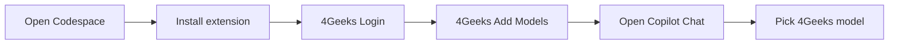

# Your academy AI models in Codespaces — 4Geeks Student + Copilot Chat

<!-- hide -->

_Estas instrucciones también están disponibles en [español](https://github.com/4GeeksAcademy/ai-engineering-syllabus/blob/main/content/lessons/4geeks-student-extension/4geeks-student-extension.es.md)._

<!-- endhide -->

Thanks to **4Geeks**, you get **two model sets** in **Copilot Chat** while working inside **GitHub Codespaces** — no separate Copilot subscription required:

- **Copilot models** — GPT and Codex versions
- **4Geeks models** — recognized open-source models that help you **save tokens** without giving up performance

**Choose smart**: pick the set that fits the task — frontier / heavy work with Copilot when you need it, and 4Geeks models for everyday coding or more automatic / repetitive tasks, so you stretch your token budget.

---

## What you will achieve

Enabling additional AI models provided by 4Geeks Academy doing the following steps:

- Install **4Geeks Student** extension inside your Codespace.
- Sign in with your 4Geeks account (OAuth).
- Register the LLM models assigned to your academy.
- Select a 4Geeks model in Copilot Chat and chat as usual.



---

## Important — repeat this on every Codespace

In the course you work mainly in **GitHub Codespaces**. Each Codespace is a **fresh cloud environment**:

- Extensions installed in one Codespace **do not carry over** to another.
- When you start a **new exercise**, open a **new repository**, or create a **new Codespace**, you must run the setup again: **install → login → add models**.

This is normal. Budget a minute or two at the start of each session.

---

## Requirements

- A running **GitHub Codespaces** environment (browser or VS Code connected to the Codespace)
- [VS Code](https://code.visualstudio.com/) **1.109** or newer (included in the Codespace)
- A **4Geeks student account** with **LLM budget** entitlement
- **Copilot Chat** available in the editor (no paid Copilot subscription required)

---

## Part A — Setup (each Codespace session)

Run these steps **every time** you open a Codespace that does not already have the extension configured.

### 1. Install the extension

1. Open the **Extensions** view (`Ctrl+Shift+X` / `Cmd+Shift+X`).
2. Search for **4Geeks Student** (publisher: **4Geeks**) and install it.
3. **Reload** the window when prompted.

### 2. Sign in

1. Click **Sign in** on the connect invite, **or**
2. Open the Command Palette (`Ctrl+Shift+P` / `Cmd+Shift+P`) and run `4Geeks: Login`.
3. Complete the OAuth flow in your browser with your **4geeks.com** account.

### 3. Register your models

1. Run `4Geeks: Add Models` from the Command Palette.
2. The extension provisions and registers the models assigned to your academy. Model names are **not fixed** — they depend on your cohort and entitlement.

---

## Part B — Use academy models in Copilot Chat

1. Open **Copilot Chat**.
2. Open the **model picker** in the chat panel.
3. Select a **4Geeks Student** model. If you do not see it in the main list, check **Other Models**.
4. Start chatting — the selected model uses your academy **LLM budget**.

### Choosing which models to use

You have two budgets in the same chat interface. Decide deliberately:

- Prefer **4Geeks models** for routine coding, exploration, and practice — strong performance at lower token cost.
- Reach for **Copilot** (GPT / Codex) when the task needs those specific models or you want a second opinion from that stack.
- If one allowance runs low, switch to the other set and keep working.

If no 4Geeks model is available for your account, the extension will show an error — contact your academy if that happens.

---

## Part C — Connect to your VPS (optional)

If your account includes **VPS credits** and you work outside Codespaces:

1. Run `4Geeks: Connect to VPS` from the Command Palette.
2. The extension connects via **Remote SSH** (it installs **Remote - SSH** if needed).

To sign out and remove registered models, run `4Geeks: Logout`.

---

## Switching to another Codespace

When you move to a new exercise or repository:

1. Open the new Codespace.
2. Repeat **Part A** (install → login → add models).
3. Pick your **4Geeks Student** model again in Copilot Chat.

---

## Commands reference

| Command                    | Description                                    |
| -------------------------- | ---------------------------------------------- |
| **4Geeks: Login**          | Sign in with your 4Geeks account               |
| **4Geeks: Add Models**     | Provision and register your academy LLM models |
| **4Geeks: Connect to VPS** | Connect to your 4Geeks VPS via Remote SSH      |
| **4Geeks: Logout**         | Sign out and remove registered models          |

---

## Checklist

### Each new Codespace

```text
□ Open Codespace
□ Install 4Geeks Student (publisher: 4Geeks)
□ Reload window
□ 4Geeks: Login (OAuth at 4geeks.com)
□ 4Geeks: Add Models
□ Copilot Chat → model picker → 4Geeks Student model
```

---

## One-sentence summary

On **every new Codespace**, install **4Geeks Student**, run `4Geeks: Login` and `4Geeks: Add Models`, then pick a **4Geeks Student** model in **Copilot Chat** to use your academy AI budget.

---

## Useful links

- [VS Code Marketplace](https://marketplace.visualstudio.com/) — search **4Geeks Student** (publisher: **4Geeks**)
- [4Geeks.com](https://4geeks.com/)
- [GitHub Codespaces documentation](https://docs.github.com/en/codespaces)
