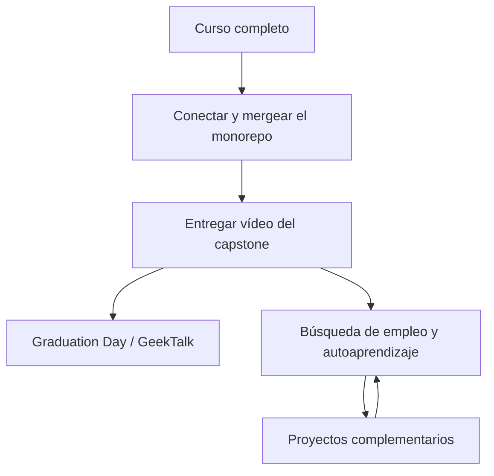

# 🎓 Has terminado el curso, ¿y ahora qué?

<!-- hide -->

_These instructions are also available in [English](https://github.com/4GeeksAcademy/ai-engineering-syllabus/blob/main/content/lessons/you-have-finished-your-course-now-what/you-have-finished-your-course-now-what.md)._

<!-- endhide -->

El último hito está mergeado. El agente hace streaming. El pipeline corre. Entonces el LMS sigue mostrando una assignment más y una carpeta de proyectos extra, y es fácil tratar ambas cosas como "más deberes" — o saltarte el vídeo y seguir codeando porque codear se siente más seguro que hablar a cámara.

Esta lección es el mapa después del temario obligatorio. Terminaste el programa de Ingeniería de IA con éxito. La graduación sigue necesitando dos handoffs obligatorios, en orden: primero, un **monorepo completamente conectado y navegable** — todos los PRs mergeados, cada módulo alcanzable desde la UI del backoffice; segundo, el **vídeo de pitch del capstone** de ese mismo sistema. Después, los proyectos complementarios siguen en el mismo monorepo de la empresa para que puedas seguir endureciendo la plataforma mientras buscas empleo, entrevistas y sigues aprendiendo por tu cuenta.

## Terminaste — este es el final del curso

La secuencia pedagógica termina aquí. Ya construiste un sistema de empresa a lo largo de los hitos: sitio público, backoffice, APIs, auth, agentes, RAG, flujos y funciones en tiempo real. Ese trabajo es el producto. El entregable obligatorio que queda no es otro ticket — es el **cierre** de ese producto.

Trata este momento como un cierre, no como un precipicio. El vídeo demuestra que sabes explicar el sistema. El contenido complementario es profundidad opcional en el mismo fork, no un segundo bootcamp que debas terminar antes de postularte.

## Primero: termina y conecta el monorepo

Haz esto **antes** de grabar nada. Un pitch de un sistema que no corre completo, o donde la mitad de los módulos son callejones sin salida, socava todo lo que dices en el vídeo.

Mergea todos los PRs de tus hitos en el mismo fork del [monorepo de la empresa](https://github.com/4GeeksAcademy/ai-engineering-company-project-monorepo). Nada obligatorio se queda en una rama abierta. Después conecta el backoffice de punta a punta: cada feature y módulo debe poder alcanzarse **navegando la UI** — haciendo clic en menús, enlaces y dashboards — no escribiendo una URL a mano porque nunca se conectó la entrada del menú. Si un revisor (o un entrevistador) no puede llegar desde la pantalla de inicio del backoffice hasta cualquiera de tus módulos sin adivinar la ruta, el monorepo no está terminado.

Concretamente, antes de tocar la cámara:

- Todos los PRs obligatorios mergeados en la rama principal de tu fork — nada de trabajo de hitos pendiente.
- Cada módulo del backoffice tiene un punto de entrada visible (ítem de menú, enlace, tarjeta en el dashboard) desde la navegación de la app.
- Puedes empezar en el home del backoffice y llegar a cada feature haciendo clic, en una sesión continua, sin escribir a mano ninguna URL.
- Auth, ruteo y layout compartido son consistentes entre módulos — ningún módulo se siente como una app separada y desconectada.

Esto es lo que hace que la plataforma sea demostrable y no solo "construible". También es lo que hace posible el vídeo del capstone: no puedes navegar en cámara un sistema que solo existe como ramas aisladas.

## Segundo: entrega el vídeo del capstone

Haz esto **después** de que el monorepo esté mergeado y sea navegable, y **antes** de empezar proyectos complementarios. Un hiring manager no puede ver una feature extra a medias. Sí puede ver un pitch de un sistema que ya corre — y que ahora navega de punta a punta.

Estructura, calidad, archivos, fecha y evaluación viven en el proyecto capstone — sigue ese README, no esta lección:

- **[Entrega final — Vídeo del proyecto final: pitch de IA en 5 minutos](https://github.com/4GeeksAcademy/ai-engineering-syllabus/tree/main/content/projects/ai-eng-capstone-project)**

**Graba el vídeo con tu propia voz — no uses un generador de voz con IA.** Esto no es una preferencia de estilo, es el punto central del entregable. Un hiring manager puede generar una voz con IA en treinta segundos; no puede fingir que tú estás detrás de tu propio sistema, explicándolo en vivo, manejando las partes que no salieron como esperabas. Tu voz, tu ritmo, tu presencia frente a cámara son la prueba de que entiendes lo que construiste y puedes defenderlo en una entrevista. Un vídeo con voz generada por IA se lee como "otro vídeo más con voz generada por IA" — indistinguible de cientos de otros, y señala que te saltaste la única parte de este entregable que realmente era sobre ti. Usa tu voz real, en cámara o narrando tu propia pantalla, aunque sea imperfecta. Imperfecto y real gana a pulido y sintético cada vez que un reclutador decide a quién llamar.

## Después: proyectos complementarios en la misma empresa

Cuando el capstone ya está entregado, puedes seguir construyendo. Los proyectos complementarios **no** forman parte de la secuencia obligatoria del temario. Extienden el **mismo fork** del [monorepo de la empresa](https://github.com/4GeeksAcademy/ai-engineering-company-project-monorepo): más robustez de acceso, seguridad y capacidades sobre la plataforma que ya tienes.

Úsalos durante la búsqueda de empleo, la preparación de entrevistas o el autoaprendizaje. Elige el track que encaje con el rol que buscas — no intentes "terminar los extras" antes de postularte.

Cada proyecto tiene su propio README, CONTEXT y evaluación. Abre la carpeta y sigue ese README. Trabaja en una rama de feature y abre un PR en **tu** fork, igual que en los hitos. Una implementación genérica que ignore la empresa no se aceptará — la misma regla que en los hitos.

El trabajo complementario sirve cuando lo puedes **contar como historia de ingeniería**, no como una lista de tickets extra. Deja el vídeo del capstone como enlace por defecto en las candidaturas. Señala un PR complementario cuando encaje con el rol. Una historia fuerte gana a cinco extras a medias.

Si esta semana tienes entrevistas, entrega el vídeo y para. Los proyectos complementarios esperan. Si hay un hueco entre candidaturas, elige **un** extra y termínalo hasta la lista de evaluación del README.

## Checklist de después del curso

Sigue este orden. Los ítems complementarios son opcionales; el vídeo no.

- [ ] Todos los PRs obligatorios mergeados en tu fork del monorepo — nada pendiente
- [ ] Backoffice completamente conectado — cada módulo alcanzable haciendo clic en la UI, sin URLs escritas a mano
- [ ] README del capstone leído entero — entrega exactamente lo que pide ese proyecto
- [ ] Vídeo grabado con tu propia voz — sin generador de voz con IA
- [ ] Capstone entregado en el LMS antes de empezar trabajo complementario
- [ ] Después de entregar: un proyecto complementario elegido (o ninguno) — no varios empezados en paralelo
- [ ] El trabajo complementario se queda en el fork de la empresa, en una rama de feature con nombre, alineado con el CONTEXT de ese proyecto

## Conclusión

Llegaste al final del programa de Ingeniería de IA. No es poco: construiste un sistema de empresa de verdad, y estás a punto de hacer el handoff. **4Geeks está orgulloso de ti — y tú deberías estarlo de ti mism@.**

El cierre obligatorio es un monorepo mergeado y navegable, y después el vídeo del capstone de ese mismo sistema. Los proyectos complementarios son cómo sigues mejorando esa misma plataforma mientras buscas trabajo y sigues aprendiendo. Conectar primero. Vídeo segundo. Profundidad extra después. Una historia terminada cada vez.
