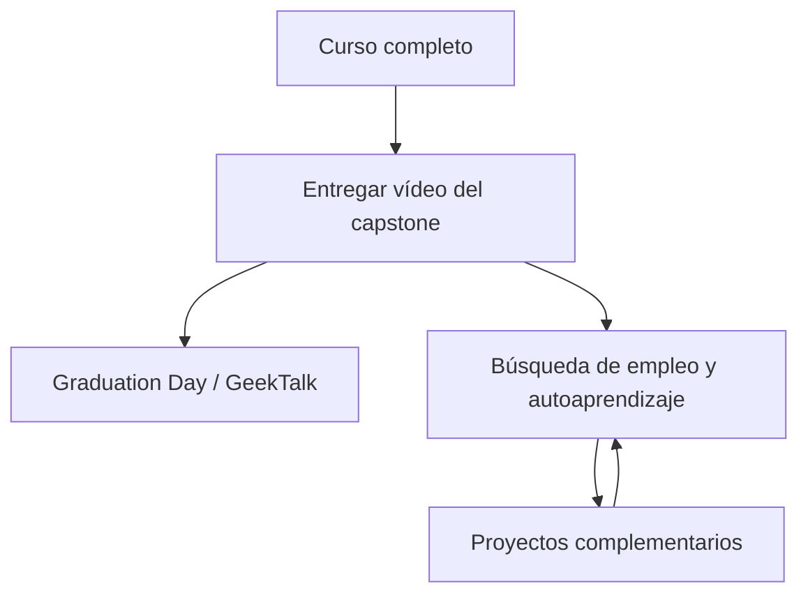

# 🎓 Has terminado el curso, ¿y ahora qué?

<!-- hide -->

_These instructions are also available in [English](https://github.com/4GeeksAcademy/ai-engineering-syllabus/blob/main/content/lessons/you-have-finished-your-course-now-what/you-have-finished-your-course-now-what.md)._

<!-- endhide -->

El último hito está mergeado. El agente hace streaming. El pipeline corre. Entonces el LMS sigue mostrando una assignment más y una carpeta de proyectos extra, y es fácil tratar ambas cosas como "más deberes" — o saltarte el vídeo y seguir codeando porque codear se siente más seguro que hablar a cámara.

Esta lección es el mapa después del temario obligatorio. Terminaste el programa de Ingeniería de IA con éxito. La graduación sigue necesitando un único handoff obligatorio: el **vídeo de pitch del capstone**. Después, los proyectos complementarios siguen en el mismo monorepo de la empresa para que puedas seguir endureciendo la plataforma mientras buscas empleo, entrevistas y sigues aprendiendo por tu cuenta.

## Terminaste — este es el final del curso

La secuencia pedagógica termina aquí. Ya construiste un sistema de empresa a lo largo de los hitos: sitio público, backoffice, APIs, auth, agentes, RAG, flujos y funciones en tiempo real. Ese trabajo es el producto. El entregable obligatorio que queda no es otro ticket — es el **cierre** de ese producto.

Trata este momento como un cierre, no como un precipicio. El vídeo demuestra que sabes explicar el sistema. El contenido complementario es profundidad opcional en el mismo fork, no un segundo bootcamp que debas terminar antes de postularte.

## Primero: entrega el vídeo del capstone

Haz esto **antes** de empezar proyectos complementarios. Un hiring manager no puede ver una feature extra a medias. Sí puede ver un pitch de un sistema que ya corre.

Estructura, calidad, archivos, fecha y evaluación viven en el proyecto capstone — sigue ese README, no esta lección:

- **[Entrega final — Vídeo del proyecto final: pitch de IA en 5 minutos](https://github.com/4GeeksAcademy/ai-engineering-syllabus/tree/main/content/projects/ai-eng-capstone-project)**

## Después: proyectos complementarios en la misma empresa

Cuando el capstone ya está entregado, puedes seguir construyendo. Los proyectos complementarios **no** forman parte de la secuencia obligatoria del temario. Extienden el **mismo fork** del [monorepo de la empresa](https://github.com/4GeeksAcademy/ai-engineering-company-project-monorepo): más robustez de acceso, seguridad y capacidades sobre la plataforma que ya tienes.

Úsalos durante la búsqueda de empleo, la preparación de entrevistas o el autoaprendizaje. Elige el track que encaje con el rol que buscas — no intentes "terminar los extras" antes de postularte.

Cada proyecto tiene su propio README, CONTEXT y evaluación. Abre la carpeta y sigue ese README. Trabaja en una rama de feature y abre un PR en **tu** fork, igual que en los hitos. Una implementación genérica que ignore la empresa no se aceptará — la misma regla que en los hitos.

El trabajo complementario sirve cuando lo puedes **contar como historia de ingeniería**, no como una lista de tickets extra. Deja el vídeo del capstone como enlace por defecto en las candidaturas. Señala un PR complementario cuando encaje con el rol. Una historia fuerte gana a cinco extras a medias.

Si esta semana tienes entrevistas, entrega el vídeo y para. Los proyectos complementarios esperan. Si hay un hueco entre candidaturas, elige **un** extra y termínalo hasta la lista de evaluación del README.

## Checklist de después del curso

Sigue este orden. Los ítems complementarios son opcionales; el vídeo no.

- [ ] README del capstone leído entero — entrega exactamente lo que pide ese proyecto
- [ ] Capstone entregado en el LMS antes de empezar trabajo complementario
- [ ] Después de entregar: un proyecto complementario elegido (o ninguno) — no varios empezados en paralelo
- [ ] El trabajo complementario se queda en el fork de la empresa, en una rama de feature con nombre, alineado con el CONTEXT de ese proyecto

## Conclusión

Llegaste al final del programa de Ingeniería de IA. No es poco: construiste un sistema de empresa de verdad, y estás a punto de hacer el handoff. **4Geeks está orgulloso de ti — y tú deberías estarlo de ti mism@.**

El cierre obligatorio es el vídeo del capstone del sistema que ya construiste. Los proyectos complementarios son cómo sigues mejorando esa misma plataforma mientras buscas trabajo y sigues aprendiendo. Vídeo primero. Profundidad extra después. Una historia terminada cada vez.
