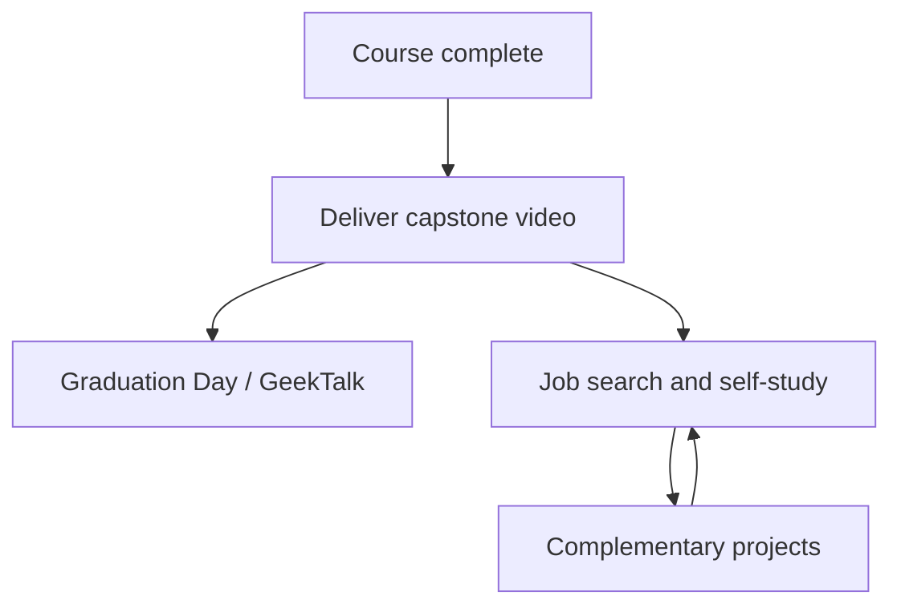

# 🎓 You have finished your course, now what

<!-- hide -->

_Estas instrucciones también están disponibles en [español](https://github.com/4GeeksAcademy/ai-engineering-syllabus/blob/main/content/lessons/you-have-finished-your-course-now-what/you-have-finished-your-course-now-what.es.md)._

<!-- endhide -->

The last milestone is merged. The agent streams. The pipeline runs. Then the LMS still shows one more assignment and a folder of extra projects, and it is easy to treat both as "more homework" — or to skip the video and keep coding because coding feels safer than talking on camera.

This lesson is the map after the required syllabus. You finished the AI Engineering program successfully. Graduation still needs one required handoff: the **capstone pitch video**. After that, complementary projects stay on the same company monorepo so you can keep hardening the platform while you job-hunt, interview, and keep learning on your own.

## You finished — this is the end of the course

The pedagogical sequence ends here. You already built a company system across the milestones: public site, backoffice, APIs, auth, agents, RAG, workflows, and real-time features. That work is the product. The remaining required deliverable is not another ticket — it is a **handoff** of that product.

Treat this moment as a close, not as a cliff. The video proves you can explain the system. Complementary content is optional depth on the same fork, not a second bootcamp you must finish before you apply for jobs.

## First: deliver the capstone video

Do this **before** you start complementary projects. A hiring manager cannot watch an unfinished extra feature. They can watch a pitch of a system that already runs.

Structure, quality, files, deadline, and evaluation live in the capstone project — follow that README, not this lesson:

- **[Capstone — Final Project Video: 5-Minute AI Pitch](https://github.com/4GeeksAcademy/ai-engineering-syllabus/tree/main/content/projects/ai-eng-capstone-project)**

## Then: complementary projects on the same company

After the capstone is in, you can keep building. Complementary projects are **not** part of the required syllabus sequence. They extend the **same fork** of the [company monorepo](https://github.com/4GeeksAcademy/ai-engineering-company-project-monorepo): more robust access, security, and capabilities on the platform you already own.

Use them during job search, interview prep, or self-study. Pick the track that matches the role you want — do not try to "finish the extras" before you apply.

Each project has its own README, CONTEXT, and evaluation. Open the folder and follow that README. Work on a feature branch and open a PR on **your** fork, same as the milestones. A generic implementation that ignores the company will not be accepted — same rule as the milestones.

Complementary work is useful when you can **tell it as an engineering story**, not as a list of extra tickets. Keep the capstone video as the default link in applications. Point to a complementary PR when it matches the role. One strong story beats five unfinished extras.

If you are in interviews this week, ship the video and stop. Complementary projects wait. If you have a gap between applications, pick **one** extra and finish it to the README's evaluation list.

## After-course checklist

Run this in order. Complementary items are optional; the video is not.

- [ ] Capstone README read in full — deliver exactly what that project asks
- [ ] Capstone submitted in the LMS before starting complementary work
- [ ] After delivery: one complementary project chosen (or none) — not several started in parallel
- [ ] Complementary work stays on the company fork, on a named feature branch, aligned with that project's CONTEXT

## Conclusion

You made it to the end of the AI Engineering program. That is not a small thing: you built a real company system, and you are about to hand it off. **4Geeks is proud of you — and you should be proud of yourself.**

The required close is the capstone video of the system you already built. Complementary projects are how you keep improving that same platform while you search for work and keep learning. Video first. Extra depth second. One finished story at a time.
