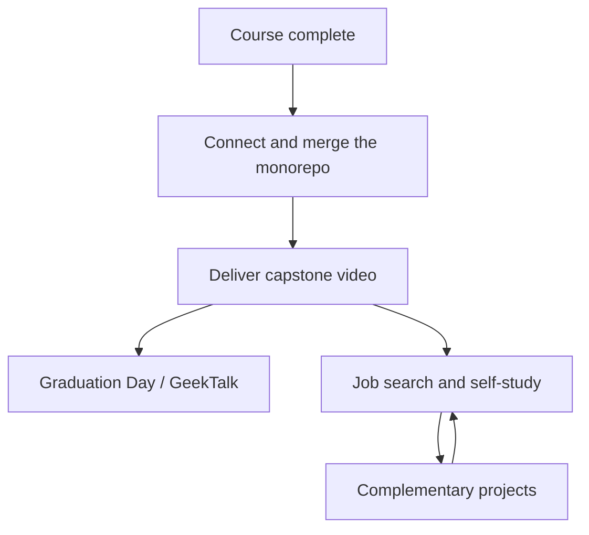

# 🎓 You have finished your course, now what

<!-- hide -->

_Estas instrucciones también están disponibles en [español](https://github.com/4GeeksAcademy/ai-engineering-syllabus/blob/main/content/lessons/you-have-finished-your-course-now-what/you-have-finished-your-course-now-what.es.md)._

<!-- endhide -->

The last milestone is merged. The agent streams. The pipeline runs. Then the LMS still shows one more assignment and a folder of extra projects, and it is easy to treat both as "more homework" — or to skip the video and keep coding because coding feels safer than talking on camera.

This lesson is the map after the required syllabus. You finished the AI Engineering program successfully. Graduation still needs two required handoffs, in order: first, a **fully connected and navigable monorepo** — all PRs merged, every module reachable from the backoffice UI; second, the **capstone pitch video** of that same system. After that, complementary projects stay on the same company monorepo so you can keep hardening the platform while you job-hunt, interview, and keep learning on your own.

## You finished — this is the end of the course

The pedagogical sequence ends here. You already built a company system across the milestones: public site, backoffice, APIs, auth, agents, RAG, workflows, and real-time features. That work is the product. The remaining required deliverable is not another ticket — it is a **handoff** of that product.

Treat this moment as a close, not as a cliff. The video proves you can explain the system. Complementary content is optional depth on the same fork, not a second bootcamp you must finish before you apply for jobs.

## First: finish and connect the monorepo

Do this **before** you record anything. A pitch video of a system that does not fully run, or where half the modules are dead ends, undercuts everything you say in it.

Merge every PR from your milestones into the same fork of the [company monorepo](https://github.com/4GeeksAcademy/ai-engineering-company-project-monorepo). Nothing required stays on an open branch. Then connect the backoffice end to end: every feature and module must be reachable by **navigating the UI** — clicking through menus, links, and dashboards — not by typing a URL by hand because the menu entry was never wired up. If a reviewer (or an interviewer) cannot get from the backoffice home screen to any of your modules without guessing a route, the monorepo is not done.

Concretely, before you touch the camera:

- All required PRs merged into your fork's main branch — no pending milestone work left open.
- Every backoffice module has a visible entry point (menu item, link, dashboard card) from the app's navigation.
- You can start at the backoffice home and reach each feature by clicking, in one continuous session, without hand-typing a single URL.
- Auth, routing, and shared layout are consistent across modules — no module feels like a separate, disconnected app.

This is what makes the platform demoable instead of just "buildable." It is also what makes the capstone video possible: you cannot navigate a system on camera that only exists as isolated branches.

## Second: deliver the capstone video

Do this **after** the monorepo is merged and navigable, and **before** you start complementary projects. A hiring manager cannot watch an unfinished extra feature. They can watch a pitch of a system that already runs — and now navigates end to end.

Structure, quality, files, deadline, and evaluation live in the capstone project — follow that README, not this lesson:

- **[Capstone — Final Project Video: 5-Minute AI Pitch](https://github.com/4GeeksAcademy/ai-engineering-syllabus/tree/main/content/projects/ai-eng-capstone-project)**

**Record the video with your own voice — do not use an AI voice generator.** This is not a style preference, it is the point of the deliverable. A hiring manager can generate an AI voiceover in thirty seconds; they cannot fake you standing behind your own system, explaining it live, handling the parts that did not go as planned. Your voice, your pacing, your on-camera presence are proof you understand what you built and can defend it in an interview. A video with an AI-generated voice reads as "another video with AI generated voice" — indistinguishable from hundreds of others, and it signals you skipped the one part of this deliverable that was actually about you. Use your real voice, on camera or narrating your own screen, even if it is imperfect. Imperfect and real beats polished and synthetic every time a recruiter is deciding who to call.

## Then: complementary projects on the same company

After the capstone is in, you can keep building. Complementary projects are **not** part of the required syllabus sequence. They extend the **same fork** of the [company monorepo](https://github.com/4GeeksAcademy/ai-engineering-company-project-monorepo): more robust access, security, and capabilities on the platform you already own.

Use them during job search, interview prep, or self-study. Pick the track that matches the role you want — do not try to "finish the extras" before you apply.

Each project has its own README, CONTEXT, and evaluation. Open the folder and follow that README. Work on a feature branch and open a PR on **your** fork, same as the milestones. A generic implementation that ignores the company will not be accepted — same rule as the milestones.

Complementary work is useful when you can **tell it as an engineering story**, not as a list of extra tickets. Keep the capstone video as the default link in applications. Point to a complementary PR when it matches the role. One strong story beats five unfinished extras.

If you are in interviews this week, ship the video and stop. Complementary projects wait. If you have a gap between applications, pick **one** extra and finish it to the README's evaluation list.

## After-course checklist

Run this in order. Complementary items are optional; the video is not.

- [ ] All required PRs merged into your monorepo fork — nothing pending
- [ ] Backoffice fully connected — every module reachable by clicking the UI, no hand-typed URLs
- [ ] Capstone README read in full — deliver exactly what that project asks
- [ ] Video recorded with your own voice — no AI voice generator
- [ ] Capstone submitted in the LMS before starting complementary work
- [ ] After delivery: one complementary project chosen (or none) — not several started in parallel
- [ ] Complementary work stays on the company fork, on a named feature branch, aligned with that project's CONTEXT

## Conclusion

You made it to the end of the AI Engineering program. That is not a small thing: you built a real company system, and you are about to hand it off. **4Geeks is proud of you — and you should be proud of yourself.**

The required close is a monorepo that is merged and navigable, then the capstone video of that same system. Complementary projects are how you keep improving that same platform while you search for work and keep learning. Connect first. Video second. Extra depth after that. One finished story at a time.
