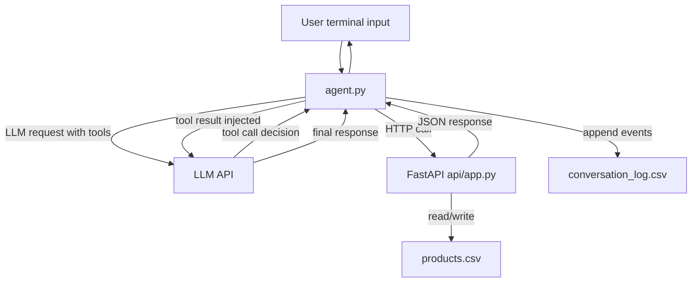

# AI basic Inventory Agent Loop - Reference solution

This reference defines what a correct delivery should include for the **AI Inventory Agent** project.

The expected solution is a two-component system:

1. A FastAPI inventory service with CSV persistence.
2. A Python AI agent that uses the API as tools in a manual tool-calling loop.

## Expected deliverables

A valid solution should include at least:

- `api/app.py` with all required endpoints.
- `agent.py` implementing a complete Observe -> Think -> Act -> Update -> Repeat loop.
- `products.csv` created/used by the API for inventory persistence.
- `conversation_log.csv` created and appended by the agent during interactions.
- A root `README` section that explains how to start API and agent in two terminals.

## Solution architecture

The solution must implement this interaction pattern:

### Component responsibilities

- **FastAPI service**: source of truth for product records and stock updates.
- **Agent loop**: orchestrates user intent resolution, tool execution, and final response composition.
- **CSV storage**:
  - `products.csv`: business state persistence across API restarts.
  - `conversation_log.csv`: append-only trace of user messages, tool calls, and agent responses.

## API behavior requirements

The reference API must satisfy:

- `GET /inventory` returns current product list.
- `POST /inventory` creates a product with required fields (`name`, `quantity`, `unit`).
- `PATCH /inventory/{product_id}` applies signed stock delta and validates existence.
- `GET /inventory/alerts` returns products below threshold (default threshold: 10).

Errors must return descriptive messages with appropriate HTTP codes.

## Agent behavior requirements

The reference agent must:

- Define tool schemas that map to each API endpoint.
- Keep full session message history in memory.
- Execute tool calls selected by the LLM.
- Re-inject tool outputs into conversation context before next iteration.
- Stop cleanly when the LLM returns a final answer with no pending tool calls.
- Offer a terminal loop for user input and responses.

## Conversation log contract

Each event written to `conversation_log.csv` must include:

- `actor` (`user`, `agent`, or `tool`)
- `message`
- `tool_call` (empty when not applicable)
- `timestamp` (ISO 8601)

The file must be append-only across sessions.

## Indicative examples of correct behavior

### Example 1 - Inbound stock update

User message:

`we just received 30 units of oat milk`

Expected behavior:

1. Agent selects the stock update tool.
2. Agent calls `PATCH /inventory/{id}` with `delta: 30`.
3. API updates quantity and returns updated product.
4. Agent replies confirming update.
5. Log includes user event, tool call event, tool result event, and final agent response event.

### Example 2 - Low stock query after sales update

User sequence:

1. `we sold 12 bags of arabica today`
2. `what products are running low?`

Expected behavior:

1. First turn triggers stock decrement.
2. Second turn triggers alert endpoint.
3. Final answer lists only products below threshold and includes quantities.

## Reviewer checklist

- [ ] API exposes all four required endpoints and returns valid responses.
- [ ] API persists data in `products.csv`.
- [ ] Agent loop executes multiple tool calls when required.
- [ ] Tool definitions are explicit and typed.
- [ ] Agent reuses conversation history inside a session.
- [ ] `conversation_log.csv` records all events using required fields.
- [ ] Log behavior is append-only across multiple executions.
- [ ] No agent framework is used; loop is manually implemented.
