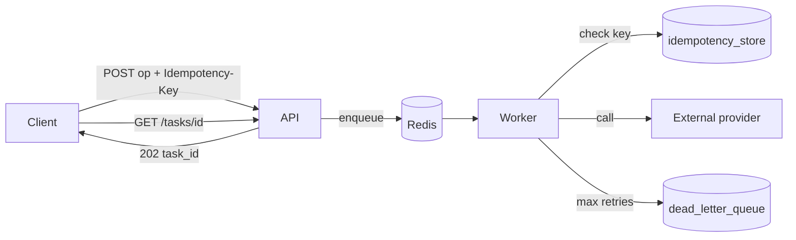

# Platform – Asynchronous Processing - Reference Solution

## Purpose

Reference architecture for moving **one external-provider-dependent operation** off the request-response cycle in the company monorepo. Pick the slowest or most fragile sync call already in your fork (notification send, webhook, report export, etc.) — do not invent a greenfield endpoint.

Differs from the earlier **Message Queues and Async Tasks** module (`ai-eng-message-queue`): that project teaches Celery + Redis + Flower from scratch. This Platform ticket adds **idempotency keys**, **exponential backoff on provider failures**, and **DLQ visibility** as non-negotiable production requirements.

## Solution Structure

- `app/services/queue/` — broker config, task definitions, retry policy
- `app/services/idempotency.py` — store/check `idempotency_key` before side effects
- `app/services/dlq.py` — persist permanently failed tasks
- `app/routes/tasks.py` — enqueue + `GET /tasks/{task_id}`
- `worker` process — separate from Uvicorn (Celery/RQ worker container or CLI)
- `tests/` — idempotency duplicate enqueue, DLQ after max retries, status transitions



## Required Coverage (From README)

- Queue system (Redis + Celery/RQ or existing stack) with worker **outside** API process
- One real monorepo operation migrated to async enqueue → worker
- Exponential backoff retries on external failure; max attempts defined
- DLQ for exhausted retries — task visible, not dropped
- Idempotency key per operation; skip duplicate side effects if key already succeeded
- Test: same key enqueued twice → single external effect
- Queryable task status: `pending`, `in_progress`, `completed`, `failed`
- Log retry count per task

## Expected API Surface

- `POST /...` (your migrated operation) — returns **202** + `task_id` immediately; accepts `Idempotency-Key` header or body field
- `GET /tasks/{task_id}` — `{ "status", "retry_count", "result", "error" }`
- Optional: `GET /tasks/dead-letter` (Admin) — list DLQ entries for ops review

## Key Implementation Decisions

- **202, not 200.** Client gets acknowledgment that work was _accepted_, not that provider succeeded.
- **Idempotency before side effect.** Check store at worker start; if `completed`, return cached result without calling provider again.
- **Backoff schedule example:** 5s → 15s → 45s (3 retries). Log each attempt with `task_id`, `attempt`, `error`.
- **DLQ row:** `task_id`, `idempotency_key`, `payload`, `last_error`, `attempts`, `failed_at`.
- **Simulate provider failure** in tests/dev with env flag or stub that fails N times then succeeds — proves backoff without live outage.

## Indicative Examples

### Example: Enqueue success (202)

```http
POST /notifications/send
Idempotency-Key: order-8842-confirm
Content-Type: application/json

{ "order_id": "8842", "channel": "email" }
```

```json
{
  "task_id": "f47ac10b-58cc-4372-a567-0e02b2c3d479",
  "status": "pending"
}
```

Status: **202 Accepted**.

### Example: Poll task status

```http
GET /tasks/f47ac10b-58cc-4372-a567-0e02b2c3d479
```

```json
{
  "task_id": "f47ac10b-58cc-4372-a567-0e02b2c3d479",
  "status": "completed",
  "retry_count": 1,
  "result": { "provider_message_id": "msg_abc123" }
}
```

### Example: Idempotency — duplicate enqueue

Second `POST` with same `Idempotency-Key` while first still running:

```json
{
  "task_id": "f47ac10b-58cc-4372-a567-0e02b2c3d479",
  "status": "pending",
  "deduplicated": true
}
```

Provider called **once**. Test asserts provider mock `call_count == 1`.

### Example: DLQ after exhausted retries

```json
{
  "task_id": "...",
  "status": "failed",
  "retry_count": 3,
  "error": "ProviderTimeout: gateway unreachable",
  "dlq": true
}
```

Row exists in `dead_letter_queue` table/queue — not silently deleted.

## Validation Notes

- Worker runs as separate process (`docker compose up worker` or `celery worker`).
- Kill provider stub → observe backoff delays in logs → task lands in DLQ after max retries.
- Re-enqueue same idempotency key after success → no second provider call.
- Document in PR which operation you migrated and why (CTO asks in submission section).
