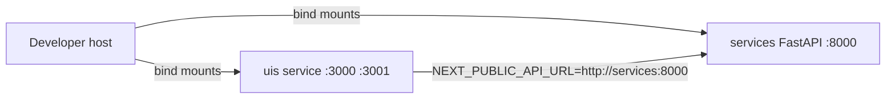

# Company Monorepo Containerization — Reference Solution

## Purpose

Reference architecture for dockerizing an existing monorepo development environment: both Next.js frontends in one UI container, FastAPI in a separate backend container, orchestrated with Docker Compose and reachable by **Docker service names** (not `localhost`).

## Expected Repository Layout (student fork)

```
ai-engineering-company-project-monorepo/
├── uis/
│   ├── website/
│   ├── backoffice/
│   ├── Dockerfile
│   ├── .dockerignore
│   └── start.sh
├── services/
│   ├── Dockerfile
│   └── .dockerignore
├── docker-compose.yml
├── .env                 # gitignored
└── .gitignore
```

## Architecture



| Service (compose name) | Build context | Host ports (example)     | Hot reload                      |
| ---------------------- | ------------- | ------------------------ | ------------------------------- |
| `uis` (or `ui`)        | `./uis`       | `3000:3000`, `3001:3001` | `next dev` + bind mount         |
| `services` (or `api`)  | `./services`  | `8000:8000`              | `uvicorn --reload` + bind mount |

Both services share an explicitly named bridge network (e.g. `monorepo-dev`).

## UI container (`/uis/`)

### `Dockerfile` (high level)

- Base: `node:22-alpine` (or current LTS Alpine).
- Copy `website/package*.json` and `backoffice/package*.json`; run `npm ci` in each app directory.
- Copy source; expose `3000` and `3001`.
- `CMD ["sh", "./start.sh"]`.

### `start.sh`

Starts both apps in the background, e.g.:

```sh
cd /uis/website && npm run dev -- -p 3000 &
cd /uis/backoffice && npm run dev -- -p 3001 &
wait
```

Compose may override `command` to run `next dev` directly with bind mounts; either pattern is acceptable if both apps reload on file changes.

### `.dockerignore`

At minimum: `node_modules`, `.next`, `.env*`, `*.log`.

## Backend container (`/services/`)

### `Dockerfile` (high level)

- Base: `python:3.13-slim`.
- `COPY requirements.txt` + `pip install -r requirements.txt`.
- `CMD` runs Uvicorn with reload, e.g. `uvicorn main:app --host 0.0.0.0 --port 8000 --reload`.

### `.dockerignore`

At minimum: `__pycache__`, `*.pyc`, `.env*`, `tests/`, `*.log`.

## `docker-compose.yml` (high level)

```yaml
services:
  uis:
    build: ./uis
    ports:
      - "3000:3000"
      - "3001:3001"
    volumes:
      - ./uis:/uis
    env_file: .env
    networks: [monorepo-dev]

  services:
    build: ./services
    ports:
      - "8000:8000"
    volumes:
      - ./services:/app
    env_file: .env
    networks: [monorepo-dev]

networks:
  monorepo-dev:
    name: monorepo-dev
```

- Inter-service URLs in `.env` use hostnames `services` and `uis` (matching `services:` keys), e.g. `NEXT_PUBLIC_API_URL=http://services:8000` for server-side calls from the UI container.
- **No secrets** in `docker-compose.yml` or Dockerfiles — only `${VAR}` references or `env_file: .env`.

## Environment variables

| Variable (examples)                | Used by      | Notes                                               |
| ---------------------------------- | ------------ | --------------------------------------------------- |
| `NEXT_PUBLIC_API_URL`              | Next.js apps | Points to `http://services:8000` inside the network |
| `DATABASE_URL` / app-specific vars | FastAPI      | Hostname `db` or other service names if applicable  |

`.env` is listed in `.gitignore`; never committed.

## Indicative validation

### `docker compose up` (success)

Containers reach `running` state; logs show Next.js ready on 3000/3001 and Uvicorn on 8000.

### `docker compose ps` (example)

```
NAME                STATUS    PORTS
repo-uis-1          running   0.0.0.0:3000-3001->3000-3001/tcp
repo-services-1     running   0.0.0.0:8000->8000/tcp
```

### Browser check

- `http://localhost:3000` — public website loads; API calls succeed when backend URL uses service name in server-side config.
- `http://localhost:3001` — backoffice loads.
- Edit a component on the host → page updates without `docker compose build`.

## Key implementation decisions

- **Single UI image** for website + backoffice reduces compose complexity while keeping separate dev ports.
- **Bind mounts** on both services for developer feedback loops.
- **Named network** makes service discovery predictable and testable.
- **Root `.env` + `env_file`** keeps credentials out of versioned YAML/images.

## Validation checklist

- [ ] `docker compose up` from repo root starts full platform without extra setup.
- [ ] Hot reload works on UI and API after host file edits.
- [ ] Both Next.js apps listen on 3000 and 3001 inside one UI service.
- [ ] Internal URLs use compose service names, not `localhost`.
- [ ] No secrets in Dockerfiles or `docker-compose.yml`; `.env` is gitignored.
- [ ] `.dockerignore` present under `/uis/` and `/services/`.
