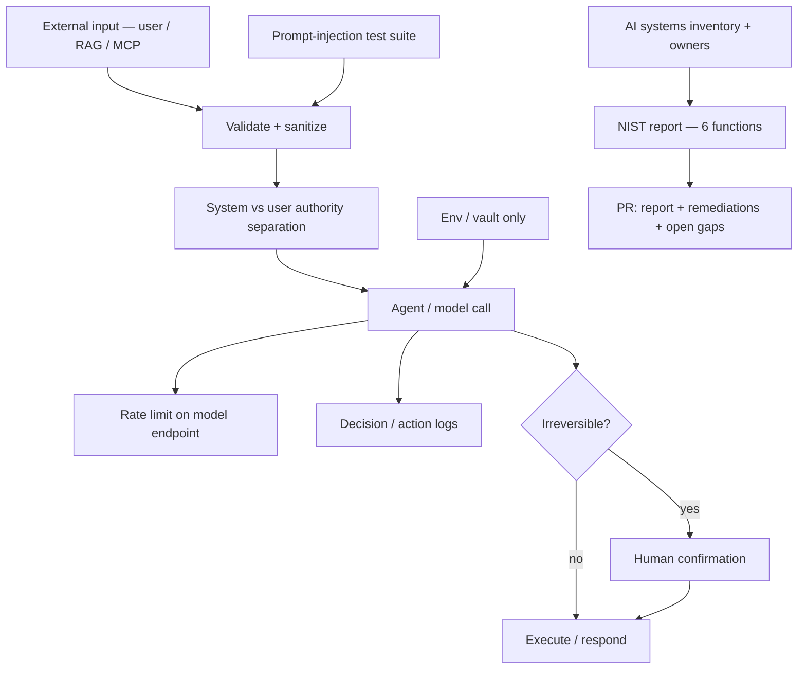

# Secure Practices for AI Integration in Systems — Reference Solution

Reference quality bar for the student's company monorepo fork. Values below are **indicative** — students must align inventory components, irreversible actions, notification SLAs, and regulatory citations with their assigned `CONTEXT-company.md` under `content/contexts/cybersecurity-analysis/`.

---

## Architecture overview

**Design invariants:**

1. **CONTEXT fidelity** — regulatory framework, inventory seed, irreversible actions, and injection cases come from the assigned company CONTEXT, not generic US/EU boilerplate.
2. **Report + remediations** — a NIST markdown alone without code/test evidence for critical Protect controls fails the rubric.
3. **Reproducible proof** — at least one prompt-injection case must fail the build if the agent obeys.
4. **Secrets hygiene** — no API keys or tokens in source; only env/vault.

---

## Recommended layout (indicative)

| Path                                      | Responsibility                                                                |
| ----------------------------------------- | ----------------------------------------------------------------------------- |
| `docs/security/ai-inventory.md`           | Component list + owner + third-party control owner                            |
| `docs/security/nist-report.md`            | Six NIST functions + prioritized actions + open gaps                          |
| `tests/security/test_prompt_injection.py` | ≥1 CONTEXT-aligned injection case that fails if obeyed                        |
| `.env.example`                            | Documented secrets; no real values                                            |
| Agent / API modules                       | Input validation, system/user separation, rate limit, HITL gates, action logs |

Exact paths may follow the student's monorepo conventions — the PR must make the artifacts discoverable.

---

## Rubric checklist (must all pass)

1. AI systems inventory complete with assigned owner per component (extend CONTEXT § inventory).
2. Third-party model/tool components name who owns the control.
3. No hardcoded secrets; credentials from environment or vault.
4. ≥1 reproducible prompt-injection test blocked or neutralized (prefer CONTEXT suggested cases).
5. Rate limiting on ≥1 endpoint that triggers model calls — verifiable (test or demo).
6. Logging of decisions/actions for ≥1 agentic flow.
7. Irreversible actions from CONTEXT require explicit human confirmation before execute.
8. NIST report covers Govern, Identify, Protect, Detect, Respond, Recover — ≥1 concrete prioritized action each.
9. Report cites CONTEXT regulatory framework (e.g. GDPR/AEPD, FIPA, HIPAA, sector rules) — not generic “data protection laws.”
10. Unfixed gaps document risk + proposed mitigation.

---

## NIST mapping (what “concrete action” means)

| Function | Example of acceptable concrete action (adapt to CONTEXT)                    |
| -------- | --------------------------------------------------------------------------- |
| Govern   | Named owner for AI security decisions; policy pointer in repo               |
| Identify | Completed inventory table with risk notes                                   |
| Protect  | Prompt-injection isolation + secrets via env + HITL on irreversible actions |
| Detect   | Agent action logs / alert hook on injection blocks                          |
| Respond  | Documented incident steps + CONTEXT notification deadline                   |
| Recover  | Restore/runbook note for agent or RAG service after compromise              |

---

## PR evidence checklist

- [ ] Link to `nist-report.md` (or equivalent) in PR description
- [ ] Link to prompt-injection test + observed pass output
- [ ] Point to rate-limit location and how to verify
- [ ] Point to agent logging sample
- [ ] List open gaps with why deferred
- [ ] Explicit CONTEXT company name + regulation citations

---

## Common mistakes

| Mistake                                               | Why it fails                                 |
| ----------------------------------------------------- | -------------------------------------------- |
| Generic NIST text with no company inventory           | Ignores CONTEXT                              |
| Cites “GDPR or CCPA” generically without CONTEXT regs | Rubric requires CONTEXT framework            |
| Injection “demo” that never fails CI/tests            | Not reproducible proof                       |
| Secrets in code “for local demo”                      | Secrets hygiene invariant                    |
| Rate limit only on static health endpoint             | Must gate a **model-calling** path           |
| Irreversible actions auto-execute with a log line     | HITL required, not observability alone       |
| Report without remediating any Protect gap            | Deliverable is report **and** critical fixes |

## Validation notes

- Grade against the student's assigned CONTEXT under `content/contexts/cybersecurity-analysis/`.
- Spot-check injection cases from that CONTEXT's suggested test section.
- Confirm legitimate in-domain agent flows still work after remediations.
