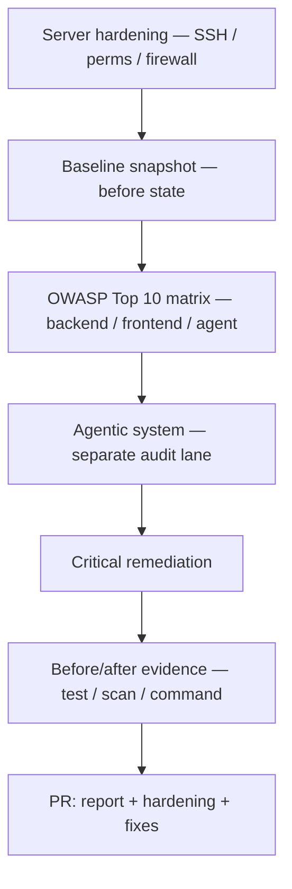

# Web Vulnerability Audit and Remediation (OWASP Top 10) — Reference Solution

Reference quality bar for the student's company monorepo fork. Values below are **indicative** — students must align audit scope, exposed ports, agent tool permissions, and critical findings with their assigned `CONTEXT-company.md` under `content/contexts/cybersecurity-analysis/`.

---

## Architecture overview

**Design invariants:**

1. **CONTEXT fidelity** — audit scope, expected ports, and agent-specific OWASP focus come from the assigned company CONTEXT §7, not generic checklists.
2. **Three lanes** — backend, frontend, and agentic system each get explicit OWASP rows; agent is never folded into "backend only."
3. **Report + fixes** — an OWASP markdown alone without server hardening and critical remediations fails the rubric.
4. **Reproducible proof** — ≥2 critical fixes need linked before/after evidence in the PR.

---

## Recommended layout (indicative)

| Path                                  | Responsibility                                                    |
| ------------------------------------- | ----------------------------------------------------------------- |
| `docs/security/owasp-top10-report.md` | 10 categories × 3 lanes; applies/doesn't apply + evidence per row |
| `docs/security/server-hardening.md`   | Non-root user, SSH policy, folder perms, firewall rules           |
| `infra/` or `deploy/` scripts         | Firewall / sshd config snippets or documented runbook steps       |
| `tests/security/`                     | Tests proving access control, secrets, or misconfig fixes         |
| Agent / MCP modules                   | Least-privilege tool scopes, env-based secrets                    |

Exact paths may follow the student's monorepo conventions — the PR must make artifacts discoverable.

---

## OWASP Top 10 matrix (what each row needs)

| Category                      | Minimum evidence when "applies"                            |
| ----------------------------- | ---------------------------------------------------------- |
| A01 Broken Access Control     | Endpoint or tool name + who can call it today vs after fix |
| A02 Cryptographic Failures    | Where secrets/transit crypto live (env, TLS, hashing)      |
| A03 Injection                 | Input path to model/tool/SQL with test or scan proof       |
| A04 Insecure Design           | Design gap + mitigation (e.g. HITL, rate limit)            |
| A05 Security Misconfiguration | Config file / default creds / open debug route             |
| A06 Vulnerable Components     | Dependency scan output or pinned upgrade                   |
| A07 Auth Failures             | Session/token flow on API or dashboard                     |
| A08 Data Integrity Failures   | Unsigned updates, unsafe deserialization                   |
| A09 Logging Failures          | What is logged vs missing for security events              |
| A10 SSRF                      | Outbound fetch from agent/tool to internal URLs            |

When "doesn't apply," cite why (e.g. no server-side redirect fetch in agent) — not a blank cell.

---

## Server hardening checklist

1. Dedicated non-root deploy/ops user with sudo only where needed.
2. `PermitRootLogin no` (or equivalent) — demonstrate `ssh root@…` fails.
3. Folder perms: code read-only for app user; logs writable; secrets not world-readable.
4. Firewall: only app HTTP(S), SSH (optionally restricted IP), and required SSE/MCP ports from CONTEXT — document closed ports.

---

## Rubric checklist (must all pass)

1. SSH root login disabled or restricted per hardening doc.
2. Non-root operational user + explicit folder permission model.
3. Firewall exposes only CONTEXT-aligned necessary ports.
4. All 10 OWASP categories evaluated with finding + evidence (per lane where relevant).
5. Agentic system audited separately — tool ACLs, secrets, misconfig noted.
6. Every critical finding fixed with reproducible before/after evidence.
7. PR links ≥2 critical fix proofs + full `owasp-top10-report.md`.

---

## PR evidence checklist

- [ ] Link to OWASP report in delivery folder
- [ ] Server hardening notes or scripts
- [ ] `ssh` / `nmap` / scan output showing closed ports or blocked root SSH
- [ ] ≥2 critical fixes: test output or command diff
- [ ] Explicit CONTEXT company name + §7 scope cited in report intro

---

## Common mistakes

| Mistake                                           | Why it fails                        |
| ------------------------------------------------- | ----------------------------------- |
| Single "app" column in OWASP table                | Agent lane missing                  |
| "N/A" on all agent rows without evidence          | Rubric requires explicit evaluation |
| Firewall doc without verification command         | Not reproducible                    |
| Fixed API but agent tools still over-privileged   | Agent-specific criteria             |
| Critical fix with screenshot only, no rerun steps | Evidence not reproducible           |
| Audit scope ignores CONTEXT inventory components  | Ignores CONTEXT                     |

## Validation notes

- Grade against the student's assigned CONTEXT under `content/contexts/cybersecurity-analysis/`.
- Spot-check §7 audit scope and agent OWASP focus for that company.
- Confirm legitimate in-domain flows still work after remediations.
