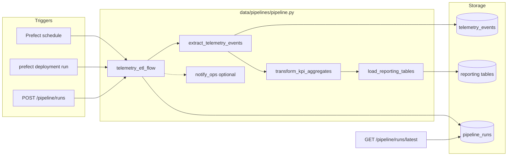

# Implementing a Resilient Data Pipeline — Reference Solution

This reference solution defines the expected quality bar for deliverables in the student's company monorepo fork:

- `data/pipelines/pipeline.py`
- Supporting modules under `data/pipelines/`, `data/process/`, or `data/raw/` as needed
- Pipeline-related endpoints in `services/`

The implementation must be **consistent with** the student's `data/pipelines/PIPELINE_DESIGN.md` and **CONTEXT-company.md**. Generic placeholder names (`events`, `metrics`, `my_flow`) should be treated as incomplete.

---

## Architecture overview



**Design invariant:** pipeline logic lives in `data/pipelines/`; `services/` only imports and exposes it.

---

## Expected file layout

| Path                                | Purpose                                                           |
| ----------------------------------- | ----------------------------------------------------------------- |
| `data/pipelines/pipeline.py`        | Main Prefect flow(s) and task definitions — required entry point  |
| `data/pipelines/PIPELINE_DESIGN.md` | Approved design from previous project — must match implementation |
| `data/process/`                     | Reusable transformation helpers imported by tasks                 |
| `data/raw/`                         | Intermediate extracts or staging files if used                    |
| `data/eval/`                        | Validation outputs from test runs                                 |
| `services/`                         | FastAPI routes for status query and manual trigger                |

---

## Phase 1 — Flows and tasks

### Minimum structure

A strong submission defines at least one `@flow` orchestrating three or more `@task` functions aligned with the design document stages:

| Task                  | Typical responsibility                              |
| --------------------- | --------------------------------------------------- |
| `extract_*`           | Read new rows from source since last watermark      |
| `transform_*`         | Validate schema, aggregate to KPI grain, dedup prep |
| `load_*`              | Idempotent upsert into reporting tables             |
| `notify_*` (optional) | Slack/email/export — non-critical                   |

### Optional tasks with `allow_failure=True`

Non-critical steps (notifications, secondary CSV export) should use:

```python
@task(allow_failure=True)
def notify_ops(summary: dict) -> None:
    ...
```

The main flow must continue when this task fails.

---

## Phase 2 — Resilience

### Retries on external I/O

Every task that hits Supabase, HTTP APIs, or filesystem over network mounts should declare retries with a comment justifying the count:

```python
@task(retries=3, retry_delay_seconds=30)
def extract_telemetry_events(watermark_from: datetime) -> list[dict]:
    # 3 retries: Supabase pooler can drop idle connections during nightly batch.
    ...
```

**Common mistake:** retries on pure in-memory transforms with no external dependency.

### Explicit failure handling

At least one task uses `raise_on_failure=False` and the flow inspects the returned state:

```python
@task(raise_on_failure=False)
def export_validation_snapshot(rows: list[dict]) -> bool:
    ...

@flow
def telemetry_etl_flow():
    ok = export_validation_snapshot(rows)
    if not ok:
        logger.warning("Validation export skipped — continuing load")
```

### Result caching

At least one expensive transform task caches by business key with TTL:

```python
from datetime import timedelta
from prefect.tasks import task_input_hash

@task(
    cache_key_fn=task_input_hash,
    cache_expiration=timedelta(hours=1),
)
def transform_kpi_aggregates(events: list[dict]) -> list[dict]:
    # Cache key = hash of input event batch; valid 1h per CTO brief (no repeat within hour).
    ...
```

Document in a comment what inputs form the cache key and why the TTL matches the schedule.

---

## Phase 3 — Idempotency and run metadata

### Idempotent load

Implement the strategy from `PIPELINE_DESIGN.md` — typical patterns:

1. **Upsert by grain** — `ON CONFLICT (report_date, entity_id) DO UPDATE`
2. **Control table** — skip `eventId` values already in `processed_event_ids`
3. **Watermark checkpoint** — load phase reads staging only for current `run_id`

**Verification:** running the flow twice over the same watermark window produces identical reporting row counts and values — no duplicates.

### Run metadata (≥5 fields)

Persist per run in `pipeline_runs` table or structured JSON log under `data/eval/`:

| Field               | Example                          |
| ------------------- | -------------------------------- |
| `started_at`        | ISO 8601 UTC                     |
| `finished_at`       | ISO 8601 UTC                     |
| `records_processed` | integer                          |
| `status`            | `success` / `failed` / `partial` |
| `error_summary`     | nullable string                  |

Additional useful fields: `run_id`, `watermark_from`, `watermark_to`, `rows_loaded`.

---

## Phase 4 — Schedule and deployment

### Schedule

Define interval or cron aligned with company data cycle. Comment the rationale:

```python
# Nightly at 02:00 UTC — after telemetry batch ingestion closes, before ops standup.
schedule = CronSchedule(cron="0 2 * * *", timezone="UTC")
```

### Deployment

Create a Prefect deployment targeting Docker infrastructure from the monorepo's existing container setup. Student should verify:

```bash
prefect deployment run telemetry-etl-flow/nightly-production
```

Deployment manifest or `prefect.yaml` should reference the monorepo image and `data/pipelines/pipeline.py` entrypoint.

---

## Phase 5 — Backend endpoints

Implement in `services/` (paths illustrative — match existing API conventions):

| Method | Path                    | Behaviour                                                       |
| ------ | ----------------------- | --------------------------------------------------------------- |
| `GET`  | `/pipeline/runs/latest` | Returns last run metadata from `pipeline_runs`                  |
| `POST` | `/pipeline/runs`        | Triggers manual flow run via Prefect client or direct flow call |

**Import pattern (required):**

```python
from data.pipelines.pipeline import telemetry_etl_flow

@router.post("/pipeline/runs")
async def trigger_pipeline_run(...):
    telemetry_etl_flow()  # or prefect deployment trigger
```

**Common mistake:** duplicating extract/transform/load SQL inside route handlers.

Endpoints must follow the same auth middleware and response envelope as other company API routes.

---

## Indicative example — strong vs weak

**Strong extract task:**

> `extract_telemetry_events` queries `public.telemetry_events` where `timestamp > watermark_from`, uses 3 retries for Supabase transient errors, returns a typed list of dicts keyed by CONTEXT event names.

**Weak (incomplete):**

> `extract_data()` reads a CSV with hardcoded path and no watermark.

**Strong idempotency:**

> Load uses `INSERT ... ON CONFLICT (report_date, product_id) DO UPDATE SET outbound_count = EXCLUDED.outbound_count` inside one transaction; second run updates same rows in place.

**Weak (incomplete):**

> Load appends rows with no conflict handling — duplicates on re-run.

---

## Common mistakes (incomplete submissions)

- `pipeline.py` missing or single monolithic function with no `@task` separation
- Retries on zero external-I/O tasks; no comment justifying retry count
- No `allow_failure=True` optional task, or flow aborts when optional step fails
- Caching missing or applied to cheap tasks with no comment on cache key/TTL
- Load creates duplicate reporting rows on second run
- Run metadata stored only in stdout, not queryable by API
- No Prefect deployment or schedule defined
- Endpoints re-implement pipeline logic instead of importing from `data/pipelines/`
- Flow/task/table names ignore CONTEXT-company.md and PIPELINE_DESIGN.md

---

## Evaluation checklist

- [ ] `data/pipelines/pipeline.py` exists with ≥1 flow and ≥3 tasks
- [ ] ≥1 task has `retries > 0` with justification comment
- [ ] ≥1 optional task uses `allow_failure=True`; flow continues on its failure
- [ ] ≥1 transform task has `cache_key_fn` + `cache_expiration` with comment
- [ ] Load is idempotent — no duplicates on second run over same data
- [ ] Each run logs ≥5 metadata fields (start, end, records, status, errors)
- [ ] Working Prefect deployment with schedule and Docker infrastructure
- [ ] CLI trigger succeeds: `prefect deployment run <flow>/<deployment>`
- [ ] `GET`-style endpoint returns last run metadata from `services/`
- [ ] `POST`-style endpoint triggers run importing from `data/pipelines/`
- [ ] Implementation matches stages and entities in `PIPELINE_DESIGN.md`
- [ ] Commit message `feat: implement resilient prefect pipeline`
