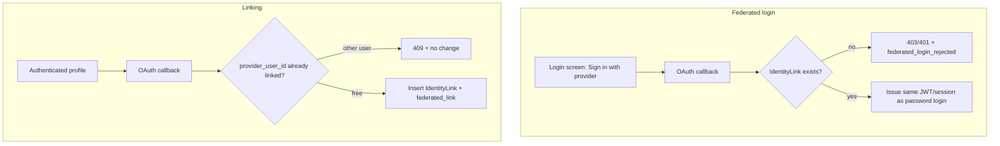

# Platform – Federated Authentication - Reference Solution

## Purpose

This reference solution describes the expected architecture, implementation scope, and validation evidence for a complete submission. The required identity provider and extra rules **must** come from the assigned file in `content/contexts/federated-authentication/` — Google (Brasaland), Microsoft (HealthCore / TrackFlow), or LinkedIn (Nexova). A generic "Sign in with Google" that auto-creates users fails the brief.

## Solution Structure

- `app/models/` — `IdentityLink` (`user_id`, `provider`, `provider_user_id`, `email_at_link_time`, `linked_at`). Unique on `(provider, provider_user_id)`.
- `app/core/oauth.py` — authorize URL, `state` issue/verify, `redirect_uri` allowlist, token exchange, extract `sub`/`oid`.
- `app/services/federated_auth.py` — **link** and **login** as two functions. Login never calls user-create.
- `app/routes/auth.py` — `/auth/{provider}/start`, `/auth/{provider}/callback` with a `intent=link|login` (or separate paths).
- `app/routes/profile.py` — link/unlink only with `get_current_user`.
- Audit log (existing audit table or `audit_events`) for the four CONTEXT event names.
- `tests/` — unlinked login does not insert a user; link requires auth; unique provider identity; unlink last-method blocked.



Login and linking share the provider SDK. They do **not** share the success path.

## Required Coverage (From README + CONTEXT)

- Zero, one, or many providers per user (`IdentityLink` rows).
- Store provider identifiers only — no plaintext long-lived tokens.
- Link only from an already-authenticated profile — never from the login screen as account creation.
- Reject linking when that provider identity belongs to another user.
- UI confirmation of which provider was linked.
- Unlink from the same place; warn and **block** if it would leave zero access methods.
- Federated login only if a link exists; otherwise explicit reject and **no new user**.
- Audit: `federated_link`, `federated_unlink`, `federated_login_success`, `federated_login_rejected`.
- OAuth `state` + `redirect_uri` allowlist.
- Session after federated login uses the same expiry/revocation as password login.

## Expected API Surface

- `GET /auth/{provider}/login` — starts OAuth for **login** (no session required)
- `GET /auth/{provider}/link` — starts OAuth for **link** (`get_current_user` required → 401 if anonymous)
- `GET /auth/{provider}/callback` — consumes `code` + `state`; branches on stored intent
- `GET /auth/me/identity-links` — authenticated
- `DELETE /auth/me/identity-links/{provider}` — authenticated; 409 if last access method
- Existing `POST /auth/login` unchanged

Provider path segment is the CONTEXT code: `google` | `microsoft` | `linkedin`.

## Key Implementation Decisions

- **Never upsert User in the login callback.** Lookup `IdentityLink` by `(provider, provider_user_id)`. Miss → reject + audit. Hit → issue JWT for `link.user_id`.
- **`state` binds intent + user id (for link) + nonce.** Reject missing/unknown/expired `state`.
- **`redirect_uri` is exact-match allowlist** from env — not taken from the query string blindly.
- **Last-method guard:** `has_password or other_links.count > 0` before unlink.
- Mock the IdP in tests (fixture `code` → canned `sub`). Do not depend on a live Google/Microsoft/LinkedIn app for CI.

## Indicative Examples

### Example: Unlinked login (must not create a user)

```http
GET /auth/google/callback?code=unlinked-code&state=<valid-login-state>
```

```json
{ "detail": "No account is linked to this identity. Register first." }
```

Status: **401** or **403**. User table row count unchanged. Audit: `federated_login_rejected`.

### Example: Link from anonymous

```http
GET /auth/google/link
```

```json
{ "detail": "Not authenticated" }
```

Status: **401**.

### Example: Duplicate provider identity

```json
{ "detail": "This identity is already linked to another account." }
```

Status: **409**.

### Example: Successful federated login (already linked)

Same body as password login:

```json
{
  "access_token": "<jwt-token>",
  "token_type": "bearer"
}
```

Token TTL and revoke list match `POST /auth/login`.

## Validation Notes

- Test: unlinked provider login → reject + zero new users.
- Test: link endpoint without JWT → 401.
- Test: same `provider_user_id` cannot attach to two users.
- Test: unlink last method → 409 + warning payload the UI can show.
- Test: forged `state` or unknown `redirect_uri` → reject.
- Confirm CONTEXT provider only (do not ship Google for HealthCore).
- Confirm audit rows for link, unlink, and rejected login.
