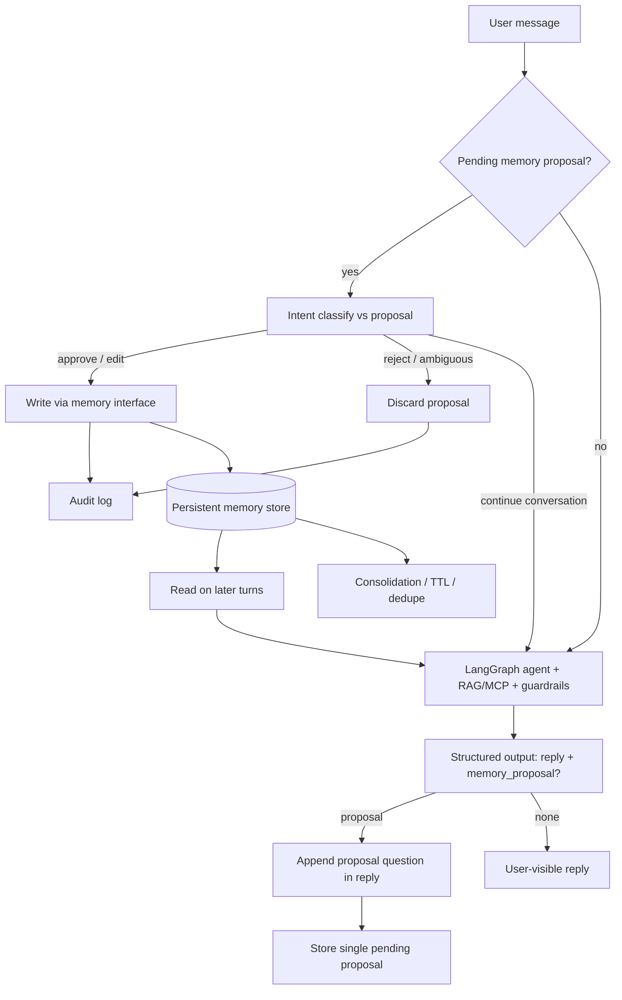

# Milestone 8 — Agent Memory and Self-Improvement — Reference Solution

Reference quality bar for the student's company monorepo fork. Values below are **indicative** — students must align memorable facts, forbidden stores, and consolidation policy with their assigned `CONTEXT-company.md` under `content/contexts/08-agent-engineering/memory/`.

---

## Architecture overview



**Design invariants:**

1. **Propose ≠ write** — memorable content is offered to the user first; the store is updated only after an explicit classified decision.
2. **One pending proposal** — no second proposal while one is open; silence/ambiguity = reject by default.
3. **Explicit memory interface** — no “append everything to the system prompt” as persistence.
4. **CONTEXT fidelity** — never-store rules and memorable fact types come from the company CONTEXT, not a generic memory policy.
5. **Auditability** — every proposal and outcome (approve / reject / edit / timeout-discard) is logged with timestamp and source message.
6. **Single agent** — self-evaluation is an extra structured field on the same model call, not a multi-agent graph.

---

## Recommended layout (indicative)

| Path                                    | Responsibility                                                  |
| --------------------------------------- | --------------------------------------------------------------- |
| `agents/<agent>/memory/interface.py`    | `read` / `write` / `delete` / `list` against the chosen backend |
| `agents/<agent>/memory/proposal.py`     | Pending proposal state (at most one); serialize for session     |
| `agents/<agent>/memory/confirm.py`      | Intent classification: approve / reject / edit / unclear        |
| `agents/<agent>/memory/audit.py`        | Append-only audit records                                       |
| `agents/<agent>/memory/consolidate.py`  | Dedup, summarize, TTL / low-relevance eviction                  |
| `agents/<agent>/schemas/turn_output.py` | Structured output: `reply` + optional `memory_proposal`         |
| `tests/pipelines/test_memory_flow.py`   | Approved cycle + rejected cycle + “nothing to remember” cases   |

---

## Memory backend selection

Document **why** the backend fits what the agent must remember (from CONTEXT). Indicative fits:

| Need                                        | Reasonable choice                          |
| ------------------------------------------- | ------------------------------------------ |
| Short facts / prefs / corrected procedures  | Redis or KV + optional TTL                 |
| Semantic recall of similar past escalations | VectorDB (or hybrid: KV id + vector index) |
| Explicit hierarchies / dependencies         | Knowledge graph (only if CONTEXT needs it) |
| Parametric fine-tuning                      | Out of scope for this milestone            |

A generic “we used Redis because it’s popular” without tying to CONTEXT memorable types fails the rubric.

---

## Structured self-evaluation (same call)

Ask the model for one structured object per turn, e.g.:

```json
{
  "reply": "…user-visible answer…",
  "memory_proposal": null
}
```

or:

```json
{
  "reply": "…answer…\n\nWant me to remember that retail payroll SLAs are now 24h?",
  "memory_proposal": {
    "action": "upsert",
    "fact": "Retail payroll tickets resolve in 24h (updated SLA).",
    "reason": "User corrected outdated SLA; reusable across agents.",
    "keys": ["sla", "payroll", "retail"]
  }
}
```

**Must NOT propose** (document ≥3 company-specific examples from CONTEXT): one-off queries, thanks/closings, single-use summaries, forbidden PII/salary/PHI/etc.

When `memory_proposal` is non-null and no pending proposal exists: surface the ask inside `reply`; store pending state. **Do not write** yet.

---

## Confirmation and audit

Reuse the same style of intent classifier as the guardrails sprint (structured label, not `"yes" in text`).

| Classifier label         | Effect                                    |
| ------------------------ | ----------------------------------------- |
| `approve`                | Write via interface; clear pending; audit |
| `edit`                   | Write edited fact; clear pending; audit   |
| `reject`                 | Clear pending; audit rejection            |
| `unclear` / topic change | Discard pending (reject default); audit   |

Indicative audit record:

```json
{
  "timestamp": "2026-07-17T10:15:00Z",
  "proposal_id": "mem-092-a1",
  "proposed_fact": "Retail payroll tickets resolve in 24h.",
  "user_message": "yes remember that",
  "decision": "approve",
  "written": true
}
```

After resolution, continue the turn normally (user may approve **and** ask a new question in the same message).

---

## Consolidation / cleanup

Implement at least one of: TTL, dedupe by key/semantic similarity, summarize clusters, drop low-relevance entries. Document the policy and why it matches company volume/risk.

Poisoning defense (required design decision): never write without confirmation; refuse CONTEXT-forbidden content even if the user “approves”; keep rejection audits so repeated poison attempts are visible.

---

## Evidence cycles (required)

### Cycle A — approve then reuse

1. User corrects a memorable fact (CONTEXT “should propose” example).
2. Agent proposes; does **not** write yet.
3. User clearly approves → write + audit.
4. Later session/turn: agent uses the stored fact without re-asking.

### Cycle B — reject then unchanged

1. Agent proposes a memorable correction.
2. User rejects or changes topic → discard + audit; store unchanged.
3. Later turn: agent does **not** behave as if the fact were stored.

---

## PR evidence checklist

- [ ] Written backend justification tied to CONTEXT memorable types.
- [ ] Explicit read/write interface (not prompt-only memory).
- [ ] ≥3 memorable and ≥3 non-memorable documented examples.
- [ ] Proposal in-conversation; single pending proposal enforced.
- [ ] Classified confirmation (not naive string match); ambiguity = reject.
- [ ] Audit for approve and reject paths.
- [ ] Consolidation/cleanup documented and runnable.
- [ ] Two complete evidence cycles attached to the PR.
- [ ] Design decisions answer CONTEXT never-store rules + no multi-agent requirement.

---

## Common mistakes

| Mistake                                  | Why it fails                                      |
| ---------------------------------------- | ------------------------------------------------- |
| Write on self-evaluation without user OK | Rubric requires explicit confirmation             |
| `"yes" in message` as confirmation       | Ambiguous / gaming-prone; must classify intent    |
| Unlimited append-only store              | Missing consolidation                             |
| Ignoring CONTEXT never-store list        | Company-specific restriction fails                |
| Second agent just for “memory proposal”  | Unnecessary; structured field on same call enough |
| Assuming silence = approve               | Default must be discard                           |

## Validation notes

- Exercise approve + reject paths in Docker/test target.
- Spot-check CONTEXT “never enter memory” items cannot be written even after a fake approve.
- Confirm guardrails from the previous sprint still apply (memory must not become a poison channel).
