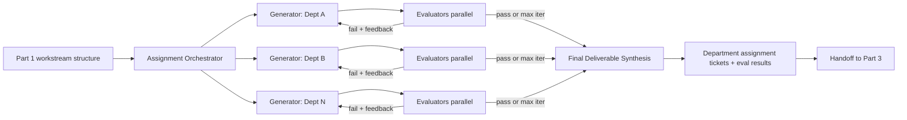
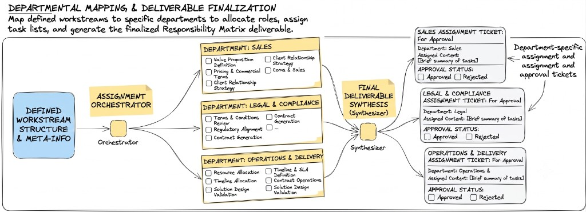

# Milestone 9 Part 2 — RFP Response Generation & Evaluation — Reference Solution

Reference quality bar for the student's company monorepo fork. Values below are **indicative** — students must align section formats and guideline checks with their assigned `CONTEXT-company.md`.

---

## Architecture overview





**Design invariants:**

1. **Reuse Part 1** — generators consume synthesizer/metadata output; do not re-classify RFPs from scratch.
2. **One generator per department** — clearly separated agents/modules.
3. **Parallel evaluators** — readability, relevance, and CONTEXT guidelines run concurrently per section.
4. **Structured fail feedback** — regenerators receive concrete reasons (rule ids, missing fields), not vague “improve it”.
5. **Bounded loop** — hard `max_iterations`; ticket never stuck forever; exhausting limit ≠ silent discard of whole ticket.
6. **CONTEXT fidelity** — guideline checklist comes from CONTEXT, not generic style taste.

---

## Recommended layout (indicative)

| Path                                              | Responsibility                                     |
| ------------------------------------------------- | -------------------------------------------------- |
| `services/rfp_response/orchestrator.py`           | Map Part 1 workstreams → department generators     |
| `services/rfp_response/generators/`               | One generator module per CONTEXT department        |
| `services/rfp_response/evaluators/readability.py` | py-readability-metrics wrapper → pass/fail         |
| `services/rfp_response/evaluators/relevance.py`   | Section vs RFP asks                                |
| `services/rfp_response/evaluators/guidelines.py`  | CONTEXT rule checklist                             |
| `services/rfp_response/loop.py`                   | Generator ↔ evaluators with iteration counter      |
| `services/rfp_response/synthesizer.py`            | Package drafts + eval results → assignment tickets |
| `services/rfp_intake/tickets.py`                  | Extend statuses: `drafting`, `under_evaluation`, … |
| `tests/pipelines/test_rfp_generator.py`           | Generator unit tests                               |
| `tests/pipelines/test_rfp_evaluator.py`           | Evaluator + failure-path unit tests                |

---

## Ticket lifecycle (Part 2 additions)

| Status                         | When set                                       |
| ------------------------------ | ---------------------------------------------- |
| `drafting`                     | Generators running for one or more departments |
| `under_evaluation`             | Evaluators running / loop in progress          |
| `needs_human_review`           | Optional: iteration limit hit on ≥1 section    |
| `ready_for_approval` / handoff | All sections packaged for Part 3               |

Keep Part 1 statuses (`analyzing`, `discarded`, `done` for intake) intact; extend the state machine rather than replacing it.

---

## Evaluator contracts (structured)

### Readability

```json
{
  "evaluator": "readability",
  "pass": true,
  "metrics": { "flesch_kincaid_grade": 9.2, "gunning_fog": 10.1 },
  "feedback": null
}
```

### Relevance

```json
{
  "evaluator": "relevance",
  "pass": false,
  "unanswered_asks": ["SLA for API uptime", "Data residency country"],
  "feedback": "Draft omits SLA and residency; regenerate to address both."
}
```

### Guidelines (CONTEXT)

```json
{
  "evaluator": "guidelines",
  "pass": false,
  "failed_rules": [
    "GUIDELINE_PRICING_MUST_INCLUDE_CURRENCY",
    "GUIDELINE_NO_UNVERIFIED_SLA"
  ],
  "feedback": "Add currency on all prices; remove unverified 99.99% uptime claim."
}
```

Section passes only when **all** evaluators pass. Aggregate feedback before regenerating.

---

## Generator-evaluator loop

```text
for department in workstreams:
  iterations = 0
  draft = generate(department, part1_summary, feedback=None)
  while iterations < MAX:
    ticket.status = under_evaluation
    results = parallel_evaluate(draft, rfp_context, context_guidelines)
    if all_pass(results):
      store(department, draft, results)
      break
    iterations += 1
    if iterations >= MAX:
      store(department, draft, results, flag=needs_human_review)
      break
    draft = generate(department, part1_summary, feedback=aggregate(results))
```

**Parallelism notes:** run department loops concurrently where safe; within a department, run the three evaluators concurrently and merge into keyed results (`readability` / `relevance` / `guidelines`) to avoid shared-state races.

---

## Synthesizer / handoff to Part 3

Each department assignment ticket should include:

```json
{
  "department": "Legal",
  "assigned_content": "…final draft markdown…",
  "evaluation": {
    "passed": true,
    "iterations": 2,
    "results": { "readability": {}, "relevance": {}, "guidelines": {} }
  },
  "approval_status": "pending"
}
```

Part 3 consumes these tickets for human approval / final assembly — do not skip storing failed-but-capped sections.

---

## PR evidence checklist

- [ ] Generators are per-department and consume Part 1 output
- [ ] ≥3 evaluators in parallel (readability, relevance, guidelines)
- [ ] Fail path returns concrete feedback and regenerates
- [ ] Iteration limit enforced; ticket not discarded wholesale
- [ ] Ticket status updates during drafting / evaluation
- [ ] Handoff includes content **and** evaluation per department
- [ ] Unit tests: generator success, evaluator fail path
- [ ] Pass + fail section examples in PR description
- [ ] CONTEXT guidelines used as checklist (verifiable rule ids)

---

## Common mistakes

| Mistake                                       | Why it fails                                     |
| --------------------------------------------- | ------------------------------------------------ |
| One mega-generator for all departments        | Rubric requires per-department generators        |
| Free-text “looks good” evaluation             | Must be verifiable criteria / structured results |
| Infinite regenerate loop                      | Missing iteration limit                          |
| Discarding whole ticket on one failed section | Ticket must survive; flag section instead        |
| Ignoring CONTEXT guideline list               | Company-specific rules required                  |
| Rewriting Part 1 from scratch                 | Must extend existing intake/routing              |

---

## Validation notes

- Feed a Part 1 synthesizer fixture into Part 2 without re-uploading PDF.
- Force a guidelines failure; confirm feedback names rule ids and regenerates.
- Hit max iterations; confirm ticket shows human-review path, not crash/discard.
- Confirm evaluators for Dept A do not block Dept B completion.
