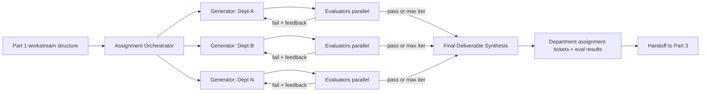
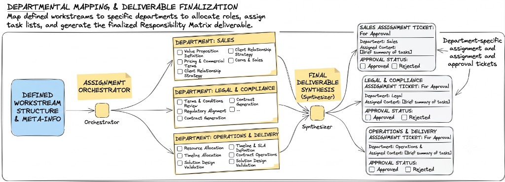

# Milestone 9 Part 2 — RFP Response Generation & Evaluation — Reference Solution

Reference quality bar for the student's company monorepo fork. Values below are **indicative** — students must align section formats and guideline checks with their assigned `CONTEXT-company.md`.

---

## Architecture overview


```mermaid
flowchart LR
  P1[Part 1 workstream structure] --> AO[Assignment Orchestrator]
  AO --> G1[Generator: Dept A]
  AO --> G2[Generator: Dept B]
  AO --> GN[Generator: Dept N]
  G1 --> E1[Evaluators parallel]
  G2 --> E2[Evaluators parallel]
  GN --> EN[Evaluators parallel]
  E1 -->|fail + feedback| G1
  E2 -->|fail + feedback| G2
  EN -->|fail + feedback| GN
  E1 -->|pass or max iter| SYN[Final Deliverable Synthesis]
  E2 -->|pass or max iter| SYN
  EN -->|pass or max iter| SYN
  SYN --> TIX[Department assignment tickets + eval results]
  TIX --> P3[Handoff to Part 3]
```



**Design invariants:**

1. **Reuse Part 1** — generators **consume** the Part 1 routing handoff (`ticket_id` + synthesizer / `key_aspects` payload via queue flag, DB field, or documented contract). Do not re-classify RFPs or re-parse the PDF as the primary path.
2. **One generator per department** — clearly separated agents/modules.
3. **Parallel evaluators** — readability, relevance, and CONTEXT guidelines run concurrently per section.
4. **Structured `EvaluationResult`** — regenerators receive concrete reasons (rule ids, missing fields), not vague “improve it”.
5. **Bounded loop** — hard `max_iterations`; on exhaust → keep last draft + eval, set `needs_human_review`, still hand off to Part 3 (never silent discard of whole ticket).
6. **CONTEXT fidelity** — guideline checklist comes from CONTEXT, not generic style taste.

---

## Recommended layout (indicative)

| Path                                                     | Responsibility                                     |
| -------------------------------------------------------- | -------------------------------------------------- |
| `data/pipelines/rfp_response/` (or extend `rfp_intake/`) | Generators, evaluators, loop, synthesizer          |
| `data/pipelines/rfp_response/orchestrator.py`            | Map Part 1 workstreams → department generators     |
| `data/pipelines/rfp_response/generators/`                | One generator module per CONTEXT department        |
| `data/pipelines/rfp_response/evaluators/readability.py`  | py-readability-metrics wrapper → pass/fail         |
| `data/pipelines/rfp_response/evaluators/relevance.py`    | Section vs RFP asks                                |
| `data/pipelines/rfp_response/evaluators/guidelines.py`   | CONTEXT rule checklist                             |
| `data/pipelines/rfp_response/loop.py`                    | Generator ↔ evaluators with iteration counter      |
| `data/pipelines/rfp_response/synthesizer.py`             | Package drafts + eval results → assignment tickets |
| `services/.../routers/rfp.py`                            | Same existing API — trigger Part 2 + GET status    |
| `tests/pipelines/test_rfp_generator.py`                  | Generator unit tests                               |
| `tests/pipelines/test_rfp_evaluator.py`                  | Evaluator fail path + one CONTEXT compliance fail  |

---

## Ticket lifecycle (Part 2 additions)

| Status                         | When set                                                                                                                                                                  |
| ------------------------------ | ------------------------------------------------------------------------------------------------------------------------------------------------------------------------- |
| `drafting`                     | Generators running for one or more departments                                                                                                                            |
| `under_evaluation`             | Evaluators running / loop in progress                                                                                                                                     |
| `needs_human_review`           | **Required** when iteration limit hit on ≥1 section without pass                                                                                                          |
| Part 3 handoff (same statuses) | All sections packaged with draft + `EvaluationResult` (including flagged ones) — stay on `needs_human_review` / `under_evaluation`; do **not** invent a new ticket status |

Keep Part 1 statuses (`analyzing`, `discarded`, `intake_complete`) intact; Part 2 extends with `drafting` / `under_evaluation` / `needs_human_review`. Persist drafts and `evaluation_results` in the same PostgreSQL tables.

---

## Evaluator contracts (`EvaluationResult`)

Aggregate per section into this shape (field names may vary slightly; shape must be equivalent):

```text
EvaluationResult:
  section_id / department_id
  readability: { pass, score, details }
  relevance: { pass, missing_aspects[] }
  compliance: { pass, rule_ids[], violations[] }
  overall_pass: bool
  feedback_for_generator: string   # concrete and actionable
```

### Readability (feeds `readability`)

```json
{
  "pass": true,
  "score": 9.2,
  "details": { "flesch_kincaid_grade": 9.2, "gunning_fog": 10.1 }
}
```

### Relevance (feeds `relevance`)

```json
{
  "pass": false,
  "missing_aspects": ["SLA for API uptime", "Data residency country"]
}
```

### Compliance / guidelines (feeds `compliance`)

```json
{
  "pass": false,
  "rule_ids": [
    "GUIDELINE_PRICING_MUST_INCLUDE_CURRENCY",
    "GUIDELINE_NO_UNVERIFIED_SLA"
  ],
  "violations": [
    "Prices listed without currency",
    "Unverified 99.99% uptime claim"
  ]
}
```

`overall_pass` is true only when **all** of readability, relevance, and compliance pass. `feedback_for_generator` aggregates concrete fixes before regenerating.

---

## Generator-evaluator loop

```text
for department in workstreams:
  iterations = 0
  draft = generate(department, part1_summary, feedback=None)
  while iterations < MAX:
    ticket.status = under_evaluation
    results = parallel_evaluate(draft, rfp_context, context_guidelines)
    if all_pass(results):
      store(department, draft, results)
      break
    iterations += 1
    if iterations >= MAX:
      store(department, draft, results, flag=needs_human_review)
      break
    draft = generate(department, part1_summary, feedback=aggregate(results))
```

**Parallelism notes:** run department loops concurrently where safe; within a department, run the three evaluators concurrently and merge into an `EvaluationResult` (`readability` / `relevance` / `compliance`) to avoid shared-state races.

---

## Synthesizer / handoff to Part 3

Each department assignment ticket should include:

```json
{
  "department": "Legal",
  "assigned_content": "…final draft markdown…",
  "evaluation": {
    "section_id": "legal",
    "readability": { "pass": true, "score": 9.2, "details": {} },
    "relevance": { "pass": true, "missing_aspects": [] },
    "compliance": { "pass": true, "rule_ids": [], "violations": [] },
    "overall_pass": true,
    "feedback_for_generator": "",
    "iterations": 2
  },
  "approval_status": "pending"
}
```

If iterations were exhausted: `overall_pass` is false, ticket/section status is `needs_human_review`, but the draft + `EvaluationResult` **still** ship in the handoff. Part 3 consumes these tickets for human approval / final assembly — do not skip storing failed-but-capped sections.

---

## PR evidence checklist

- [ ] Generators are per-department and consume Part 1 routing handoff (`ticket_id` + synthesizer payload) — not a re-parsed PDF path
- [ ] ≥3 evaluators in parallel (readability, relevance, guidelines)
- [ ] Fail path returns `feedback_for_generator` and regenerates
- [ ] Iteration limit enforced; exhaust → `needs_human_review` + handoff (ticket not discarded)
- [ ] Ticket status updates during drafting / evaluation / needs_human_review
- [ ] Handoff includes content **and** `EvaluationResult` per department
- [ ] Unit tests: generator success, evaluator fail path, one CONTEXT-anchored compliance fail (fixture + assert `compliance.pass == false` — no full loop required)
- [ ] Pass + fail section examples in PR description
- [ ] CONTEXT guidelines used as checklist (verifiable rule ids)

---

## Common mistakes

| Mistake                                        | Why it fails                                          |
| ---------------------------------------------- | ----------------------------------------------------- |
| One mega-generator for all departments         | Rubric requires per-department generators             |
| Free-text “looks good” evaluation              | Must follow `EvaluationResult` shape                  |
| Infinite regenerate loop                       | Missing iteration limit                               |
| Discarding whole ticket on one failed section  | Exhaust → `needs_human_review`, still hand off        |
| Ignoring CONTEXT guideline list                | Company-specific rules required                       |
| Rewriting Part 1 from scratch                  | Must extend existing intake/routing                   |
| Ignoring Part 1 routing handoff / re-parse PDF | Part 2 must consume `ticket_id` + synthesizer payload |

---

## Validation notes

- Feed a Part 1 synthesizer fixture into Part 2 without re-uploading PDF.
- Force a guidelines failure; confirm feedback names rule ids and regenerates.
- Hit max iterations; confirm `needs_human_review` + draft still in handoff (not crash/discard).
- Confirm evaluators for Dept A do not block Dept B completion.
- Compliance unit test: one forbidden claim from CONTEXT → `compliance.pass == false`.
