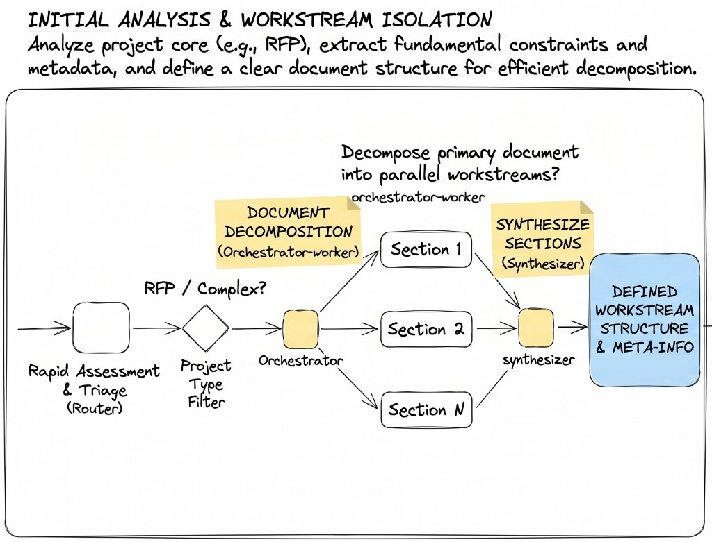

# Maple Street Library — Recepción y Orquestación de RFPs (Ejemplo de clase)

> **Para instructores:** Escenario paralelo de aula para `ai-eng-milestone-agentic-workflows-orchestrate`. Misma columna vertebral (PDF → Markdown, puerta clasificadora, orchestrator-worker-synthesizer, ciclo de vida del ticket). Dominio distinto a los agentes CONTEXT de empresa. El alumnado sigue el brief completo del `README.md` en la raíz del proyecto.

_These instructions are also available in [English](./README.md)._

---

## El reto

**Maple Street Library** recibe solicitudes de subvenciones municipales (PDF) de asociaciones vecinales que piden financiación para programas de lectura. El mostrador de subvenciones está desbordado: cada solicitud necesita aportes de **Programs**, **Facilities** y **Finance** — y nadie sabe, con una lectura rápida, quién debe responder qué.

En una sesión: construye el **primer tramo** de un flujo agéntico que reciba esos PDF, decida si son solicitudes reales de subvención, y reparta el análisis entre workers por departamento antes de que un synthesizer entregue a Ventas un resumen de enrutamiento.

### Nota de alcance

| Proyecto evaluado (`ai-eng-milestone-agentic-workflows-orchestrate`) | Este ejemplo de clase                                               |
| -------------------------------------------------------------------- | ------------------------------------------------------------------- |
| Monorepo de empresa + departamentos / formato RFP del CONTEXT        | Solo mostrador de subvenciones Maple Street                         |
| UI de tickets completa en `uis/backoffice`                           | Subida CLI + archivo JSON de estado                                 |
| MarkItDown + py-readability-metrics en servicios Docker              | Conversor stub + fixture fija de legibilidad                        |
| Stack completo LangGraph + MCP del Hito 8                            | Pipeline mínimo: clasificador → orquestador → workers → synthesizer |
| PR con RFP de ejemplo específica de empresa                          | Demo en vivo + 5 tests automatizados                                |

---

## Columna vertebral (debe cubrirse en vivo)

1. **Ciclo de vida del ticket** — `analizando` → `esperando_aprobación` / `terminado` / `descartado`
2. **PDF → Markdown** antes de cualquier llamada al LLM (lección de coste en tokens)
3. **Puerta clasificadora** — PDF que no es subvención detiene el pipeline; ticket = `descartado`
4. **Metadatos + legibilidad** almacenados por documento (estimación de coste de procesamiento)
5. **Orquestador** descompone el documento en workstreams por departamento
6. **Workers** en paralelo; cada uno devuelve aspectos del departamento + pista de contacto
7. **Synthesizer** fusiona en un resumen orientado a Ventas (sin agente monolítico único)



---

## Departamentos semilla (indicativo)

| Departamento | Responsabilidad del worker                                      |
| ------------ | --------------------------------------------------------------- |
| Programs     | Encaje curricular, audiencia, conflictos de horario             |
| Facilities   | Capacidad de sala, acceso ADA, restricciones fuera de horario   |
| Finance      | Partidas presupuestarias, fondos complementarios, hitos de pago |

Fragmento de subvención de ejemplo (Markdown tras conversión):

```markdown
# Neighborhood Reading Circle — Grant Application 2026

Applicant: Riverside Community Association
Requested amount: $12,400
Programs: weekly story hours for ages 6–10, summer reading kickoff
Facilities: needs Meeting Room B Saturday mornings; wheelchair ramp noted
Finance: 60% upfront, 40% on attendance report; requires 501(c)(3) letter
```

Contraejemplo no-subvención: PDF de carta de restaurante → clasificador → `descartado`.

---

## Qué construir

### 1. Recepción + estado del ticket

- [ ] CLI o endpoint mínimo: ruta PDF → crear id de ticket + estado `analizando`
- [ ] Persistir transiciones de estado en JSON o stub sqlite

### 2. Ingesta

- [ ] Convertir PDF a Markdown (stub OK si el instructor provee sidecar `.md`)
- [ ] Extraer metadatos: solicitante, fecha, departamentos mencionados
- [ ] Adjuntar puntuación de legibilidad (fixture o `py-readability-metrics` real)

### 3. Agente clasificador

- [ ] Salida: `{ "is_grant_application": bool, "confidence": float, "reason": str }`
- [ ] Si false → ticket `descartado`; no invocar orquestador

### 4. Orchestrator-worker-synthesizer

- [ ] Orquestador emite work items: `[{ "department": "Programs", "sections": [...] }, ...]`
- [ ] Un worker por departamento; salida estructurada por worker
- [ ] Synthesizer produce tabla final de enrutamiento para el mostrador de subvenciones

### 5. Tests (`tests/test_grant_orchestration.py`)

| #   | Escenario                                   | Esperado                                     |
| --- | ------------------------------------------- | -------------------------------------------- |
| 1   | PDF de subvención válida                    | Estado `terminado`; synthesizer con 3 deptos |
| 2   | PDF de menú                                 | Estado `descartado`; sin llamadas a workers  |
| 3   | Subvención sin sección Finance              | Worker Finance devuelve "no mencionado"      |
| 4   | Salida del orquestador                      | ≥2 work items paralelos                      |
| 5   | Clasificador + un worker testeados aislados | Solo mocks; sin LLM en vivo                  |

---

## Verificar juntos

- [ ] Estado del ticket coincide con la etapa del pipeline en cada paso
- [ ] Rechazo del clasificador no tumba el sistema
- [ ] Workers reciben contexto acotado (no siempre doc completo — debatir trade-off)
- [ ] Salida del synthesizer legible sin abrir el PDF original
- [ ] Patrón del diagrama visible en la estructura del código (módulos/agentes separados)

---

## Preguntas de discusión

1. ¿Por qué convertir PDF → Markdown antes del clasificador y no después?
2. ¿Cuándo debe el orquestador pasar el documento completo vs. trozos por sección a los workers?
3. ¿Qué pasa si Programs y Finance se contradicen en presupuesto — quién gana en el synthesizer?
4. ¿En qué se diferencia el modo ticket de un job en background sin seguimiento?
