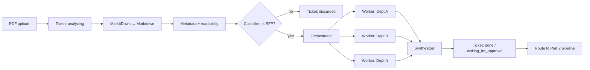

# Milestone 9 Part 1 — RFP Intake & Orchestration — Reference Solution

Reference quality bar for the student's company monorepo fork. Values below are **indicative** — students must align departments, RFP format, and classification criteria with their assigned `CONTEXT-company.md`.

---

## Architecture overview




**Design invariants:**

1. **Convert before classify** — no agent reads raw PDF bytes; Markdown first.
2. **Classifier is a hard gate** — non-RFP stops the flow; ticket must show `discarded` explicitly.
3. **Separate agents** — orchestrator, workers, and synthesizer are distinct nodes/modules, not one prompt pretending to be three roles.
4. **Ticket truth** — UI/API status reflects actual pipeline stage; no optimistic `done`.
5. **CONTEXT fidelity** — department names, RFP sections, and rejection rules come from CONTEXT, not generic defaults.
6. **Scoped worker input** — workers receive orchestrator-assigned slices + shared metadata, not necessarily the full document (document the choice).

---

## Recommended layout (indicative)

| Path                                         | Responsibility                                  |
| -------------------------------------------- | ----------------------------------------------- |
| `uis/backoffice/.../rfp/`                    | Upload UI, ticket list, status polling          |
| `services/rfp_intake/convert.py`             | MarkItDown wrapper; store `.md` artifact        |
| `services/rfp_intake/metrics.py`             | Metadata extraction + py-readability-metrics    |
| `services/rfp_intake/tickets.py`             | Ticket CRUD + status enum                       |
| `services/rfp_intake/agents/classifier.py`   | RFP yes/no structured output                    |
| `services/rfp_intake/agents/orchestrator.py` | Decompose into department workstreams           |
| `services/rfp_intake/agents/workers/`        | One module per CONTEXT department               |
| `services/rfp_intake/agents/synthesizer.py`  | Merge worker outputs → Sales summary            |
| `services/rfp_intake/pipeline.py`            | LangGraph (or equivalent) wiring + routing hook |
| `tests/pipelines/test_rfp_classifier.py`     | Classifier unit tests                           |
| `tests/pipelines/test_rfp_worker_*.py`       | At least one worker unit-tested                 |

---

## Ticket lifecycle

| Status                 | When set                                                   |
| ---------------------- | ---------------------------------------------------------- |
| `analyzing`            | Upload received; conversion + agents running               |
| `waiting_for_approval` | Optional: human review before Part 2 (if CONTEXT requires) |
| `done`                 | Synthesizer output stored; Sales can read routing summary  |
| `discarded`            | Classifier rejected document; pipeline halted              |

Persist: ticket id, original filename, markdown path, metadata JSON, readability scores, classifier result, synthesizer output, timestamps per transition.

---

## Classifier (structured output)

```json
{
  "is_rfp": true,
  "confidence": 0.94,
  "reason": "Contains scope, pricing request, and submission deadline per CONTEXT RFP template.",
  "detected_departments": ["Legal", "Engineering", "Finance"]
}
```

If `is_rfp` is false: set ticket `discarded`, log reason, **do not** enqueue orchestrator. Other tickets continue processing independently.

Unit tests: valid CONTEXT sample RFP, obvious non-RFP (invoice, marketing brochure), edge case (RFP-like but missing mandatory sections per CONTEXT).

---

## Orchestrator-worker-synthesizer

### Orchestrator output (indicative)

```json
{
  "workstreams": [
    {
      "department": "Engineering",
      "section_refs": ["Technical Requirements", "Integration SLA"],
      "prompt_context": "...extracted markdown slices..."
    },
    {
      "department": "Legal",
      "section_refs": ["Compliance", "Data Processing"],
      "prompt_context": "..."
    }
  ]
}
```

### Worker output (per department)

```json
{
  "department": "Engineering",
  "key_aspects": ["48h API uptime SLA", "OAuth2 required"],
  "open_questions": ["Who owns staging credentials?"],
  "suggested_contact_role": "Engineering lead — integrations"
}
```

### Synthesizer output (Sales-facing)

```json
{
  "summary": "RFP from Acme Corp — due 2026-08-01",
  "by_department": [
    {
      "department": "Engineering",
      "needs": ["Confirm integration SLA", "Assign staging owner"],
      "contact": "Engineering lead — integrations"
    }
  ],
  "readability_estimate": "high complexity — allow extra worker time",
  "routing_next": "proposal_generation_queue"
}
```

Workers should run in parallel where the runtime allows; synthesizer waits for all workstreams or handles partial failure explicitly (document behavior).

---

## Readability & metadata

Use `py-readability-metrics` on Markdown body to estimate processing cost (Flesch-Kincaid, Gunning Fog, etc.). Store alongside:

- Client / issuer name (if present)
- Submission deadline
- Departments explicitly mentioned
- Page / word count post-conversion

These fields support Sales triage without opening the PDF.

---

## Routing hook (Part 1 → Part 2)

Part 1 ends with a **routing decision**: validated RFP + synthesizer output enqueued for the next milestone (proposal generation). Implement as:

- Message queue topic, database row flag, or API handoff — document the contract.
- Include ticket id + synthesizer JSON payload so Part 2 is idempotent.

---

## PR evidence checklist

- [ ] Ticket UI upload + live status updates
- [ ] MarkItDown conversion artifact stored
- [ ] Metadata + readability on every processed (non-discarded) document
- [ ] Classifier rejects non-RFP with `discarded` status
- [ ] Orchestrator / workers / synthesizer as separate agents
- [ ] Final output lists per-department needs + contacts (CONTEXT-aligned)
- [ ] Unit tests: classifier + ≥1 worker
- [ ] Sample RFP + pipeline output attached to PR
- [ ] Design questions answered (unknown department, contradictions, false negatives)

---

## Common mistakes

| Mistake                        | Why it fails                                               |
| ------------------------------ | ---------------------------------------------------------- |
| Single agent plays all roles   | Rubric requires orchestrator-worker-synthesizer separation |
| PDF sent directly to LLM       | Token cost + rubric expects MarkItDown first               |
| Silent failure on non-RFP      | Ticket must show explicit `discarded`                      |
| Generic department names       | Must match CONTEXT-company.md                              |
| Status stuck on `analyzing`    | Ticket must reflect real pipeline stage                    |
| No tests for classifier/worker | Required in `tests/pipelines/`                             |

---

## Validation notes

- Run pipeline in Docker test target with sample CONTEXT RFP PDF.
- Upload non-RFP; confirm ticket `discarded` and no worker invocation.
- Verify synthesizer JSON is sufficient for Sales without reading source PDF.
- Confirm parallel workers do not block unrelated ticket processing.
