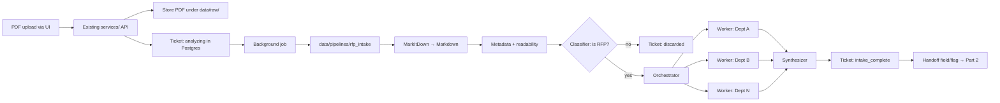
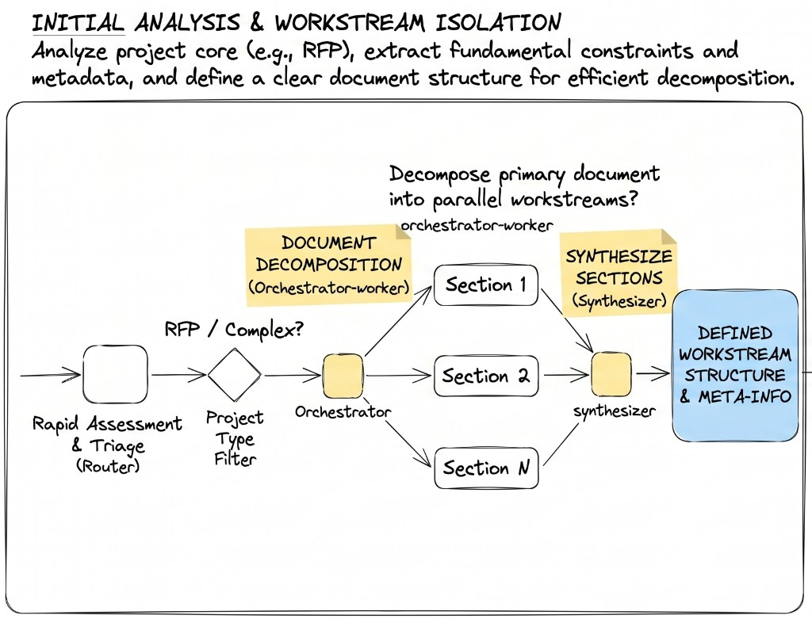

# Milestone 9 Part 1 — RFP Intake & Orchestration — Reference Solution

Reference quality bar for the student's company monorepo fork. Values below are **indicative** — students must align departments, RFP format, and classification criteria with their assigned `CONTEXT-company.md`.

---

## Architecture overview


```mermaid
flowchart LR
  UP[PDF upload via UI] --> API[Existing services/ API]
  API --> RAW[Store PDF under data/raw/]
  API --> TICKET[Ticket: analyzing in Postgres]
  TICKET --> BG[Background job]
  BG --> PIPE[data/pipelines/rfp_intake]
  PIPE --> MD[MarkItDown → Markdown]
  MD --> META[Metadata + readability]
  META --> CLS{Classifier: is RFP?}
  CLS -->|no| DISC[Ticket: discarded]
  CLS -->|yes| ORCH[Orchestrator]
  ORCH --> W1[Worker: Dept A]
  ORCH --> W2[Worker: Dept B]
  ORCH --> WN[Worker: Dept N]
  W1 --> SYN[Synthesizer]
  W2 --> SYN
  WN --> SYN
  SYN --> DONE[Ticket: intake_complete]
  DONE --> ROUTE[Handoff field/flag → Part 2]
```



**Design invariants:**

1. **One backend** — extend existing `services/` API; no second HTTP service. Standalone CLIs → `scripts/`.
2. **Pipeline owns the graph** — LangGraph (or equivalent) lives under `data/pipelines/rfp_intake/`; routers only create tickets, enqueue, and query Postgres.
3. **Postgres source of truth** — Ticket, RFP metadata, and `key_aspects` in Supabase/PostgreSQL (SQLModel). Not TinyDB / JSON-as-DB.
4. **PDF via UI → `data/raw/`** — runtime artifact of intake; test with CONTEXT `rfp-requests/` uploaded through the UI.
5. **Convert before classify** — no agent reads raw PDF bytes; Markdown first (MarkItDown or documented equivalent).
6. **Classifier is a hard gate** — non-RFP → `discarded`; do not enqueue orchestrator.
7. **Separate agents** — orchestrator, workers, synthesizer are distinct nodes — dedicated `rfp_intake` graph, not bolted onto CX.
8. **Async upload** — `POST` returns quickly (`202` + `ticket_id`); pipeline runs in background; UI polls status.
9. **Part 1 statuses only** — `analyzing` → `intake_complete` | `discarded`. `waiting_for_approval` is Part 3.
10. **Scoped worker input** — metadata + department extracts; never invent missing volumes/figures.

---

## Recommended layout (indicative)

| Path                                          | Responsibility                                          |
| --------------------------------------------- | ------------------------------------------------------- |
| `uis/backoffice/.../rfp/`                     | Upload UI, ticket list, status polling                  |
| `services/.../routers/rfp.py` (or equivalent) | Upload + GET ticket on **existing** API; calls pipeline |
| `data/pipelines/rfp_intake/`                  | LangGraph wiring, convert, agents, routing hook         |
| `data/pipelines/rfp_intake/convert.py`        | MarkItDown wrapper; `.md` artifact path                 |
| `data/pipelines/rfp_intake/metrics.py`        | Metadata + py-readability-metrics                       |
| `data/pipelines/rfp_intake/models.py`         | SQLModel: Ticket, RFP metadata, DepartmentSection       |
| `data/pipelines/rfp_intake/agents/`           | classifier, orchestrator, workers/, synthesizer         |
| `data/raw/rfp/` (or similar)                  | Uploaded PDFs (runtime)                                 |
| `scripts/rfp_intake_smoke.py`                 | Optional CLI smoke / reprocess — not a second API       |
| `tests/pipelines/test_rfp_classifier.py`      | Classifier unit tests                                   |
| `tests/pipelines/test_rfp_worker_*.py`        | At least one worker unit-tested                         |

Reuse LiteLLM / structured-output patterns from Milestone 8; keep the **graph** separate.

---

## Ticket lifecycle (Part 1)

| Status            | When set                                                                      |
| ----------------- | ----------------------------------------------------------------------------- |
| `analyzing`       | Upload received; PDF in `data/raw/`; background pipeline started              |
| `discarded`       | Classifier rejected document; pipeline halted                                 |
| `intake_complete` | Synthesizer output + `key_aspects` stored in Postgres; Sales can read summary |

Do **not** set `waiting_for_approval` in Part 1. Part 2 uses `drafting` / `under_evaluation`; Part 3 uses `waiting_for_approval` → `done`.

Persist in PostgreSQL: ticket id, `raw_pdf_path`, markdown path, metadata JSON/columns, readability scores, classifier result, per-department `key_aspects`, synthesizer summary, timestamps per transition.

---

## Classifier (structured output)

```json
{
  "is_rfp": true,
  "confidence": 0.94,
  "reason": "Contains scope, pricing request, and submission deadline per CONTEXT RFP template.",
  "detected_departments": ["operaciones", "procurement"]
}
```

If `is_rfp` is false: set ticket `discarded`, log reason, **do not** enqueue orchestrator. Other tickets continue independently.

Unit tests: CONTEXT formal RFP, informal RFP, invalid reject (and HealthCore PHI case if assigned).

---

## Orchestrator-worker-synthesizer

### Orchestrator output (indicative)

```json
{
  "workstreams": [
    {
      "department": "warehouse",
      "section_refs": ["Storage requirements", "SKU volume"],
      "prompt_context": "...extracted markdown slices..."
    }
  ]
}
```

### Worker output (per department)

```json
{
  "department": "warehouse",
  "key_aspects": ["Needs ambient + cold storage for 5k orders/mo"],
  "open_questions": ["Peak season volume not stated"],
  "suggested_contact_role": "Warehouse Operations — Ana Whitfield"
}
```

### Synthesizer output (Sales-facing)

```json
{
  "summary": "RFP from ModaViva — due 2026-08-01",
  "by_department": [
    {
      "department": "warehouse",
      "needs": ["Confirm pallet capacity", "Clarify peak volume"],
      "contact": "Warehouse Operations — Ana Whitfield"
    }
  ],
  "readability_estimate": "high complexity — allow extra worker time",
  "routing_next": "proposal_generation_queue"
}
```

Workers run in parallel where the runtime allows; synthesizer waits for all workstreams or documents partial failure. Missing figures → `open_questions`, never invented numbers.

---

## Readability & metadata

Use `py-readability-metrics` on Markdown body. Store alongside CONTEXT-required metadata fields in Postgres.

---

## Routing hook (Part 1 → Part 2)

Part 1 ends with **routing**: validated RFP + synthesizer output ready for Part 2. Implement as DB flag/field, queue topic, or documented handoff — **still the same API**. Include ticket id + synthesizer payload so Part 2 is idempotent.

---

## PR evidence checklist

- [ ] Same backend only; pipeline under `data/pipelines/rfp_intake/`
- [ ] Ticket + metadata + key aspects in PostgreSQL (Supabase)
- [ ] UI upload → PDF under `data/raw/` + async status polling
- [ ] Statuses: `analyzing` → `intake_complete` | `discarded`
- [ ] MarkItDown (or equivalent) conversion artifact
- [ ] Classifier rejects non-RFP with `discarded`
- [ ] Orchestrator / workers / synthesizer as separate agents
- [ ] Routing handoff: `ticket_id` + synthesizer payload ready for Part 2
- [ ] Final output lists per-department needs + contacts (CONTEXT-aligned)
- [ ] Unit tests: classifier + ≥1 worker
- [ ] Sample CONTEXT RFP + pipeline output attached to PR

---

## Common mistakes

| Mistake                                     | Why it fails                                |
| ------------------------------------------- | ------------------------------------------- |
| New FastAPI/Flask app for RFP               | Must extend existing `services/` backend    |
| Graph under `services/` only                | Pipeline logic belongs in `data/pipelines/` |
| TinyDB / JSON as ticket store               | Postgres/Supabase required                  |
| Sync `POST` runs full pipeline              | Timeouts; must be async + poll              |
| `waiting_for_approval` after Part 1 success | That status is Part 3 HITL                  |
| Single agent plays all roles                | Rubric requires separation                  |
| PDF sent directly to LLM                    | Convert first                               |
| Silent failure on non-RFP                   | Explicit `discarded`                        |
| Invented volumes in workers                 | Use `open_questions`                        |
| Generic department names                    | Must match CONTEXT                          |

---

## Validation notes

- Run pipeline via Docker/test target; upload CONTEXT sample PDFs through UI.
- Upload non-RFP; confirm `discarded` and no worker invocation.
- Confirm rows in Postgres for ticket / metadata / key_aspects.
- Confirm PDF path under `data/raw/` and synthesizer JSON enough for Sales without opening the PDF.
- Confirm parallel workers do not block unrelated tickets.
