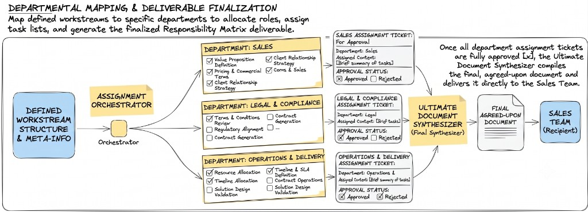

# Maple Street Library — Grant Approval & Final Document (Class Example)

> **For instructors:** Parallel classroom scenario for `ai-eng-milestone-agentic-workflows-produce`. Same spine (scoped `interrupt`/`resume`, checkpointer, per-department approval, arbitration, ultimate synthesizer → Sales). Continues Maple Street grant desk from Parts 1–2 class examples. Students still follow the full brief in the project root `README.md`.

_Estas instrucciones también están disponibles en [español](./README.es.md)._

---

## The challenge

Parts 1–2 already drafted and self-evaluated Programs / Facilities / Finance sections. Now: **humans** must approve each department ticket before the **ultimate document synthesizer** ships one final grant response to the grants desk (Sales analog).

Pause only the waiting branch. Persist with a checkpointer. Resume without restarting. Arbitrate contradictions. Trace every node.

### Scope note

| Graded project (`ai-eng-milestone-agentic-workflows-produce`) | This class example                |
| ------------------------------------------------------------- | --------------------------------- |
| Company monorepo + CONTEXT approval hierarchy                 | Maple Street grant desk only      |
| Full Parts 1–2 pipeline                                       | Fixture Part 2 assignment tickets |
| SQLite/Postgres checkpointer                                  | SQLite file checkpointer          |
| Full `uis/backoffice` approval UI                             | CLI approve/reject + JSON ticket  |
| End-to-end company RFP                                        | Mini E2E with fixtures + 5 tests  |

---

## Teaching spine (must hit live)

1. Per-department **assignment ticket** awaiting human approval
2. Scoped **`interrupt`** — only that department branch pauses
3. **Checkpointer** + namespaced `thread_id` (e.g. `grant-{ticket_id}`)
4. Explicit **`resume`** with validated human payload: approve / reject / request_changes
5. **Arbitration node** when two departments disagree
6. Iteration limit on post-reject loops
7. When all approved → **ultimate synthesizer** → final document → grants desk
8. Node trace log: agent, input, output, timestamp

---

## What to build

### 1. Human-in-the-loop

- [ ] Interrupt before each department approval
- [ ] Resume entrypoint validates human decision
- [ ] Reject / request_changes routes back toward Part 2 generator (or documented path)

### 2. Control

- [ ] Arbitration node for contradictory department outputs
- [ ] `max_iterations` on remaining cross-department loops
- [ ] Append-only execution trace in state

### 3. Produce

- [ ] Ultimate synthesizer runs **only** when all tickets approved
- [ ] Ticket status → `done`; final `.md`/`.pdf` path stored

### 4. Tests (`tests/test_grant_produce.py`)

| #   | Scenario                          | Expect                                       |
| --- | --------------------------------- | -------------------------------------------- |
| 1   | Approve all three                 | Final document generated; ticket `done`      |
| 2   | Interrupt + resume Finance        | State resumes; Programs not restarted        |
| 3   | Reject Facilities                 | No synthesizer; section returns for revision |
| 4   | Programs vs Finance contradiction | Arbitration node fires                       |
| 5   | Iteration limit                   | Loop stops; trace shows limit                |

---

## Verify together

- [ ] One department waiting does not freeze others
- [ ] Resume ≠ full restart
- [ ] Synthesizer never runs with a pending approval
- [ ] Trace lists agents in order for the run

---

## Discussion questions

1. Guardrail vs interrupt — which cases never need a human?
2. How do you namespace `thread_id` for concurrent grants?
3. Minimum UI fields for confident approval without rereading the whole draft?
