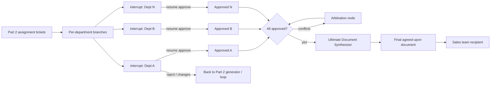

# Milestone 9 Part 3 — Approval & Document Completion — Reference Solution

Reference quality bar for the student's company monorepo fork. Values below are **indicative** — students must align approval hierarchy and final document format with their assigned `CONTEXT-company.md`.

---

## Architecture overview




**Design invariants:**

1. **Human ≠ evaluator** — Part 2 auto-eval is not sign-off; Part 3 requires real HITL.
2. **Scoped interrupt** — pause only the department branch waiting on approval.
3. **Durable pause** — checkpointer (SQLite/Postgres) before interrupt; resume from checkpoint.
4. **Resume is an entrypoint** — validated human payload; not a full graph restart.
5. **Explicit arbitration** — disagreements go to a dedicated node, not agent freestyle.
6. **Synthesize last** — final document only when every required department is approved.
7. **One continuous ticket** — Part 1→2→3 shares identity, statuses, and artifacts.

---

## Recommended layout (indicative)

| Path                                       | Responsibility                            |
| ------------------------------------------ | ----------------------------------------- |
| `services/rfp_produce/approval.py`         | Interrupt payloads + resume validation    |
| `services/rfp_produce/checkpointer.py`     | SQLite/Postgres checkpointer wiring       |
| `services/rfp_produce/arbitration.py`      | Explicit conflict resolution node         |
| `services/rfp_produce/synthesizer.py`      | Ultimate document consolidation           |
| `services/rfp_produce/trace.py`            | Append agent/input/output/timestamp       |
| `services/rfp_intake/tickets.py`           | Extend statuses + approval UI fields      |
| `uis/backoffice/.../approvals/`            | Per-department approve / reject / changes |
| `tests/pipelines/test_interrupt_resume.py` | Interrupt + resume                        |
| `tests/pipelines/test_arbitration.py`      | Disagreement path                         |
| `tests/pipelines/test_iteration_limit.py`  | Cap enforcement                           |

---

## Ticket lifecycle (Part 3)

| Status               | When set                                     |
| -------------------- | -------------------------------------------- |
| `awaiting_approval`  | ≥1 department interrupt pending              |
| `partially_approved` | Some departments approved; others still open |
| `needs_revision`     | Reject / request_changes on a section        |
| `arbitrating`        | Explicit arbitration node running            |
| `producing`          | Ultimate synthesizer running                 |
| `done`               | Final document stored and linked on ticket   |

Department-level approval status lives on each assignment ticket: `pending` / `approved` / `rejected` / `changes_requested`.

---

## Interrupt / resume contract

### Interrupt payload (shown to human)

```json
{
  "ticket_id": "rfp-1042",
  "department": "Legal",
  "section_summary": "…",
  "evaluation_snapshot": { "passed": true, "iterations": 1 },
  "actions": ["approve", "reject", "request_changes"]
}
```

### Resume payload (validated before re-entering graph)

```json
{
  "department": "Legal",
  "decision": "approve",
  "actor": "legal.approver@company",
  "comment": "OK to proceed",
  "requested_changes": null
}
```

Reject / `request_changes` should route back to Part 2 generation for that department (document the edge). Do not invent silent auto-approve.

**Thread id:** namespace per RFP, e.g. `rfp-{ticket_id}` or `rfp-{ticket_id}:{department}` if you checkpoint branches separately — document the choice and prove concurrent RFPs do not collide.

---

## Arbitration

Trigger when structured contradiction detectors fire (e.g. Finance price ≠ Sales quoted price; Legal forbids a clause Operations included).

Arbitration node output (indicative):

```json
{
  "conflict_id": "price-mismatch-01",
  "departments": ["Sales", "Finance"],
  "rule": "CONTEXT_ARBITRATION_FINANCE_OWNS_NUMBERS",
  "resolution": "Rewrite Sales section to match Finance figure",
  "next": "request_changes:Sales"
}
```

Agents must not “vote among themselves” as the resolution mechanism.

---

## Ultimate synthesizer

Runs only when every required CONTEXT department shows `approved`:

1. Concatenate / template approved sections into CONTEXT final-document format.
2. Attach approval metadata (who, when) and execution trace reference.
3. Store artifact; set ticket `done`; expose download/link in backoffice.

Never synthesize with a pending or rejected department.

---

## Traceability

Every node appends:

```json
{
  "ts": "2026-07-17T20:15:00Z",
  "agent": "ultimate_synthesizer",
  "input_ref": "approved_sections_v3",
  "output_ref": "final_doc_rfp-1042.md"
}
```

Enough to answer “which agent did what, in what order” for one run without digging through logs by hand.

---

## End-to-end continuity checklist

- [ ] Same ticket id from Part 1 upload through Part 3 `done`
- [ ] Status vocabulary continuous (no orphan statuses between parts)
- [ ] Part 2 drafts are the ones humans approve (no regenerated silent swap)
- [ ] Messages / UI copy consistent across handoffs
- [ ] One sample RFP documented in PR: input → approvals → final doc

---

## PR evidence checklist

- [ ] Scoped interrupt per department + durable checkpointer
- [ ] Resume entrypoint with validated human decisions
- [ ] Other departments progress while one waits
- [ ] Arbitration node + iteration limit in code
- [ ] Per-node trace with agent/input/output/timestamp
- [ ] Final document only after all approvals
- [ ] Ticket `done` + accessible artifact
- [ ] E2E sample across Parts 1–3
- [ ] Tests: interrupt/resume, iteration limit, arbitration
- [ ] CONTEXT approval hierarchy + final format honored

---

## Common mistakes

| Mistake                                | Why it fails                          |
| -------------------------------------- | ------------------------------------- |
| Treating Part 2 eval as approval       | Rubric requires real HITL             |
| Global graph pause on one interrupt    | Must be branch-scoped                 |
| In-memory checkpointer in “prod” tests | State lost across process restarts    |
| Resume = re-invoke from start          | Must continue from checkpoint         |
| Agents resolve conflicts alone         | Need explicit arbitration node        |
| Synthesize with pending approvals      | Final doc must wait for full sign-off |
| Broken Part 1→2→3 handoff              | E2E continuity is graded              |

---

## Validation notes

- Simulate approve on two departments while third remains interrupted; confirm first two continue / complete their branches.
- Reject one section; confirm synthesizer does not run and revision path is taken.
- Force a Finance/Sales contradiction; confirm arbitration node executes and is traced.
- Restart the process mid-interrupt; resume from checkpointer without replaying Part 1.
