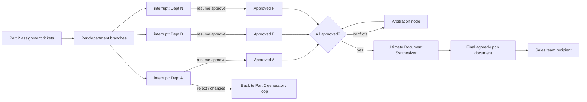

# Milestone 9 Part 3 — Approval & Document Completion — Reference Solution

Reference quality bar for the student's company monorepo fork. Values below are **indicative** — students must align department approvers, CONTEXT conflict triggers / fixed arbiter, and final document format with their assigned `CONTEXT-company.md`.

---

## Architecture overview


```mermaid
flowchart LR
  P2[Part 2 assignment tickets] --> BR[Per-department branches]
  BR --> I1[interrupt: Dept A]
  BR --> I2[interrupt: Dept B]
  BR --> IN[interrupt: Dept N]
  I1 -->|resume approve| A1[Approved A]
  I2 -->|resume approve| A2[Approved B]
  IN -->|resume approve| AN[Approved N]
  I1 -->|reject / changes| LOOP[Back to Part 2 generator / loop]
  A1 --> GATE{All approved?}
  A2 --> GATE
  AN --> GATE
  GATE -->|conflicts| ARB[Arbitration node]
  ARB --> GATE
  GATE -->|yes| SYN[Ultimate Document Synthesizer]
  SYN --> DOC[Final agreed-upon document]
  DOC --> SALES[Sales team recipient]
```


**Design invariants:**

1. **Human ≠ evaluator** — Part 2 auto-eval is not sign-off; Part 3 requires real HITL.
2. **Scoped interrupt** — pause only the department branch waiting on approval.
3. **Durable pause** — checkpointer (SQLite/Postgres) before interrupt; resume from checkpoint.
4. **Resume is an entrypoint** — validated human payload; not a full graph restart.
5. **Explicit arbitration** — CONTEXT conflict triggers → fixed arbiter (named human / deterministic rule); not LLM freestyle among agents.
6. **Namespaced `thread_id`** — e.g. `rfp-{ticket_id}` (optionally `:{department}`); concurrent tickets never share a checkpoint.
7. **Synthesize last** — final document only when every required department is approved.
8. **One continuous ticket** — Part 1→2→3 shares identity, statuses, and artifacts.
9. **Reproducible E2E** — fixture + script/integration test with simulated resumes; not UI-click-only evidence.

---

## Recommended layout (indicative)

| Path                                                    | Responsibility                                                    |
| ------------------------------------------------------- | ----------------------------------------------------------------- |
| `data/pipelines/rfp_produce/` (or extend `rfp_intake/`) | Interrupt, checkpointer, arbitration, ultimate synthesizer, trace |
| `data/pipelines/rfp_produce/approval.py`                | Interrupt payloads + resume validation                            |
| `data/pipelines/rfp_produce/checkpointer.py`            | SQLite/Postgres checkpointer wiring                               |
| `data/pipelines/rfp_produce/arbitration.py`             | Explicit conflict resolution node                                 |
| `data/pipelines/rfp_produce/synthesizer.py`             | Ultimate document consolidation                                   |
| `data/pipelines/rfp_produce/trace.py`                   | Append agent/input/output/timestamp                               |
| `services/.../routers/rfp.py`                           | Same existing API — approve/reject/resume + GET ticket            |
| `uis/backoffice/.../approvals/`                         | Per-department approve / reject / changes                         |
| `tests/pipelines/test_interrupt_resume.py`              | Interrupt + resume                                                |
| `tests/pipelines/test_arbitration.py`                   | CONTEXT trigger → fixed arbiter path                              |
| `tests/pipelines/test_iteration_limit.py`               | Cap enforcement                                                   |
| `tests/pipelines/test_parallel_interrupt.py`            | Approve B while A still interrupted                               |
| `tests/pipelines/test_e2e_produce.py` or `scripts/`     | Fixture + simulated resumes E2E                                   |

---

## Ticket lifecycle (Part 3)

| Status                 | When set                                            |
| ---------------------- | --------------------------------------------------- |
| `waiting_for_approval` | ≥1 department interrupt pending (Part 3 human gate) |
| `partially_approved`   | Some departments approved; others still open        |
| `needs_revision`       | Reject / request_changes on a section               |
| `arbitrating`          | Explicit arbitration node running                   |
| `producing`            | Ultimate synthesizer running                        |
| `done`                 | Final document stored and linked on ticket          |

Department-level approval status lives on each assignment ticket: `pending` / `approved` / `rejected` / `changes_requested`.

---

## Interrupt / resume contract

### Interrupt payload (shown to human)

```json
{
  "ticket_id": "rfp-1042",
  "department": "Legal",
  "section_summary": "…",
  "evaluation_snapshot": { "passed": true, "iterations": 1 },
  "actions": ["approve", "reject", "request_changes"]
}
```

### Resume payload (validated before re-entering graph)

```json
{
  "department": "Legal",
  "decision": "approve",
  "actor": "legal.approver@company",
  "comment": "OK to proceed",
  "requested_changes": null
}
```

Reject / `request_changes` should route back to Part 2 generation for that department (document the edge). Do not invent silent auto-approve.

**Thread id (required):** namespace per ticket, e.g. `rfp-{ticket_id}` or `rfp-{ticket_id}:{department}` if you checkpoint branches separately. Concurrent tickets must not collide — this is graded, not optional.

---

## Arbitration

Implement the **trigger ids and fixed arbiters** from your CONTEXT §7 (TrackFlow / Brasaland / Nexova / HealthCore). Detect contradictions in structured state; route to the named human or deterministic rule — never LLM consensus.

Arbitration node output (indicative):

```json
{
  "conflict_id": "volume-vs-capacity",
  "departments": ["warehouse", "lastmile"],
  "arbiter": "miguel.torres",
  "rule": "CONTEXT_ARBITRATION_CAP_TO_WAREHOUSE",
  "resolution": "Cap lastmile volume to warehouse capacity; request_changes:lastmile",
  "next": "request_changes:lastmile"
}
```

Agents may surface a conflict; they must not resolve it by free-form voting.

---

## Ultimate synthesizer

Runs only when every required CONTEXT department shows `approved`:

1. Concatenate / template approved sections into CONTEXT final-document format.
2. Attach approval metadata (who, when) and execution trace reference.
3. Store artifact; set ticket `done`; expose download/link in backoffice.

Never synthesize with a pending or rejected department.

---

## Traceability

Every node appends:

```json
{
  "ts": "2026-07-17T20:15:00Z",
  "agent": "ultimate_synthesizer",
  "input_ref": "approved_sections_v3",
  "output_ref": "final_doc_rfp-1042.md"
}
```

Enough to answer “which agent did what, in what order” for one run without digging through logs by hand.

---

## End-to-end continuity checklist

- [ ] Same ticket id from Part 1 upload through Part 3 `done`
- [ ] Status vocabulary continuous (no orphan statuses between parts)
- [ ] Part 2 drafts are the ones humans approve (no regenerated silent swap)
- [ ] Messages / UI copy consistent across handoffs
- [ ] One sample RFP documented in PR: input → approvals → final doc
- [ ] Reproducible fixture/script or integration test linked (simulated resumes)

---

## PR evidence checklist

- [ ] Scoped interrupt per department + durable checkpointer
- [ ] Resume entrypoint with validated human decisions
- [ ] Test/trace: approve B while A still interrupted
- [ ] `thread_id` namespaced by ticket (and dept if applicable)
- [ ] Arbitration on CONTEXT triggers + fixed arbiter + iteration limit
- [ ] Per-node trace with agent/input/output/timestamp
- [ ] Final document only after all approvals
- [ ] Ticket `done` + accessible artifact
- [ ] Reproducible E2E/fixture with simulated approvals (script or integration test)
- [ ] E2E sample across Parts 1–3 linked in PR
- [ ] Tests: interrupt/resume, iteration limit, arbitration, parallel-under-interrupt
- [ ] CONTEXT approvers + §7 arbitration + final format honored

---

## Common mistakes

| Mistake                                   | Why it fails                           |
| ----------------------------------------- | -------------------------------------- |
| Treating Part 2 eval as approval          | Rubric requires real HITL              |
| Global graph pause on one interrupt       | Must be branch-scoped                  |
| Serial fake-parallelism                   | Need approve-B-while-A-paused proof    |
| Shared `thread_id` across tickets         | Concurrent runs corrupt checkpoints    |
| In-memory checkpointer in “prod” tests    | State lost across process restarts     |
| Resume = re-invoke from start             | Must continue from checkpoint          |
| Arbitration node without CONTEXT triggers | Decorative stub; fails rubric          |
| Agents resolve conflicts alone            | Fixed arbiter / rules required         |
| Invented multi-level hierarchy            | Use CONTEXT owners only (+ CEO if any) |
| Manual-only E2E (no fixture script)       | Review must be reproducible            |
| Synthesize with pending approvals         | Final doc must wait for full sign-off  |
| Broken Part 1→2→3 handoff                 | E2E continuity is graded               |

---

## Validation notes

- **Required test:** approve department B while A remains interrupted; confirm B completes and A stays paused.
- Reject one section; confirm synthesizer does not run and revision path is taken.
- Force a CONTEXT §7 trigger (e.g. TrackFlow `volume-vs-capacity`); confirm arbitration node + fixed arbiter path execute and are traced.
- Run fixture E2E with programmatic resumes; no dependency on live UI clicks for CI/review.
- Restart the process mid-interrupt; resume from checkpointer without replaying Part 1.
- Two concurrent tickets with distinct `thread_id`s; confirm checkpoints do not collide.
