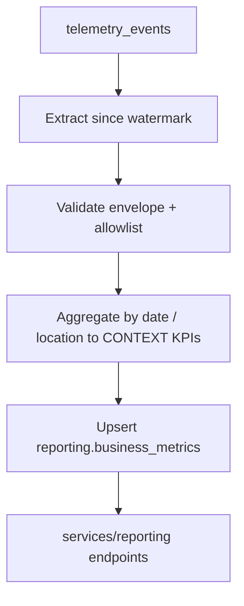

# Pipeline Design Document — Business Performance Pipeline (Reference Excerpt)

> Instructor/evaluator reference only. Student deliverable: `data/pipelines/PIPELINE_DESIGN.md` in the company monorepo. KPIs and deliverable must come from the company data-pipelines CONTEXT.

## Current State

We capture inventory telemetry events (`inbound_order_created`, `outbound_order_created`, `direct_stock_edit_rejected`, `order_validation_failed`, `stock_threshold_triggered`) into `public.telemetry_events` via `POST /telemetry/events`. `services/telemetry/analysis.py` + `GET /telemetry/report` answer engineering questions (volume, errors, latency). They stay unchanged.

**Gap:** no auditable business rollup for the weekly executive report scoped in CONTEXT (purchase cost, waste, stockouts per location).

**Limitations of ad-hoc attempts:**

- No run log — cannot tell if a partial aggregate was written before a crash.
- Full-table scan every run — does not scale as event volume grows.
- Re-running duplicates reporting rows; no watermark or `run_id`.
- Late-arriving events for a prior day are missed until someone manually re-runs.

## Purpose

Produce the daily rollup that feeds the weekly executive location cost & waste report by computing CONTEXT KPIs into `reporting.business_metrics` from mandatory telemetry metrics — without changing `telemetry_events` or `GET /telemetry/report`.

## Extraction Format

| Attribute | Value                                                                  |
| --------- | ---------------------------------------------------------------------- |
| Source    | `public.telemetry_events` (Supabase Postgres)                          |
| Format    | JSON `properties` column + Event Envelope fields                       |
| Refresh   | Near-real-time inserts; pipeline runs nightly at 02:00 UTC             |
| Window    | Events where `timestamp > last_watermark` and `eventName` in allowlist |

## Data Flow Diagram

Dedup/idempotency enforced at **E** via upsert keys. Watermark advanced only after successful load. Technical report path (`GET /telemetry/report`) remains a separate read of `telemetry_events`.

## Update / Dedup Strategy

- **Event-level:** skip rows whose `eventId` already exists in `pipeline.processed_event_ids` (insert-on-conflict-do-nothing).
- **Aggregate-level:** upsert `reporting.business_metrics` on `(report_date, location_id)` — recomputes KPIs when late events arrive within the 7-day reprocess window.

## Idempotency Plan

1. Start run → insert `pipeline_runs` row with `status = running`, `run_id`.
2. Extract/transform write to `staging.*` tagged with `run_id`.
3. Load executes single transaction: upsert `reporting.business_metrics`, insert processed `eventId`s, update watermark.
4. On load failure: transaction rolls back; `pipeline_runs.status = failed`, checkpoint = `pre_load`. Retry reuses staging if still valid, otherwise re-extracts same window — upsert prevents duplicate reporting rows.

## Execution Log

| Field            | Type        | Justification                                  |
| ---------------- | ----------- | ---------------------------------------------- |
| `run_id`         | UUID        | Trace one execution across Prefect logs and DB |
| `started_at`     | timestamptz | Incident timeline                              |
| `finished_at`    | timestamptz | Duration / SLA monitoring                      |
| `watermark_from` | timestamptz | Audit processed range start                    |
| `watermark_to`   | timestamptz | Audit processed range end                      |
| `rows_extracted` | integer     | Detect empty windows                           |
| `rows_loaded`    | integer     | Reconcile with `reporting.business_metrics`    |
| `status`         | enum        | Alerting automation                            |
| `error_summary`  | text        | Ops-readable failure reason                    |

## Prefect Mapping

| Concept | Name                             | Role                                                   |
| ------- | -------------------------------- | ------------------------------------------------------ |
| Flow    | `business_performance_etl_flow`  | Scheduled orchestration                                |
| Flow    | `backfill_business_metrics_flow` | Manual date-range reprocess                            |
| Task    | `extract_telemetry_events`       | Query Supabase since watermark                         |
| Task    | `transform_business_kpis`        | Validate + aggregate to CONTEXT KPI grain              |
| Task    | `load_business_metrics`          | Transactional upsert + watermark advance               |
| States  | Running / Completed / Failed     | Per flow run; Failed preserves checkpoint              |
| Block   | `SupabaseCredentials`            | DB connection string + service role key                |
| Block   | `PipelineConfig`                 | Watermark table, batch size, reprocess window (7 days) |

## Application Integration (design only)

| Endpoint                          | Calls                                                  |
| --------------------------------- | ------------------------------------------------------ |
| `GET /reporting/business-metrics` | `get_business_metrics()` in `data/pipelines/`          |
| `POST /reporting/pipeline/run`    | `business_performance_etl_flow()` in `data/pipelines/` |
