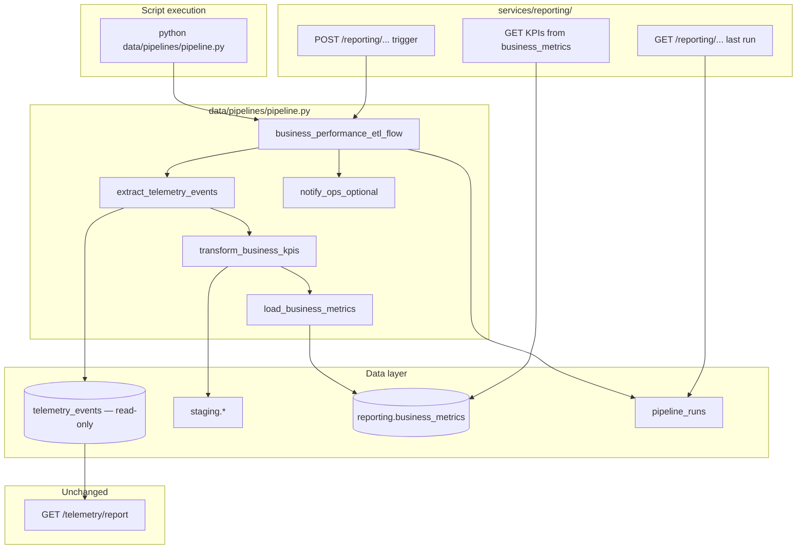

# Milestone 6 — Implementing a Resilient Business Performance Pipeline (2/3) — Reference Solution

This reference solution defines the expected quality bar for deliverables in the student's company monorepo fork:

- `data/pipelines/pipeline.py` — Prefect flows and tasks
- `services/reporting/` — API endpoints that query or trigger the pipeline
- CLI entry point so the pipeline runs via `python data/pipelines/pipeline.py`
- Execution metadata persisted per run
- Idempotent writes into `reporting.business_metrics`

The deliverable is **runnable orchestration code** that implements the student's approved `data/pipelines/PIPELINE_DESIGN.md` and the company **[data-pipelines CONTEXT](https://github.com/4GeeksAcademy/ai-engineering-syllabus/tree/main/content/contexts/06-telemetry-data-pipelines/data-pipelines)**.

**Hard constraint:** do not modify `telemetry_events` write paths, `services/telemetry/analysis.py`, or `GET /telemetry/report`.

---

## Solution architecture



**Component boundaries:**

| Layer                               | Responsibility                                                                                  |
| ----------------------------------- | ----------------------------------------------------------------------------------------------- |
| `data/pipelines/pipeline.py`        | Prefect `@flow` / `@task`, resilience config, idempotent load into `reporting.business_metrics` |
| `services/reporting/`               | HTTP surface — imports flows/functions from `data/pipelines/`; no duplicated ETL logic          |
| `pipeline_runs` (or structured log) | Per-run metadata: start, end, rows processed, status, errors                                    |

---

## Expected file structure

```
data/
  pipelines/
    pipeline.py          # Main entry point — at least one @flow, 3+ @task
    PIPELINE_DESIGN.md   # Student's approved design (from Part 1)
  raw/                   # Input snapshots / intermediate files
  process/               # Reusable transform helpers
  eval/                  # Pipeline validation outputs
services/
  reporting/             # status + trigger (+ KPI query) endpoints
  telemetry/             # untouched — technical report stays here
```

---

## Prefect resilience patterns (reference)

### Retries on external I/O

```python
@task(retries=3, retry_delay_seconds=30)
def extract_telemetry_events(watermark_from: datetime) -> list[dict]:
    # 3 retries: absorbs transient DB/API blips without paging on-call.
    ...
```

### Optional task with partial failure tolerance

```python
@task
def notify_ops_optional(summary: dict) -> None:
  ...

@flow
def business_performance_etl_flow():
    ...
    notify_ops_optional(summary, return_state=True)  # flow continues if Slack/webhook fails
```

### Explicit failure handling

```python
@task
def export_csv_optional(rows: list[dict]) -> str | None:
    ...

@flow
def business_performance_etl_flow():
    state = export_csv_optional(rows, return_state=True)
    if state.is_failed():
        logger.warning("CSV export skipped — non-critical")
        path = None
    else:
        path = state.result()
```

### Caching expensive transform

```python
def transform_cache_key(ctx, parameters):
    return f"{parameters['watermark_from']}-{parameters['watermark_to']}"

@task(
    cache_key_fn=transform_cache_key,
    cache_expiration=timedelta(hours=1),
)
def transform_business_kpis(rows: list[dict], ...) -> list[dict]:
    # Cache key = processed window; valid 1h per ticket (skip repeat within hour).
    ...
```

---

## Idempotency and execution log

**Load phase** must use the strategy from `PIPELINE_DESIGN.md` + CONTEXT unique constraint — typical pattern:

- Upsert on business grain into `reporting.business_metrics` (e.g. `(report_date, location_id)`)
- `ON CONFLICT DO UPDATE` for KPI columns
- Watermark advanced only after successful load commit

**Minimum metadata per run** (≥5 fields):

| Field               | Example                                               |
| ------------------- | ----------------------------------------------------- |
| `started_at`        | `2026-06-24T02:00:01Z`                                |
| `finished_at`       | `2026-06-24T02:03:12Z`                                |
| `records_processed` | `1842`                                                |
| `status`            | `success` / `failed` / `partial`                      |
| `error_summary`     | `null` or `"load_business_metrics: connection reset"` |

Persist in `pipeline_runs` table or structured JSON log under `data/eval/`.

---

## Script-based execution

```python
if __name__ == "__main__":
    business_performance_etl_flow()
```

```bash
python data/pipelines/pipeline.py
```

Document schedule + run command in `PIPELINE_DESIGN.md` (aligned with CONTEXT reporting cadence).

---

## Expected API surface (`services/reporting/`)

Endpoints follow existing monorepo auth and RESPONSE shape from CONTEXT.

### Last run metadata

```json
{
  "run_id": "a1b2c3d4-e5f6-7890-abcd-ef1234567890",
  "status": "success",
  "started_at": "2026-06-24T02:00:01Z",
  "finished_at": "2026-06-24T02:03:12Z",
  "records_processed": 1842,
  "error_summary": null
}
```

### Manual trigger

```json
{
  "message": "Pipeline run submitted",
  "flow_run_id": "prefect-flow-run-uuid"
}
```

Must call the flow from `data/pipelines/pipeline.py` — not re-implement ETL in `services/`.

---

## Common mistakes (incomplete submissions)

- Writing into `telemetry_events` or changing `GET /telemetry/report`
- Endpoints under `services/telemetry/` instead of `services/reporting/`
- KPI names that diverge from CONTEXT "KPIs to Measure"
- Single script without `@flow` / `@task`
- Retries missing on DB/API tasks, or no justification comment
- Optional step fails and stops entire flow
- No cache on any transform task
- Load appends rows on re-run → duplicates in `reporting.business_metrics`
- Fewer than five metadata fields logged per execution
- Missing `if __name__ == "__main__"` block
- Endpoints duplicate pipeline logic instead of importing from `data/pipelines/`

---

## Evaluation checklist

- [ ] `data/pipelines/pipeline.py` exists with ≥1 flow and ≥3 tasks
- [ ] ≥1 task has `retries > 0` with justification comment
- [ ] ≥1 optional task invoked with `return_state=True`; flow continues on its failure
- [ ] ≥1 transform task has `cache_key_fn` + `cache_expiration` with comment
- [ ] Load is idempotent into `reporting.business_metrics` — no duplicates on second run
- [ ] Each run logs ≥5 metadata fields (start, end, records, status, errors)
- [ ] `python data/pipelines/pipeline.py` runs the full ETL flow without errors
- [ ] Run command documented in `PIPELINE_DESIGN.md` or inline comments
- [ ] `telemetry_events` and `services/telemetry/analysis.py` untouched
- [ ] `services/reporting/` endpoint returns last run metadata
- [ ] `services/reporting/` endpoint triggers manual run via import from `data/pipelines/`
- [ ] KPI values match CONTEXT "KPIs to Measure"
- [ ] Implementation matches `PIPELINE_DESIGN.md`
- [ ] Commit message `feat: implement resilient business performance pipeline`

---

## Auxiliary reference

See `PIPELINE_DESIGN.example.md` in this folder for a condensed design excerpt illustrating the spec students implement. Students must use their own `data/pipelines/PIPELINE_DESIGN.md` from Part 1 — do not copy verbatim.
