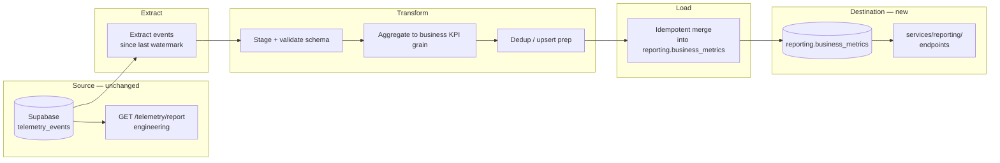

# Milestone 6 — Designing a Business Performance Data Pipeline (1/3) — Reference Solution

This reference solution defines the expected quality bar for deliverables in the student's company monorepo fork:

- `data/pipelines/PIPELINE_DESIGN.md`

The deliverable is **design documentation only** — no Prefect flows, Python scripts, migrations, or runnable ETL code. Another engineer should be able to implement the pipeline from this document without follow-up questions.

## Alignment with company domain

All KPIs, mandatory metrics, audience, cadence, and destination names must come from the company's **[data-pipelines CONTEXT](https://github.com/4GeeksAcademy/ai-engineering-syllabus/tree/main/content/contexts/06-telemetry-data-pipelines/data-pipelines)** and existing telemetry work. Generic placeholders that ignore sector-specific KPIs or entity naming should be treated as incomplete.

**Hard constraint:** this pipeline is **new**. Designs must not modify `telemetry_events`, `services/telemetry/analysis.py`, or `GET /telemetry/report`. Output lives under `reporting.business_metrics` (and related reporting tables) and is exposed via `services/reporting/`.

---

## Expected deliverable structure

### `data/pipelines/PIPELINE_DESIGN.md`

A complete design should include at least:

| Section                     | What a strong submission covers                                                                                                                                                                   |
| --------------------------- | ------------------------------------------------------------------------------------------------------------------------------------------------------------------------------------------------- |
| **Current State**           | Existing telemetry events, `telemetry_events` storage, what the technical report (`GET /telemetry/report`) already answers for engineering, and the business gap from the data-pipelines CONTEXT. |
| **Purpose**                 | One concrete sentence naming the business deliverable + KPI(s) from CONTEXT "KPIs to Measure" + mandatory telemetry metric(s) that feed them.                                                     |
| **Extraction format**       | Source is `telemetry_events` (plus any domain tables), format, refresh frequency.                                                                                                                 |
| **Data flow diagram**       | Mermaid or text with extract → transform → load using real company table/entity names.                                                                                                            |
| **Update / dedup strategy** | Concrete mechanism when sources update existing records (upsert, partition key, control table).                                                                                                   |
| **Idempotency strategy**    | What happens on the **second run** after a load-phase failure.                                                                                                                                    |
| **Execution log**           | ≥5 fields with name, type, and audit justification.                                                                                                                                               |
| **Prefect mapping**         | ≥2 flows, ≥3 tasks, relevant states, and blocks for credentials/config.                                                                                                                           |
| **Application integration** | ≥2 planned `services/reporting/` endpoints (status + manual trigger) naming `data/pipelines/` functions each will call.                                                                           |

---

## Pipeline architecture (reference)

**Key decisions:**

- Extract uses a **watermark** (`last_processed_at` or `pipeline_runs` checkpoint) — not full-table scans every run.
- Technical report path stays untouched; business path writes only to `reporting.*`.
- Load is a transactional upsert keyed on the CONTEXT grain (e.g. date + location).

---

## Indicative example — Current State (strong vs weak)

**Strong:**

> We capture five inventory telemetry events (`inbound_order_created`, `outbound_order_created`, `direct_stock_edit_rejected`, `order_validation_failed`, `stock_threshold_triggered`) into `public.telemetry_events`. `services/telemetry/analysis.py` and `GET /telemetry/report` answer engineering questions (daily event volume, error rate by type, latency). They do **not** answer the weekly per-location cost & waste rollup scoped in our data-pipelines CONTEXT. No execution log, no idempotent business aggregate table.

**Weak (incomplete):**

> We have telemetry in Supabase and use Pandas for reports.

---

## Indicative example — Purpose (strong vs weak)

**Strong:**

> Produce the daily rollup that feeds the CEO's weekly location cost & waste report by computing Purchase Cost, Waste Cost, Waste Ratio, Stockout Frequency, and Price Alert Frequency into `reporting.business_metrics` from mandatory telemetry metrics already defined in CONTEXT.

**Weak (incomplete):**

> The pipeline loads telemetry data into reporting tables for dashboards.

---

## Indicative example — Update / dedup strategy

Telemetry events are append-only, but **aggregated KPI rows** may be recomputed when late events arrive. Document one of:

1. **Upsert by grain** — e.g. `(report_date, location_id)` into `reporting.business_metrics` with `ON CONFLICT DO UPDATE`.
2. **Watermark + reprocess window** — re-aggregate last N days when new events land after cutoff; log the invalidating run.
3. **Control table** — `processed_event_ids` to skip already-ingested `eventId` values from the Event Envelope.

**Common mistake:** saying "use DISTINCT" without naming the business key or handling late arrivals.

---

## Indicative example — Idempotency plan

**Failure scenario:** pipeline fails after loading 60% of daily aggregates into `reporting.business_metrics`.

**Recovery:**

1. Each run has a unique `run_id` logged at start in `pipeline_runs`.
2. Load writes via **transactional upsert** on the daily partition / grain key.
3. `pipeline_runs.checkpoint` stores last completed phase (`extract`, `transform`, `load`).
4. On retry after load failure: re-run load upsert only — upsert keys prevent duplicate reporting rows.

**Common mistake:** "re-run the whole job" without explaining how already-committed rows are not duplicated.

---

## Execution log — minimum fields (reference)

| Field                             | Type                                  | Rationale                                              |
| --------------------------------- | ------------------------------------- | ------------------------------------------------------ |
| `run_id`                          | UUID                                  | Correlate logs, metrics, and alerts for one execution. |
| `started_at` / `finished_at`      | ISO 8601 UTC                          | SLA tracking, duration trends, incident timelines.     |
| `watermark_from` / `watermark_to` | ISO 8601 UTC                          | Audit which event time range was processed.            |
| `rows_extracted`                  | integer                               | Detect empty or truncated source windows.              |
| `rows_loaded`                     | integer                               | Reconcile with `reporting.business_metrics` counts.    |
| `status`                          | enum (`success`, `failed`, `partial`) | Automation and paging rules.                           |
| `error_summary`                   | string (nullable)                     | Human-readable failure without scraping stack traces.  |
| `pipeline_version`                | semver / git sha                      | Reproducibility when logic changes.                    |

At least **five** fields with type and justification are required by the rubric.

---

## Prefect mapping (reference)

| Prefect concept | Example mapping                                                                                                                               |
| --------------- | --------------------------------------------------------------------------------------------------------------------------------------------- |
| **Flow**        | `business_performance_etl_flow` — nightly/weekly run; `backfill_business_metrics_flow` — reprocesses date range on demand.                    |
| **Task**        | `extract_telemetry_events`, `transform_business_kpis`, `load_business_metrics`                                                                |
| **States**      | `Running` during extract/transform/load; `Completed` when `pipeline_runs.status = success`; `Failed` triggers alert and preserves checkpoint. |
| **Blocks**      | `SupabaseCredentials` (DB URL + service key), `PipelineConfig` (watermark table, batch size, reprocess window days).                          |

---

## Application integration (reference)

| Endpoint                          | Calls from `data/pipelines/`                                                                    |
| --------------------------------- | ----------------------------------------------------------------------------------------------- |
| `GET /reporting/business-metrics` | `get_business_metrics(start, end)` — read-only query over `reporting.business_metrics`          |
| `POST /reporting/pipeline/run`    | `business_performance_etl_flow()` or `trigger_pipeline_run()` — no ETL logic inside `services/` |

Keep these in `services/reporting/`, separate from `services/telemetry/`.

---

## Common mistakes (incomplete submissions)

- Purpose names technical KPIs (volume, latency) instead of CONTEXT business KPIs.
- Mutating or "replacing" `telemetry_events` / `GET /telemetry/report`.
- Destination in `public` instead of `reporting.business_metrics`.
- Generic table names (`events`, `metrics`) instead of company-specific entity names.
- Data flow diagram with only two stages or missing real source/destination names.
- Idempotency described as a wish ("should be idempotent") without second-run behavior.
- Execution log listing field names without types or audit justification.
- Prefect section naming one flow and one task.
- No `services/reporting/` endpoints or ETL logic left inside services.
- Implementation code added when the brief asks for design only.

---

## Evaluation checklist

- [ ] `data/pipelines/PIPELINE_DESIGN.md` exists; design doc only — no orchestration code.
- [ ] Purpose is one sentence naming business deliverable + CONTEXT KPI(s).
- [ ] Design does not modify `telemetry_events`, `services/telemetry/analysis.py`, or `GET /telemetry/report`.
- [ ] Output in `reporting` schema + `services/reporting/` endpoints.
- [ ] Diagram shows extract → transform → load with real table/entity names.
- [ ] Update/dedup strategy uses a concrete mechanism.
- [ ] Idempotency describes second run after load failure.
- [ ] Execution log has ≥5 fields with name, type, and justification.
- [ ] Prefect mapping: ≥2 flows, ≥3 tasks, states, and ≥1 block.
- [ ] ≥2 `services/reporting/` endpoints naming `data/pipelines/` functions.
- [ ] Design consistent with telemetry events and mandatory metrics from CONTEXT.
- [ ] Commit message `feat: add business performance pipeline design document`.

---

## Auxiliary reference

See `PIPELINE_DESIGN.example.md` in this folder for a condensed sample document illustrating tone and depth. Students should write their own design in `data/pipelines/PIPELINE_DESIGN.md` — do not copy verbatim.
