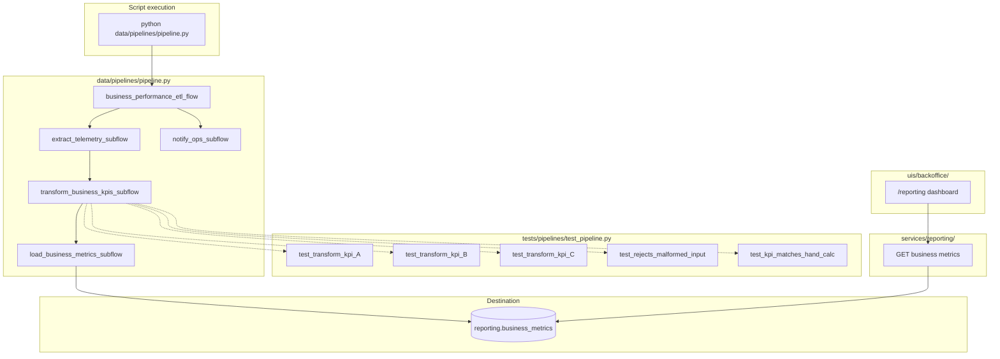

# Milestone 6 — Business Performance Pipeline Enhancement: Subflows and Tests (3/3) — Reference Solution

This reference solution defines the expected quality bar for deliverables in the student's company monorepo fork:

- `data/pipelines/pipeline.py` — main flow orchestrating extract, transform, and load subflows
- `tests/pipelines/test_pipeline.py` — isolated unit tests for KPI transformation tasks
- `uis/backoffice/` reporting dashboard — every CONTEXT KPI, labeled for a non-technical stakeholder
- CLI entry point so the pipeline runs via `python data/pipelines/pipeline.py`

The deliverable is **production-ready orchestration + leadership-facing UI** built on the Part 2 pipeline and the company **[data-pipelines CONTEXT](https://github.com/4GeeksAcademy/ai-engineering-syllabus/tree/main/content/contexts/06-telemetry-data-pipelines/data-pipelines)**.

**Hard constraint:** `telemetry_events` and `services/telemetry/analysis.py` remain unmodified. Dashboard reads from `services/reporting/`, not the technical telemetry report.

---

## Solution architecture



**Component boundaries:**

| Layer                        | Responsibility                                                   |
| ---------------------------- | ---------------------------------------------------------------- |
| `data/pipelines/pipeline.py` | Main `@flow` coordinates subflows; no inline ETL in main body    |
| Subflows (`@flow`)           | One per phase — explicit I/O, independently runnable             |
| `data/process/`              | Pure transform helpers (testable without Prefect runtime)        |
| `tests/pipelines/`           | Unit tests with in-memory fixtures shaped like company telemetry |
| `uis/backoffice/`            | Business dashboard labeling every CONTEXT KPI                    |
| `services/reporting/`        | Already built in Part 2 — dashboard consumer                     |

---

## Expected file structure

```
data/
  pipelines/
    pipeline.py              # Main flow + ≥3 subflows
    PIPELINE_DESIGN.md       # Run command + optional design-question enhancements
  process/                   # Transform helpers (imported by tasks)
tests/
  pipelines/
    test_pipeline.py         # ≥3 KPI transform tests + defensive + hand-calc
uis/
  backoffice/
    .../reporting            # Dashboard page (route name may vary)
services/
  reporting/                 # Unchanged from Part 2 (consumer of metrics)
  telemetry/                 # Untouched
```

---

## Subflow refactoring patterns (reference)

```python
@flow(name="extract-telemetry-events")
def extract_telemetry_subflow(watermark_from: datetime) -> list[dict]:
    return extract_telemetry_events(watermark_from)

@flow(name="transform-business-kpis")
def transform_business_kpis_subflow(rows: list[dict], watermark_to: datetime) -> list[dict]:
    return transform_business_kpis(rows, watermark_to=watermark_to)

@flow(name="load-business-metrics")
def load_business_metrics_subflow(aggregates: list[dict], run_id: str) -> int:
    return load_business_metrics(aggregates, run_id=run_id)

@flow
def business_performance_etl_flow():
    watermark_from = resolve_watermark()
    rows = extract_telemetry_subflow(watermark_from)
    aggregates = transform_business_kpis_subflow(rows, watermark_to=datetime.now(UTC))
    records = load_business_metrics_subflow(aggregates, run_id=str(uuid4()))
    notify_ops_subflow(records, return_state=True)
    return records
```

Subflows must pass data through return values — not module-level globals. Name subflows after company KPIs / stages from CONTEXT, not `extract_data`.

---

## Unit test patterns (reference)

Tests target **transformation tasks or pure helpers** — no live DB.

```python
import pytest
from data.process.transforms import compute_waste_ratio, normalize_event_payload

def test_compute_waste_ratio_for_known_inputs():
    # Hand-calculated: waste 20 / purchase 100 = 0.20 (CONTEXT Waste Ratio definition)
    assert compute_waste_ratio(purchase_cost=100, waste_cost=20) == 0.20

def test_compute_purchase_cost_aggregates_location_week():
    rows = [
        {"location_id": "loc-1", "purchase_cost": 40},
        {"location_id": "loc-1", "purchase_cost": 60},
    ]
    assert compute_purchase_cost(rows, location_id="loc-1") == 100

def test_rejects_malformed_timestamp_raises_or_returns_none():
    raw = {"event_type": "stock_waste_registered", "timestamp": None}
    with pytest.raises(ValueError):
        normalize_event_payload(raw)
```

```bash
python -m pytest tests/pipelines/test_pipeline.py -v
```

Must include: ≥3 transform tests, ≥1 defensive/malformed input test, ≥1 hand-calculated KPI vs CONTEXT definition.

---

## Business dashboard (mandatory)

- Page under `uis/backoffice/` (e.g. `/reporting`)
- Fetches `services/reporting/` — real data from `reporting.business_metrics`
- Renders **every** KPI from CONTEXT "KPIs to Measure", labeled with exact CONTEXT names
- Shows period (week/month per CONTEXT cadence)
- Legible to the stakeholder named in CONTEXT (CEO / ops lead) — not a raw JSON dump

---

## Script-based execution

```python
if __name__ == "__main__":
    business_performance_etl_flow()
```

```bash
python data/pipelines/pipeline.py
```

Document in `PIPELINE_DESIGN.md`. Optional: note any design-question enhancements (heartbeat, concurrency lock, etc.) and which Part 1 question they answer.

---

## Common mistakes (incomplete submissions)

- Main flow still contains all ETL inline — no subflows
- Subflows share globals instead of explicit parameters
- Tests hit production DB instead of in-memory fixtures
- No hand-calculated KPI assertion against CONTEXT definition
- Missing dashboard, or dashboard shows technical metrics (volume/error/latency)
- Dashboard queries `GET /telemetry/report` instead of `services/reporting/`
- Generic names (`extract_data`, `test_transform`)
- Optional notification failure aborts main flow
- Mutating telemetry pipeline code during the refactor

---

## Evaluation checklist

- [ ] Main flow invokes ≥3 subflows (`@flow`)
- [ ] Each subflow has explicit inputs/outputs and can run independently
- [ ] `tests/pipelines/test_pipeline.py` has ≥3 transform unit tests
- [ ] ≥1 defensive test against invalid/malformed input
- [ ] ≥1 test validates KPI vs CONTEXT definition with hand-calculated input
- [ ] `python -m pytest tests/pipelines/test_pipeline.py` passes
- [ ] `python data/pipelines/pipeline.py` runs full ETL without errors
- [ ] Run command documented
- [ ] Names reflect CONTEXT KPI / domain vocabulary
- [ ] `telemetry_events` and `services/telemetry/analysis.py` unmodified
- [ ] Backoffice dashboard shows every CONTEXT KPI, correctly labeled, from `services/reporting/`
- [ ] Dashboard legible to non-technical stakeholder
- [ ] Commit message `feat: refactor business performance pipeline into subflows, add unit tests, and add reporting dashboard`
