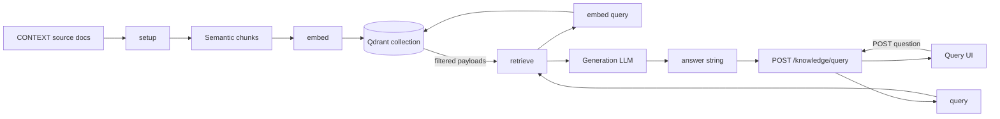

# Milestone 7 — RAG & Knowledge Base — Reference Solution

Reference quality bar for the student's company monorepo fork. Values below are **indicative** — students must align collection names, document paths, and field names with their assigned `CONTEXT-company.md`.

---

## Architecture overview



**Design invariants:**

1. Four functions, four responsibilities — swappable without cross-imports of business logic in `services/`.
2. `query()` is the only pipeline entry point for HTTP and UI.
3. Client never sees raw Qdrant hits — only `answer` from the generation step.

---

## Phase 1 — `data/process/rag.py`

### `setup()`

Responsibilities only:

1. Load documents from paths in `CONTEXT-company.md` (e.g. `data/raw/knowledge/sales-playbook.md`)
2. Split into chunks at semantic boundaries (`##` headings, product blocks, numbered procedure groups)
3. For each chunk, compute `point_id` deterministically (e.g. hash of `document + section + chunk_index`) so re-runs upsert instead of duplicate
4. Call `embed(chunk.text)` and upsert to Qdrant

### Payload schema (minimum)

| Field             | Type  | Purpose                          |
| ----------------- | ----- | -------------------------------- |
| `company`         | `str` | Company slug from CONTEXT        |
| `source_document` | `str` | Stable doc id from CONTEXT enum  |
| `section`         | `str` | Heading or logical section name  |
| `language`        | `str` | `en` or `es` per CONTEXT         |
| `chunk_index`     | `int` | Ordinal within section           |
| `text`            | `str` | Chunk body for generation prompt |

### `embed(text: str) -> list[float]`

- Single implementation shared by indexing and query paths
- Embedding model ≠ generation model
- Vector dimension must match collection config on first create

### Qdrant collection

```python
# Indicative — use name from CONTEXT
client.create_collection(
    collection_name="company_knowledge",
    vectors_config=VectorParams(size=EMBED_DIM, distance=Distance.COSINE),
)
```

### Chunking anti-patterns (reject in review)

| Bad                         | Why                                         |
| --------------------------- | ------------------------------------------- |
| Fixed 500-char splits       | Cuts policies mid-condition                 |
| Whole document = one vector | Retrieval too coarse for specific questions |
| No `section` metadata       | Cannot cite or debug wrong answers          |

---

## Phase 2 — `data/pipelines/rag.py`

### `retrieve(query, *, k=5, min_score=0.75) -> list[dict]`

```python
vector = embed(query)
hits = client.search(
    collection_name=COLLECTION,
    query_vector=vector,
    limit=k,
    with_payload=True,
)
return [
    hit.payload
    for hit in hits
    if hit.score >= min_score
]
```

- Return **list of payload dicts**, not Qdrant `ScoredPoint` objects
- Empty list is valid — `query()` must handle it

### `query(question: str) -> str`

1. `chunks = retrieve(question)`
2. If empty: still call LLM with explicit "no relevant context found" instruction
3. Build prompt:

```
You are a salesperson at {COMPANY_NAME}. Answer using ONLY the context below.
If the context does not contain the answer, say so — do not invent policies or prices.

Context:
---
{formatted chunks with [document / section] headers}
---

Question: {question}
```

4. Return `llm.generate(prompt)` string only

---

## Phase 3 — FastAPI endpoint

```python
@router.post("/knowledge/query")
def knowledge_query(body: QueryRequest) -> QueryResponse:
    answer = query(body.question)
    return QueryResponse(answer=answer)
```

- Router imports `query` from `data.pipelines.rag` — no inline retrieval
- Do not expose `chunks`, `scores`, or Qdrant IDs in response schema

---

## Phase 4 — UI (`uis/` or backoffice page)

Minimum UX:

| State   | Behaviour                           |
| ------- | ----------------------------------- |
| Idle    | Text input + submit button          |
| Loading | Disabled submit, spinner or label   |
| Success | Render `answer` in readable block   |
| Error   | Distinct message — not blank answer |

Dark mode default if using existing backoffice theme tokens.

---

## Phase 5 — Unit tests (`tests/pipelines/test_rag.py`)

### `retrieve()` — mock Qdrant

```python
def test_retrieve_filters_below_min_score(monkeypatch):
    fake_hits = [
        ScoredPoint(id=1, score=0.9, payload={"text": "a"}),
        ScoredPoint(id=2, score=0.5, payload={"text": "b"}),
    ]
    monkeypatch.setattr("data.pipelines.rag._search", lambda **kw: fake_hits)
    result = retrieve("test", k=5, min_score=0.75)
    assert len(result) == 1
    assert result[0]["text"] == "a"
```

### `query()` — mock retrieve + LLM

```python
def test_query_returns_llm_output_not_raw_chunks(monkeypatch):
    monkeypatch.setattr("data.pipelines.rag.retrieve", lambda q: [{"text": "chunk"}])
    monkeypatch.setattr("data.pipelines.rag._generate", lambda prompt: "Sales answer")
    assert query("What is the return policy?") == "Sales answer"
```

---

## Docker — Qdrant service

```yaml
qdrant:
  image: qdrant/qdrant:latest
  ports:
    - "6333:6333"
  volumes:
    - qdrant_data:/qdrant/storage
```

`QDRANT_URL=http://qdrant:6333` in API environment when running via Compose.

---

## Submission checklist

- [ ] Four functions separated; no LangChain/LlamaIndex orchestration layer
- [ ] Chunks respect semantic units; metadata on every point
- [ ] `retrieve()` threshold enforced; not always k results
- [ ] Endpoint returns model-generated `answer` only
- [ ] UI demonstrates one real company question
- [ ] `pytest tests/pipelines/test_rag.py` passes
- [ ] PR title `[W18D51] RAG Knowledge Base` with example Q&A + screenshot + collection stats

---

## Evaluation mapping

| Rubric item                     | Where to verify                                |
| ------------------------------- | ---------------------------------------------- |
| Modular four functions          | `data/process/rag.py`, `data/pipelines/rag.py` |
| No raw vector results to client | API response schema + manual curl test         |
| CONTEXT alignment               | Collection name, doc paths, domain terms       |
| Salesperson voice               | Generation system prompt in `query()`          |
| Tests                           | `tests/pipelines/test_rag.py` CI/local         |
