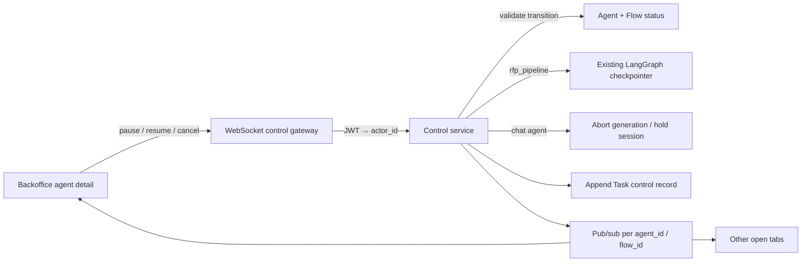

# Milestone — Agent Control (Part 2) — Reference Solution

Reference quality bar for the student's company monorepo fork. Agent ids, command payloads, and permission notes below are **indicative** — students must align with their assigned `CONTEXT-company.md` under `content/contexts/10-realtime/agent-control/`. Part 1 entities (`Agent` / `Flow` / `Task`) and agent ids come from [`agent-observability/`](../../../contexts/10-realtime/agent-observability/); do not invent a parallel registry.

---

## Architecture overview



**Design invariants:**

1. **Extend Part 1, don't fork** — same `agent_id` / `flow_id` / Task history. Informational `available_actions` become executable buttons.
2. **`paused` ≠ `cancelled`** — distinct statuses. `paused` is resumable; `cancelled` is terminal (only a new flow/execution may start).
3. **Reuse checkpointing for `rfp_pipeline`** — same LangGraph checkpointer that already backs HITL approval. Do **not** build a second checkpoint store.
4. **Chat pause ≠ graph checkpoint** — conversational agent: abort mid-stream / hold session open; resume releases the hold (CONTEXT: no checkpoint replay required).
5. **Kill switch ≠ business approval** — operator `pause`/`resume`/`cancel` is a separate permission set from department `approve` / `request_changes`. Never bypass Compliance PHI approval (HealthCore) via cancel.
6. **Pub/sub fan-out** — every subscriber on that agent/flow gets `control_applied` (or equivalent), not only the commander.
7. **`actor_id` from JWT** — never trust a client-supplied actor field.
8. **Cancel cascades** — cancelling an `rfp_workflow` sets Flow to `cancelled` and marks pending department tasks accordingly (no orphaned `running` children).
9. **HealthCore: no PHI** in commands, events, or audit rows.
10. **Monorepo paths only** — `services/`, `uis/backoffice`, `tests/`.

---

## Recommended layout (indicative)

| Path                                            | Responsibility                                                     |
| ----------------------------------------------- | ------------------------------------------------------------------ |
| `services/.../agent_observability/models.py` (extend) | Add `paused` / `cancelled`; control Task fields                    |
| `services/.../control/transitions.py`           | Allowed `(status, action) → next_status` matrix                    |
| `services/.../control/ws.py`                    | WebSocket accept, JWT, command routing                             |
| `services/.../control/handlers.py`              | `pause` / `resume` / `cancel` per agent type                       |
| `services/.../control/bus.py`                   | Pub/sub keyed by `agent_id` and/or `flow_id`                       |
| Existing RFP checkpointer                       | Persist node on pause; resume from `thread_id`                     |
| Chat stream runner                              | Cancel generation task; hold / close session                       |
| `uis/backoffice/.../agent_observability/AgentDetail`  | Wire buttons; enable/disable from status                           |
| `uis/backoffice/.../useAgentControlWs.ts`       | Send commands; apply `control_applied`; reconnect + refetch status |
| `tests/services/test_control_pause.py`          | Checkpoint persisted; status `paused`                              |
| `tests/services/test_control_resume.py`         | Resumes from checkpoint, not step 0                                |
| `tests/services/test_control_cancel.py`         | Terminal; later resume rejected                                    |
| `tests/services/test_control_pubsub.py`         | Second subscriber sees event                                       |
| `tests/services/test_control_audit.py`          | `actor_id` + timestamp on Task                                     |

---

## Status & transition matrix (indicative)

| Current                             | `pause`                                                                                                                   | `resume`     | `cancel`      |
| ----------------------------------- | ------------------------------------------------------------------------------------------------------------------------- | ------------ | ------------- |
| `running`                           | → `paused`                                                                                                                | reject       | → `cancelled` |
| `waiting_for_human` (business HITL) | → `paused` (optional / CONTEXT) or reject — **document**; UI must still show HITL vs operator pause as different concepts | reject / n/a | → `cancelled` |
| `paused`                            | reject                                                                                                                    | → `running`  | → `cancelled` |
| `cancelled`                         | reject                                                                                                                    | **reject**   | reject        |
| `completed` / `failed`              | reject                                                                                                                    | reject       | reject        |

Exact names must match CONTEXT. Conversational vs RFP pause semantics differ (stream abort vs checkpoint) but status vocabulary stays shared.

---

## WebSocket contract (indicative — match CONTEXT)

Inbound commands:

```json
{"command": "pause", "data": {"agent_id": "rfp_pipeline", "flow_id": "flow_0318"}}
{"command": "resume", "data": {"agent_id": "rfp_pipeline", "flow_id": "flow_0318"}}
{"command": "cancel", "data": {"agent_id": "first_line_support", "flow_id": "chat_0447"}}
```

Outbound fan-out:

```json
{"event": "control_applied", "data": {"agent_id": "rfp_pipeline", "flow_id": "flow_0318", "action": "pause", "actor_id": "user_0154", "timestamp": "2026-03-12T09:41:17Z"}}
{"event": "control_rejected", "data": {"agent_id": "rfp_pipeline", "flow_id": "flow_0318", "action": "resume", "reason": "invalid_transition", "current_status": "running"}}
```

**Auth:** validate JWT on connect (query `token` and/or first auth frame). Reject/close before accepting commands if invalid. Set `actor_id` from verified user id.

**Concurrency:** serialize control mutations per `(agent_id, flow_id)` (asyncio lock / DB row lock). Second conflicting command gets `control_rejected`, not a silent overwrite.

---

## Handler sketch (indicative)

```python
# Pseudocode — adapt to monorepo
async def apply_control(cmd: str, agent_id: str, flow_id: str, actor_id: str):
    async with lock_for(agent_id, flow_id):
        agent, flow = await store.get(agent_id, flow_id)
        if not transitions.allowed(agent.status, cmd):
            return Rejected(reason="invalid_transition", current_status=agent.status)

        if agent_id.endswith("_pipeline") or agent_id == "rfp_pipeline":  # CONTEXT id
            if cmd == "pause":
                await graph.pause_and_checkpoint(thread_id=flow.thread_id)
                agent.status = "paused"
            elif cmd == "resume":
                await graph.resume_from_checkpoint(thread_id=flow.thread_id)
                agent.status = "running"
            elif cmd == "cancel":
                await graph.cancel(thread_id=flow.thread_id)  # no further nodes
                agent.status = "cancelled"
                flow.status = "cancelled"
                await store.mark_pending_tasks_cancelled(flow_id)
        else:
            # conversational: abort generation / hold or close session
            ...

        await store.append_control_task(
            flow_id=flow_id,
            agent_id=agent_id,
            action_type=cmd,  # or CONTEXT control action_type
            actor_id=actor_id,
        )
        await bus.publish(
            "control_applied",
            {"agent_id": agent_id, "flow_id": flow_id, "action": cmd, "actor_id": actor_id, "timestamp": now()},
        )
```

**Acceptable:** FastAPI WebSocket + existing checkpointer; chat cancel closes session; HITL approval endpoints untouched.

**Not acceptable:** restarting the whole process to "pause"; resume after cancel; client-supplied `actor_id`; merging operator cancel into department approve; orphaned `running` department tasks after flow cancel; open unauthenticated socket; inventing a second checkpoint database for RFP.

---

## Frontend sketch (indicative)

```javascript
// Buttons: enabled from Part 1 available_actions / current status
// On click: send { command, data: { agent_id, flow_id } } — no actor_id
// On control_applied: patch local agent + append task history row
// On reconnect: refetch GET /agent-observability/agents/{id} then resubscribe
```

Distinguish in UI:

- `waiting_for_human` / department approval (business) vs `paused` by operator (ops)
- Do not reuse the approve/reject buttons for pause/cancel

---

## Testing bar

| Check       | Pass criteria                                                                             |
| ----------- | ----------------------------------------------------------------------------------------- |
| Pause       | Checkpoint (or chat hold) persisted; status `paused`; other agents untouched              |
| Resume      | Continues from checkpoint / held session — not from first node                            |
| Cancel      | Status `cancelled`; later `resume` → explicit error; flow + pending tasks updated for RFP |
| Transitions | Invalid pairs → `control_rejected` / HTTP/WS error, no state change                       |
| Pub/sub     | Second WS client subscribed to same agent/flow receives `control_applied`                 |
| Audit       | Task history row has action, JWT-derived `actor_id`, timestamp                            |
| Auth        | Unauthenticated WS rejected                                                               |
| Scope       | No changes to department approval handlers                                                |

---

## Common mistakes

| Mistake                                                     | Why it fails                                       |
| ----------------------------------------------------------- | -------------------------------------------------- |
| Same status for pause and cancel                            | Rubric requires different guarantees               |
| New checkpoint store for RFP                                | Must reuse existing LangGraph checkpointer         |
| Only the commanding tab updates                             | Pub/sub required                                   |
| Trusting `actor_id` from client                             | Audit must come from JWT                           |
| Cancel leaves pending department tasks `running`            | Cascade required                                   |
| Replacing HITL approve with operator cancel                 | Kill switch ≠ business approval                    |
| HealthCore PHI in audit payload                             | Non-negotiable                                     |
| Delivery folder outside monorepo layout                     | Same as Part 1                                     |
| Treating post-grad WebSocket chat project as this milestone | Different brief (`ai-eng-real-time-communication`) |
