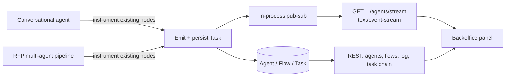

# Milestone — Agent Observability (Part 1) — Reference Solution

Reference quality bar for the student's company monorepo fork. Agent ids, `flow_type`, `action_type`, `department_id`, and `needs_intervention` rules below are **indicative** — students must align with their assigned `CONTEXT-company.md` under `content/contexts/10-realtime/agent-observability/`. Part 2 (control: pause/resume/cancel) is [`ai-eng-milestone-real-time-agent-control`](../../ai-eng-milestone-real-time-agent-control/.learn/solution/README.md) — out of scope here.

---

## Architecture overview



**Design invariants:**

1. **Three entities, not one blob** — Agent (registry + live status), Flow/Execution (one run of `chat_session` or `rfp_workflow`), Task/Step (one `action_type` in one flow for one agent). An agent belongs to many flows over time; a flow has many tasks; a task belongs to exactly one flow and one agent.
2. **Instrument, don't rewrite** — emit at existing step / tool / status change points. Do not change RAG, LangGraph nodes, or RFP approval logic.
3. **Persist even with zero SSE clients** — history must survive refresh and disconnect. Stream is a fan-out of already-stored events, not the source of truth.
4. **Named SSE events** — `agent_step` and `agent_status_changed` (CONTEXT names). Never a single generic `event: message` for all domain traffic.
5. **Traceable chain** — every task stores `trigger` (prior `task_id` **or** external cause such as inbound message / `ticket_id`), `derived_task_ids`, `prev_task_id`, `next_task_id`, plus `flow_id` and `agent_id`.
6. **Look, don't touch** — `available_actions` is derived from status (informational). No pause/resume/kill handlers in this part.
7. **Auth same as backoffice** — JWT on REST and SSE. Client uses `fetch` + `ReadableStream` (not bare `EventSource`).
8. **CONTEXT fidelity** — `agent_id`, `flow_type`, `action_type`, `department_id` (when a step is department-scoped), and `needs_intervention` rules match the assigned company file. HealthCore: **no PHI** in events, logs, or persisted task payloads.
9. **Monorepo paths only** — `services/`, `uis/backoffice`, `tests/`; no `parte-1-agent-observability/` delivery folder.

---

## Recommended layout (indicative)

| Path                                       | Responsibility                                               |
| ------------------------------------------ | ------------------------------------------------------------ |
| `services/.../agent_observability/models.py`     | Agent, Flow, Task (+ trigger / prev / next / derived)        |
| `services/.../agent_observability/store.py`      | Persist tasks; compute `needs_intervention`                  |
| `services/.../agent_observability/bus.py`        | Pub-sub after persist                                        |
| `services/.../agent_observability/sse.py`        | SSE headers, named events, keep-alive, JWT                   |
| `services/.../agent_observability/available.py`  | Map status → informational action tags                       |
| `services/.../routers/agent_observability.py`    | REST: agents, flows, log, task chain                         |
| Existing agent / RFP nodes                 | After each real step: `store.record(...)` then `bus.publish` |
| `uis/backoffice/.../agent_observability/`        | Agent list/detail, flow list/detail, paginated log           |
| `uis/backoffice/.../useAgentSse.ts`        | `fetch` + `ReadableStream`, backoff, recovery                |
| `tests/services/test_agent_observability_sse.py` | Headers, event name, JSON `data` shape                       |
| `tests/services/test_agent_observability_api.py` | Agent list/detail, flow detail, pagination                   |
| `tests/services/test_task_traceability.py` | `task_id` → trigger, derived, prev/next                      |

---

## Entity sketch (indicative)

```text
Agent 1 ──< participates in >── * Flow
Flow  1 ──< contains >────────── * Task
Agent 1 ──< executes >────────── * Task   (scoped by flow_id so concurrent flows don't mix)
```

| Entity | Required fields (plus CONTEXT extras)                                                                                        |
| ------ | ---------------------------------------------------------------------------------------------------------------------------- |
| Agent  | `agent_id`, `name`, `flow_types[]`, `status`, `needs_intervention`                                                           |
| Flow   | `flow_id`, `flow_type`, `status`, `triggered_by`, `participating_agent_ids`                                                  |
| Task   | `task_id`, `flow_id`, `agent_id`, `action_type`, `trigger`, `derived_task_ids[]`, `prev_task_id`, `next_task_id`, timestamps |

`trigger` is **not** always another task: chat flows typically start from an inbound message; RFP flows from the existing `ticket_id`. Model that as a typed union (`{"kind":"task","task_id":"..."}` vs `{"kind":"external","source":"ticket","ticket_id":"..."}`) rather than a nullable FK only.

**`needs_intervention` (CONTEXT pattern — implement the assigned company's rule, not a generic timeout):** typically `true` when a `chat_session` stays on `query`/`tool_call` longer than 20s without `deliver`, or an `rfp_workflow` exceeds the configured `evaluate` retry limit without a pass. HealthCore also flags `contains_phi: true` from the compliance evaluator as high-priority intervention — still **without** storing PHI.

**`available_actions`:** pure function of `status` (e.g. `running` → `["pause"]` tagged as available; `paused` → `["resume","kill"]`). Return strings/tags only. Part 2 will POST to those same names.

---

## SSE wire format (indicative)

```http
HTTP/1.1 200 OK
Content-Type: text/event-stream
Cache-Control: no-cache
Connection: keep-alive
X-Accel-Buffering: no
```

```text
event: agent_step
id: evt_1205
data: {"agent_id":"rfp_pipeline","flow_id":"flow_0318","task_id":"task_1205","action_type":"evaluate","department_id":"seleccion"}

event: agent_status_changed
id: evt_1206
data: {"agent_id":"first_line_support","flow_id":"chat_0447","status":"running"}

: keepalive
```

Use **your** CONTEXT `agent_id` / `department_id` values. Nexova `seleccion` above is an example, not a universal default.

**Acceptable:** persist first, then publish; FastAPI `StreamingResponse` (or equivalent) yielding encoded frames; keep-alive comments; JWT dependency shared with backoffice.

**Not acceptable:** SSE-only memory with no DB; polling the panel and calling it real-time; bare `EventSource`; unauthenticated stream; executing pause/resume/kill; inventing parallel agent ids; shipping a parallel app folder; HealthCore payloads with patient identifiers.

---

## REST surface (indicative)

Reuse existing API prefix conventions. Names below are illustrative:

| Intent                           | Example                                                                    |
| -------------------------------- | -------------------------------------------------------------------------- |
| Agent list                       | `GET /agent-observability/agents`                                                |
| Agent detail + available actions | `GET /agent-observability/agents/{agent_id}`                                     |
| Last 5 flows + nested tasks      | `GET /agent-observability/agents/{agent_id}/flows?limit=5`                       |
| Last 10 tasks (flat log)         | `GET /agent-observability/agents/{agent_id}/tasks?limit=10`                      |
| Paginated global log             | `GET /agent-observability/log?cursor=&limit=` (keyset or offset; no dupes/skips) |
| Flow list                        | `GET /agent-observability/flows`                                                 |
| Flow detail                      | `GET /agent-observability/flows/{flow_id}`                                       |
| Task chain                       | `GET /agent-observability/tasks/{task_id}`                                       |
| SSE                              | `GET /agent-observability/stream`                                                |

Live views (list + detail) subscribe to SSE and patch local state by `agent_id` / `flow_id`. Log and history views are request/response.

---

## Frontend sketch (indicative)

```javascript
// Progressive backoff; auth via fetch; recover missed events
// (Last-Event-ID / short replay, or refetch agent list then SSE).
async function consumeAgentSse(
  url,
  { token, onEvent, lastEventId, refetchAgents },
) {
  let delayMs = 1000;
  for (;;) {
    try {
      await refetchAgents?.();
      const headers = { Authorization: `Bearer ${token}` };
      if (lastEventId) headers["Last-Event-ID"] = lastEventId;
      const res = await fetch(url, { headers });
      if (
        !res.ok ||
        !res.headers.get("content-type")?.includes("text/event-stream")
      ) {
        throw new Error("bad sse response");
      }
      const reader = res.body.getReader();
      const decoder = new TextDecoder();
      let buffer = "";
      delayMs = 1000;
      while (true) {
        const { value, done } = await reader.read();
        if (done) break;
        buffer += decoder.decode(value, { stream: true });
        // parse frames → onEvent; remember event id for Last-Event-ID
      }
    } catch (_) {
      /* backoff */
    }
    await sleep(delayMs);
    delayMs = Math.min(delayMs * 2, 30000);
  }
}
```

UI: intervention flag must be visually distinct. Task rows must show trigger, derived ids, prev/next. Filter log by `agent_id` and `flow_id`. Concurrent flows: nest tasks under `flow_id` in the last-5-flows panel; never flatten two flows into one timeline without `flow_id`.

---

## Testing bar

| Check             | Pass criteria                                                                                                                             |
| ----------------- | ----------------------------------------------------------------------------------------------------------------------------------------- |
| SSE               | `Content-Type` includes `text/event-stream`; named `event:`; JSON `data` has CONTEXT keys (`agent_id`, `flow_id`, `action_type` on steps) |
| Auth              | Unauthenticated REST and SSE rejected                                                                                                     |
| Agents            | List includes id, name, flow(s), status, `needs_intervention`; detail includes informational `available_actions`                          |
| Flow              | Given `flow_id`, participating agents + tasks in order                                                                                    |
| Traceability      | Given any `task_id`, trigger + derived + prev/next unambiguous                                                                            |
| Pagination        | Chronological; page N+1 neither duplicates nor skips vs page N                                                                            |
| Two architectures | Same schema covers conversational `chat_session` and multi-node `rfp_workflow`                                                            |
| No control        | No POST/PATCH that pauses, resumes, or kills an agent                                                                                     |

---

## Common mistakes

| Mistake                                                 | Why it fails                                          |
| ------------------------------------------------------- | ----------------------------------------------------- |
| One table named "agent_run" mixing agent + flow + task  | Cardinality and concurrent flows break                |
| Live SSE without persistence                            | History disappears on refresh                         |
| Generic `message` events                                | Rubric requires `agent_step` / `agent_status_changed` |
| Inventing agent ids                                     | Must match CONTEXT                                    |
| `EventSource` only                                      | Cannot send `Authorization`                           |
| Executing pause because the UI shows the button         | Part 2 only                                           |
| Duplicating RFP department approval inside this panel   | Observe from outside                                  |
| Mixing tasks from two `flow_id`s in one agent timeline  | Concurrent participation                              |
| HealthCore PHI in payload "just for debugging"          | Non-negotiable constraint                             |
| Delivery folder outside `services/` / `uis/` / `tests/` | Monorepo layout required                              |
