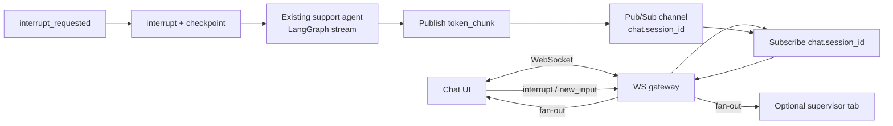

# Milestone 10 Part 2 — WebSocket Chat Streaming — Reference Solution

Reference quality bar for the student's company monorepo fork. Agent ids, session fields, and event names below are **indicative** — students must align with their assigned `CONTEXT-company.md` under `content/contexts/10-realtime/communication/` and keep Part 1 naming discipline where session/ticket ids overlap.

---

## Architecture overview



**Design invariants:**

1. **Agent untouched** — same tools, memory, and graph nodes; only the transport changes from request/response to WebSocket + stream.
2. **Bidirectional** — client sends user messages and interrupts; server sends `token_chunk`, status, and `generation_completed`.
3. **Named events** — never a single generic `message` type for tokens, interrupts, and completion.
4. **Pub/sub per session** — agent produces once; N WebSocket consumers subscribe to `chat.<session_id>` (in-memory OK).
5. **True interrupt** — mid-stream cancel stops generation (LangGraph `interrupt()` + checkpoint), then resumes with new input — not “discard tokens on the client only.”
6. **Reconnect** — same progressive backoff discipline as Part 1; conversation thread/`session_id` survives reconnect.

---

## Recommended layout (indicative)

| Path                               | Responsibility                                               |
| ---------------------------------- | ------------------------------------------------------------ |
| `services/.../chat/ws.py`          | WebSocket accept, join session, route inbound events         |
| `services/.../chat/bus.py`         | In-process pub/sub keyed by `session_id`                     |
| `services/.../chat/stream.py`      | Run agent stream mode → publish `token_chunk`                |
| `services/.../chat/interrupt.py`   | Handle `interrupt_requested` → pause + resume with new input |
| `uis/.../chat/useChatSocket.ts`    | WS client, token append UI, interrupt control, backoff       |
| `tests/services/test_ws_events.py` | Event contract: token / interrupt / completed                |

---

## Event contract (indicative — match CONTEXT)

```json
{"event": "token_chunk", "data": {"session_id": "chat_0044", "token": "For", "sequence": 12}}
{"event": "interrupt_requested", "data": {"session_id": "chat_0044", "new_input": "wait, I asked about the Miami location"}}
{"event": "generation_completed", "data": {"session_id": "chat_0044", "message_id": "msg_0091"}}
```

Optional session status updates (if CONTEXT defines them): `active` → `interrupted` → `active` / `closed`.

**Acceptable:** FastAPI WebSocket (or stack equivalent) + LangGraph `messages` / `custom` stream mode; one producer task per generation; subscribers receive identical frames.

**Not acceptable:** SSE-only for this part; buffering full reply then dumping once; client-side “stop” that ignores tokens while the model keeps generating; calling the agent once per subscribed supervisor tab.

---

## Backend sketch (indicative)

```python
# Pseudocode — adapt to monorepo
@app.websocket("/ws/chat/{session_id}")
async def chat_ws(ws: WebSocket, session_id: str):
    await ws.accept()
    q = bus.subscribe(f"chat.{session_id}")
    try:
        consumer = asyncio.create_task(fanout(ws, q))
        while True:
            msg = await ws.receive_json()
            if msg["event"] == "user_message":
                asyncio.create_task(run_agent_stream(session_id, msg["data"]["text"]))
            elif msg["event"] == "interrupt_requested":
                await cancel_generation(session_id)
                await resume_with_input(session_id, msg["data"]["new_input"])
    finally:
        bus.unsubscribe(q)
        consumer.cancel()

async def run_agent_stream(session_id: str, text: str):
    # Prefer stream mode that yields tokens (e.g. messages / custom)
    async for token in agent.astream_tokens(text, thread_id=session_id):
        bus.publish(
            f"chat.{session_id}",
            {"event": "token_chunk", "data": {"session_id": session_id, "token": token, "sequence": n}},
        )
    bus.publish(
        f"chat.{session_id}",
        {"event": "generation_completed", "data": {"session_id": session_id, "message_id": mid}},
    )
```

Interrupt must cancel the running stream task **and** use checkpoint/`interrupt()` so the next turn sees the new user input — document what happens to partial tokens (discard vs keep as incomplete assistant message).

---

## Frontend sketch (indicative)

```javascript
// Append tokens; send interrupt while streaming; backoff reconnect
ws.onmessage = (ev) => {
  const { event, data } = JSON.parse(ev.data);
  if (event === "token_chunk") appendToken(data.token);
  if (event === "generation_completed") markDone(data.message_id);
};

function sendInterrupt(newInput) {
  ws.send(
    JSON.stringify({
      event: "interrupt_requested",
      data: { session_id, new_input: newInput },
    }),
  );
}
```

UI: live typing effect (token append). Interrupt control = send new message (or Stop) while `generation` in progress. Reconnect with progressive backoff; re-attach to same `session_id`.

---

## Testing bar

| Check                    | Pass criteria                                                                                                     |
| ------------------------ | ----------------------------------------------------------------------------------------------------------------- |
| Event contract unit test | Assert shapes for `token_chunk`, `interrupt_requested`, `generation_completed`                                    |
| Interrupt behavior       | Mid-stream interrupt stops original generation; next output reflects `new_input` (automated or documented manual) |
| Fan-out                  | Two subscribers on same session see same tokens; agent invoked once                                               |
| Part 1 consistency       | Session/ticket field names match CONTEXT + Part 1 conventions                                                     |

---

## Common mistakes

| Mistake                         | Why it fails                                            |
| ------------------------------- | ------------------------------------------------------- |
| Rebuild agent / tools           | Out of scope — transport only                           |
| SSE + client ignore             | Not bidirectional; interrupt not real                   |
| Generic WS `message` only       | Rubric requires named structured events                 |
| Agent call per WebSocket        | Breaks supervisor fan-out; must pub/sub                 |
| No backoff reconnect            | Part 1 discipline required in both directions           |
| Parallel event schema vs Part 1 | Inventing duplicate id/status names fails CONTEXT check |
