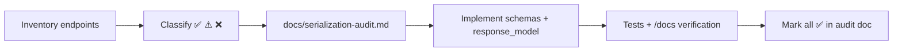

# Backend Serialization Audit — Reference Solution

## Purpose

Reference for a complete submission inside the **company monorepo** FastAPI app: every route has explicit Pydantic contracts, `docs/serialization-audit.md` records before/after state, and no endpoint returns raw TinyDB documents, SQLModel rows, or untyped dicts.

**Monorepo contract (do not invent a parallel user stack):**

- `User` and `Profile` live in **TinyDB only**. IDs are UUID **strings**. Role is an enum (`admin` | `manager` | `user`), not `role_id`.
- Auth/user paths have **no `/api` prefix**: `/users`, `/auth/*`, `/profiles/*`.
- Password reset routes from the restore project: `POST /auth/forgot-password`, `POST /auth/reset-password`, `POST /auth/change-password`. There is no `restore-password` route.
- Display name lives on **`Profile.name`**, never on `User`.
- Use a **non-user** SQLModel resource (inventory products/orders) for ORM `from_attributes` examples.

## Audit loop (expected workflow)



| Phase          | Artifact                                        | Location                      |
| -------------- | ----------------------------------------------- | ----------------------------- |
| Discovery      | Route table (method, path, purpose)             | `docs/serialization-audit.md` |
| Classification | Per-endpoint status + required output shape     | Same file                     |
| Implementation | `schemas/`, route `response_model`, body models | FastAPI app under `services/` |
| Verification   | Test suite green; manual `/docs` checks         | CI + interactive docs         |

Work on branch `feature/serialization-audit`; PR title `feat: serialization audit and implementation`.

## Required deliverable structure

### `docs/serialization-audit.md` (indicative outline)

```markdown
# Serialization audit

## Endpoint inventory

| Method | Path                  | Purpose                | Before | After |
| ------ | --------------------- | ---------------------- | ------ | ----- |
| POST   | /users                | Register user          | ❌     | ✅    |
| POST   | /auth/login           | Login                  | ❌     | ✅    |
| GET    | /auth/me              | Current user           | ⚠️     | ✅    |
| POST   | /auth/forgot-password | Request reset email    | ⚠️     | ✅    |
| POST   | /auth/reset-password  | Set new password       | ⚠️     | ✅    |
| POST   | /auth/change-password | Change while logged in | ⚠️     | ✅    |
| GET    | /users                | List users             | ❌     | ✅    |
| GET    | /inventory/products   | List inventory         | ❌     | ✅    |

Audit auth routes first — they are the most common source of credential leakage.

Legend: ✅ serialized · ⚠️ partial · ❌ raw document / untyped dict

## Findings (before implementation)

### POST /users — ❌ Not serialized

- **Today:** Echoes full TinyDB user including `hashed_password` and `email`.
- **Target input:** `UserCreate` (`email`, `password`; optional profile fields).
- **Target output:** `UserPublic` (`id`, `role`) **without** password or email — or a token-only follow-up via login. Do not put `display_name` on User.

### POST /auth/login — ❌ Not serialized

- **Today:** Returns user dict with `hashed_password`.
- **Target input:** `UserLogin` (`email`, `password`).
- **Target output:** `TokenResponse` (`access_token`, `token_type`) — never echo credentials or email.

### GET /auth/me — ⚠️ Partially serialized

- **Today:** May leak `hashed_password`.
- **Target output:** `MeResponse` with the caller's `email`, `role`, and nested `Profile` (`name`, `phone`, `address`). **Email is allowed here** — the profile view depends on it.

### POST /auth/forgot-password — ⚠️ Partially serialized

- **Today:** Response confirms `{ "email": "..." }` — aids account enumeration.
- **Target output:** Generic `{ "message": "If the account exists, instructions were sent." }` — no email in body.

### POST /auth/reset-password / POST /auth/change-password

- **Target output:** Generic success message. Never return password fields or email.

### GET /users — ❌ Not serialized

- **Today:** Returns TinyDB documents; may expose `hashed_password`.
- **Target:** `UserListItem` with `id` (UUID string), `role`. List projections should not need `display_name` on User — compose `Profile.name` if a label is required.

### GET /inventory/products — ❌ Not serialized (SQLModel example)

- **Today:** Returns SQLModel rows (or dicts) with internal columns.
- **Target:** CONTEXT-named product-equivalent schema with computed `current_stock`. This is the ORM/`from_attributes` example — **not** User.

## Decisions log

| Endpoint              | Relationship handling                                                                |
| --------------------- | ------------------------------------------------------------------------------------ |
| GET /auth/me          | Nested `profile` object (`name`, `phone`, `address`); email on the user projection   |
| GET /inventory/orders | Embed product-equivalent summary; do not embed TinyDB user — only `user_uuid` string |

## Post-implementation checklist

- [ ] All endpoints marked ✅
- [ ] Every route declares `response_model=...`
- [ ] Write routes use separate body models (not response schema)
```

### Schema layout (indicative)

```
services/
├── schemas/
│   ├── user.py          # UserCreate, UserPublic, UserListItem, TokenResponse, MeResponse
│   ├── profile.py       # ProfileRead, ProfileUpdate
│   └── inventory.py     # product/inbound/outbound schemas from CONTEXT.md
├── routers/
│   ├── auth.py
│   ├── users.py
│   └── inventory.py
└── models.py            # SQLModel inventory only — never returned without response_model
```

TinyDB `User` / `Profile` are documents, not SQLAlchemy models. Do not introduce `hashed_password` on a SQL `User` table.

## Classification rules (evaluator anchor)

| Status                  | Meaning                                                                         |
| ----------------------- | ------------------------------------------------------------------------------- |
| ✅ Already serialized   | Explicit `response_model`; fields match client needs; no sensitive leakage      |
| ⚠️ Partially serialized | Has `response_model` but over-fetches, wrong nesting, or input/output conflated |
| ❌ Not serialized       | Raw TinyDB doc, raw SQLModel, untyped `dict`, or missing `response_model`       |

## Indicative code patterns

### Auth identity — email allowed only on `/auth/me`

```python
class MeResponse(BaseModel):
    id: str  # TinyDB UUID
    email: str
    role: Literal["admin", "manager", "user"]
    profile: ProfileRead
```

### Unauthenticated auth flows — no email in the body

```python
class TokenResponse(BaseModel):
    access_token: str
    token_type: str = "bearer"
    # no email, no password
```

### Inventory list — SQLModel + `from_attributes` (not User)

```python
@router.get("/inventory/products", response_model=list[ProductRead])
def list_products(db: Session = Depends(get_db)):
    rows = db.exec(select(ProductEquivalent)).all()
    return rows  # FastAPI serializes via ProductRead
```

`ProductEquivalent` is the CONTEXT entity (`Ingredient`, `SKU`, …). `id` types follow CONTEXT (usually `int` PK), distinct from TinyDB user UUID strings.

### Sensitive field exclusion

```python
class UserPublic(BaseModel):
    id: str
    role: Literal["admin", "manager", "user"]
    # hashed_password absent; email absent (not /auth/me)
```

## Indicative API responses

### GET /auth/me (after)

```json
{
  "id": "550e8400-e29b-41d4-a716-446655440000",
  "email": "alex@company.com",
  "role": "user",
  "profile": {
    "name": "Alex",
    "phone": "+1-555-0100",
    "address": "Miami"
  }
}
```

### POST /auth/login (after)

```json
{
  "access_token": "<jwt>",
  "token_type": "bearer"
}
```

### GET /users (after)

```json
[
  {
    "id": "550e8400-e29b-41d4-a716-446655440000",
    "role": "user"
  }
]
```

## Validation notes

- Run existing test suite after schema changes; fix regressions before marking audit complete.
- In `/docs`, spot-check at least three endpoints: one list, one detail, one write.
- Confirm list payloads omit nested objects when audit doc says "flat projection".
- Audit document quality is graded: implementation without audit trail is insufficient.
- Confirm `GET /auth/me` still returns email (profile view). Confirm register/login/forgot/reset do **not**.

## Key implementation decisions

- **Unauthenticated auth routes** (register, login, forgot/reset) never return password fields or email.
- **`GET /auth/me` may return the caller's email** — exempt from the no-email rule.
- **TinyDB users** — UUID string ids, `role` enum, no SQL `User` / `role_id` / `display_name`.
- **ORM stays internal** for inventory SQLModel — routes return Pydantic models (or ORM instances only when `response_model` + `from_attributes` map safe fields).
- **Input ≠ output** — `UserCreate` accepts `password`; `UserPublic` / `MeResponse` never do.
- **Relationships are explicit** — document in audit whether each endpoint returns ID only, nested object, or flat summary.
- **No scope creep** — audit and shape existing surface; do not rewrite unrelated business logic.
