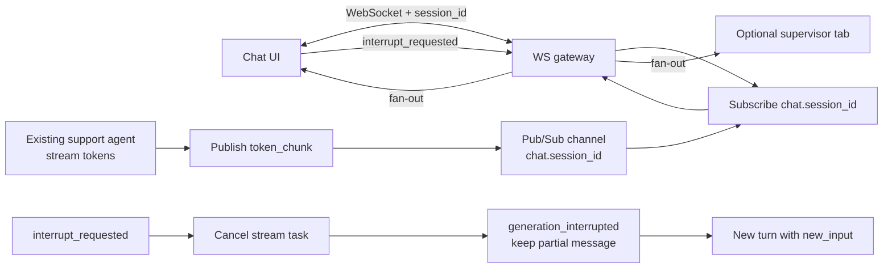

# Real-Time Systems Part 2 — WebSocket Chat Streaming — Reference Solution

Reference quality bar for the student's company monorepo fork. Agent ids, session fields, and event names below are **indicative** — students must align with their assigned `CONTEXT-company.md` under `content/contexts/10-realtime/communication/` (Part 2 only). Part 1 RFP/SSE schemas live under `10-realtime/notification/` and must not be mixed into this WebSocket contract.

---

## Architecture overview



**Design invariants:**

1. **Agent untouched** — same tools, memory, and graph nodes; only the transport changes from request/response to WebSocket + stream.
2. **Bidirectional** — client sends user messages and interrupts; server sends `token_chunk`, `generation_interrupted`, and `generation_completed`.
3. **Named events** — never a single generic `message` type for tokens, interrupts, and completion.
4. **Pub/sub per session** — agent produces once; N WebSocket consumers subscribe to `chat.<session_id>` (in-memory OK).
5. **Stream abort ≠ HITL `interrupt()`** — mid-response stop **cancels** the running generation task so tokens stop. LangGraph `interrupt()` is optional and only for a separate graph-level HITL pause — it is **not** the acceptance mechanism for “stop generating.”
6. **Interrupted partial stays** — mark message / session `interrupted`; keep tokens already shown; next assistant reply is a **new turn**.
7. **Reconnect with rehydrate** — handshake carries `session_id` (and/or `thread_id`); on reconnect reload checkpoint and/or message history before new tokens.
8. **Auth same as backoffice / Part 1** — validate the company JWT on WebSocket connect (query `token` and/or first client auth frame). Close/reject before chat events if missing or invalid. Do not leave the socket open unauthenticated.
9. **Monorepo paths only** — implement under `services/`, `uis/`, `tests/`; no delivery folder.

---

## Recommended layout (indicative)

| Path                               | Responsibility                                                       |
| ---------------------------------- | -------------------------------------------------------------------- |
| `services/.../chat/ws.py`          | WebSocket accept, JWT check, bind `session_id`, route inbound events |
| `services/.../chat/bus.py`         | In-process pub/sub keyed by `session_id`                             |
| `services/.../chat/stream.py`      | Run agent stream mode → publish `token_chunk`; hold cancel handle    |
| `services/.../chat/abort.py`       | Abort generation task; emit `generation_interrupted`; start new turn |
| `uis/.../chat/useChatSocket.ts`    | WS client, token append, interrupt, backoff + rehydrate              |
| `tests/services/test_ws_events.py` | Event contract + abort + reconnect rehydrate                         |

---

## Event contract (indicative — match CONTEXT)

```json
{"event": "token_chunk", "data": {"session_id": "chat_0044", "token": "For", "sequence": 12}}
{"event": "interrupt_requested", "data": {"session_id": "chat_0044", "new_input": "wait, I asked about the Miami location"}}
{"event": "generation_interrupted", "data": {"session_id": "chat_0044", "message_id": "msg_0090", "status": "interrupted"}}
{"event": "generation_completed", "data": {"session_id": "chat_0044", "message_id": "msg_0091"}}
```

Session status (CONTEXT): `active` → `interrupted` → `active` / `closed`.

**Acceptable:** FastAPI WebSocket (or stack equivalent) + LangGraph stream mode that yields tokens; one producer task per generation with a cancel handle; subscribers receive identical frames; JWT validated on connect (same secret/dependency as backoffice).

**Not acceptable:** SSE-only for this part; buffering full reply then dumping once; client-side “stop” that ignores tokens while the model keeps generating; using only LangGraph HITL `interrupt()` without aborting the stream task; deleting the partial assistant message; empty chat after reconnect; calling the agent once per subscribed supervisor tab; inventing a `parte-2-realtime-ws/` delivery folder; an **open** WebSocket with no JWT (Part 1 already required auth on SSE — keep the same discipline).

---

## Backend sketch (indicative)

```python
# Pseudocode — adapt to monorepo
generations: dict[str, asyncio.Task] = {}

@app.websocket("/ws/chat/{session_id}")
async def chat_ws(ws: WebSocket, session_id: str, token: str | None = Query(None)):
    user = await authenticate_jwt(token)  # same verifier as backoffice / Part 1 SSE
    if user is None:
        await ws.close(code=4401)
        return
    await ws.accept()
    history = await load_history_or_checkpoint(session_id)  # rehydrate
    await ws.send_json({"event": "session_snapshot", "data": history})
    q = bus.subscribe(f"chat.{session_id}")
    try:
        consumer = asyncio.create_task(fanout(ws, q))
        while True:
            msg = await ws.receive_json()
            if msg["event"] == "user_message":
                task = asyncio.create_task(
                    run_agent_stream(session_id, msg["data"]["text"])
                )
                generations[session_id] = task
            elif msg["event"] == "interrupt_requested":
                await abort_generation(session_id)  # cancel task — required
                # optional: LangGraph interrupt() ONLY if you also need HITL pause
                await start_new_turn(session_id, msg["data"]["new_input"])
    finally:
        bus.unsubscribe(q)
        consumer.cancel()

async def abort_generation(session_id: str):
    task = generations.pop(session_id, None)
    if task and not task.done():
        task.cancel()
        with contextlib.suppress(asyncio.CancelledError):
            await task
    bus.publish(
        f"chat.{session_id}",
        {
            "event": "generation_interrupted",
            "data": {"session_id": session_id, "message_id": current_msg_id, "status": "interrupted"},
        },
    )

async def run_agent_stream(session_id: str, text: str):
    async for token in agent.astream_tokens(text, thread_id=session_id):
        bus.publish(
            f"chat.{session_id}",
            {"event": "token_chunk", "data": {"session_id": session_id, "token": token, "sequence": n}},
        )
    bus.publish(
        f"chat.{session_id}",
        {"event": "generation_completed", "data": {"session_id": session_id, "message_id": mid}},
    )
```

---

## Frontend sketch (indicative)

```javascript
// Append tokens; abort mid-stream; keep partial as interrupted; new turn after
ws.onmessage = (ev) => {
  const { event, data } = JSON.parse(ev.data);
  if (event === "session_snapshot") hydrate(data);
  if (event === "token_chunk") appendToken(data.token);
  if (event === "generation_interrupted") markInterrupted(data.message_id);
  if (event === "generation_completed") markDone(data.message_id);
};

function sendInterrupt(newInput) {
  ws.send(
    JSON.stringify({
      event: "interrupt_requested",
      data: { session_id, new_input: newInput },
    }),
  );
}

// Reconnect: same session_id in URL; expect snapshot before new tokens
function connect() {
  const ws = new WebSocket(
    `${base}/ws/chat/${session_id}?token=${encodeURIComponent(jwt)}`,
  );
  // progressive backoff on close/error — same discipline as Part 1
}
```

UI: live typing. Interrupt keeps partial bubble marked interrupted; redirected reply appends as a **new** assistant message.

---

## Testing bar

| Check            | Pass criteria                                                                                                                            |
| ---------------- | ---------------------------------------------------------------------------------------------------------------------------------------- |
| Auth             | Missing/invalid JWT → connection rejected; valid token proceeds                                                                          |
| Event contract   | Assert shapes for `token_chunk`, `interrupt_requested` / `generation_interrupted`, `generation_completed`                                |
| Abort behavior   | Mid-stream interrupt → no further `token_chunk` from original task; partial marked interrupted; next output is new turn with `new_input` |
| Reconnect        | Drop WS → reconnect same `session_id` → history/checkpoint restored (not empty chat)                                                     |
| Fan-out          | Two subscribers on same session see same tokens; agent invoked once                                                                      |
| CONTEXT fidelity | Chat session / agent fields match Part 2 CONTEXT — not Part 1 RFP payloads                                                               |

---

## Common mistakes

| Mistake                                   | Why it fails                                                     |
| ----------------------------------------- | ---------------------------------------------------------------- |
| Open WS without JWT                       | Same auth as backoffice / Part 1 SSE required                    |
| Rebuild agent / tools                     | Out of scope — transport only                                    |
| SSE + client ignore                       | Not bidirectional; interrupt not real                            |
| HITL `interrupt()` only                   | Graph may pause while stream still emits tokens — abort required |
| Delete partial on interrupt               | Rubric: keep + mark `interrupted`; new turn after                |
| Reconnect without `session_id` / empty UI | Must rehydrate thread                                            |
| Generic WS `message` only                 | Rubric requires named structured events                          |
| Agent call per WebSocket                  | Breaks supervisor fan-out; must pub/sub                          |
| Mixing Part 1 RFP/SSE schemas             | Wrong CONTEXT folder / wrong contract                            |
| Delivery folder `parte-2-*`               | Work stays in `services/` / `uis/` / `tests/`                    |
