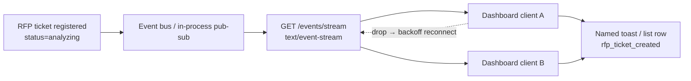

# Real-Time Systems Part 1 — SSE Notifications — Reference Solution

Reference quality bar for the student's company monorepo fork. Field names and optional second events below are **indicative** — students must align payload shape and domain values with their assigned `CONTEXT-company.md` under `content/contexts/real-time-notification/`.

---

## Architecture overview



**Design invariants:**

1. **Named event, not generic `message`** — wire format uses `event: rfp_ticket_created` (or CONTEXT-equivalent name) plus JSON `data:`.
2. **Publish on register** — emission happens in the same path that creates the RFP ticket (`status` initial value from CONTEXT, typically `analyzing`), not from a polling cron.
3. **One stream, many subscribers** — each dashboard tab opens its own SSE connection; the publisher fans out to all live subscribers.
4. **Keep-alive** — periodic comment/ping frames so proxies and browsers do not idle-close the socket.
5. **Auth same as backoffice** — SSE requires the company JWT; client uses `fetch` + `Authorization` (not bare `EventSource`, which cannot set custom headers cleanly).
6. **Reconnect with recovery + no duplicates** — progressive backoff; at least one recovery strategy (`Last-Event-ID` / short replay, refetch list then SSE for new only, or equivalent); client (or merge logic) skips already-applied `ticket_id` / event id.
7. **No AI in this part** — no model/agent calls on the notification path.
8. **Monorepo paths only** — implement under `services/`, `uis/`, `tests/`; no `parte-1-realtime-sse/` delivery folder.

---

## Recommended layout (indicative)

| Path                                      | Responsibility                                           |
| ----------------------------------------- | -------------------------------------------------------- |
| `services/.../events/sse.py`              | SSE endpoint: headers, generator, keep-alive             |
| `services/.../events/bus.py`              | In-process (or Redis) pub-sub for ticket events          |
| `services/.../rfp/tickets.py` (existing)  | On create → `bus.publish("rfp_ticket_created", payload)` |
| `uis/.../dashboard/useSse.ts` (or equiv.) | `fetch` + `ReadableStream` parse loop + backoff          |
| `uis/.../dashboard/RfpTicketToast.tsx`    | Visually distinct notification UI                        |
| `tests/services/test_sse_payload.py`      | Payload shape / event name unit tests                    |

---

## SSE wire format (indicative)

HTTP response:

```http
HTTP/1.1 200 OK
Content-Type: text/event-stream
Cache-Control: no-cache
Connection: keep-alive
X-Accel-Buffering: no
```

Event body:

```text
event: rfp_ticket_created
data: {"ticket_id":"tkt_0192","rfp_id":"rfp_0088","client_name":"Andes Tech Solutions","status":"analyzing","created_at":"2026-07-24T14:32:00Z"}

: keepalive
```

Indicative JSON (must match CONTEXT fields — example aligned to Brasaland-style ticket):

```json
{
  "ticket_id": "tkt_0192",
  "rfp_id": "rfp_0088",
  "client_name": "Andes Tech Solutions",
  "location": "Medellín",
  "service_type": "recurring_catering",
  "status": "analyzing",
  "created_at": "2026-07-24T14:32:00Z"
}
```

**Acceptable:** streaming response from FastAPI/`StreamingResponse` (or stack equivalent) yielding encoded SSE frames; JWT dependency shared with other backoffice routes.

**Not acceptable:** returning a one-shot JSON list and calling it “real-time”; using only `EventSource` (no custom `Authorization` header); an unauthenticated open stream; a single catch-all `event: message` for every domain event; shipping code under a invented top-level `parte-1-realtime-sse/` folder instead of `services/` / `uis/` / `tests/`.

---

## Auth (required)

```python
# Pseudocode — reuse the same dependency as other protected routes
async def ticket_event_stream(
    request: Request,
    user=Depends(get_current_user),  # same JWT as backoffice
):
    ...
```

Client:

```javascript
const res = await fetch(url, {
  headers: { Authorization: `Bearer ${token}` },
});
```

---

## Recovery strategies (pick at least one)

| Strategy                       | Idea                                                                                             | Dedupe                       |
| ------------------------------ | ------------------------------------------------------------------------------------------------ | ---------------------------- |
| `Last-Event-ID` / short replay | Server assigns `id:` per event; on reconnect client sends last id; server replays a short buffer | Ignore ids already in UI set |
| Refetch + SSE for new          | On reconnect, `GET` current tickets (or since cursor), merge into UI, then resume SSE            | Key by `ticket_id`           |
| Equivalent                     | Documented cursor / watermark with same guarantees                                               | Same                         |

Backoff alone without recovery is **not** enough.

---

## Backend sketch (indicative)

```python
# Pseudocode — adapt to monorepo FastAPI layout
async def ticket_event_stream(request: Request):
    queue = bus.subscribe()
    try:
        yield ": connected\n\n"
        while True:
            if await request.is_disconnected():
                break
            event = await queue.get(timeout=15)
            if event is None:
                yield ": keepalive\n\n"
                continue
            yield f"event: {event.name}\ndata: {event.json()}\n\n"
    finally:
        bus.unsubscribe(queue)
```

On ticket create:

```python
bus.publish(
    name="rfp_ticket_created",
    data={
        "ticket_id": ticket.id,
        "rfp_id": ticket.rfp_id,
        "status": ticket.status,  # CONTEXT initial status
        "created_at": ticket.created_at.isoformat(),
        # + CONTEXT-required display fields
    },
)
```

---

## Frontend sketch (indicative)

```javascript
// Progressive backoff; auth via fetch; skip duplicate ticket_id;
// on reconnect: refetch list (or send Last-Event-ID) then resume SSE
async function consumeSse(url, { token, onEvent, seenIds, refetchTickets }) {
  let delayMs = 1000;
  for (;;) {
    try {
      await refetchTickets?.(); // recovery option B — or pass Last-Event-ID header
      const res = await fetch(url, {
        headers: { Authorization: `Bearer ${token}` },
      });
      if (
        !res.ok ||
        !res.headers.get("content-type")?.includes("text/event-stream")
      ) {
        throw new Error("bad sse response");
      }
      const reader = res.body.getReader();
      const decoder = new TextDecoder();
      let buffer = "";
      delayMs = 1000; // reset after successful connect
      while (true) {
        const { value, done } = await reader.read();
        if (done) break;
        buffer += decoder.decode(value, { stream: true });
        // parse SSE frames from buffer → if event === "rfp_ticket_created"
        // and !seenIds.has(ticket_id) → onEvent(...); seenIds.add(ticket_id)
      }
    } catch (_) {
      /* fall through to backoff */
    }
    await sleep(delayMs);
    delayMs = Math.min(delayMs * 2, 30000);
  }
}
```

UI: dedicated banner/toast/list item for `rfp_ticket_created` — not the same row style as metrics charts or generic activity logs.

---

## Testing bar

| Check                | Pass criteria                                                                                                                                                                                             |
| -------------------- | --------------------------------------------------------------------------------------------------------------------------------------------------------------------------------------------------------- |
| SSE endpoint test    | Hit the stream (or generate frames through the handler): `Content-Type` includes `text/event-stream`; body has named `event:` + JSON `data:`; required CONTEXT keys present; status matches initial value |
| Auth                 | Unauthenticated request rejected; valid JWT accepted                                                                                                                                                      |
| Reconnect + recovery | Documented manual steps **or** automated test: drop stream → backoff → reconnect → recovery strategy applied → no duplicate UI for same `ticket_id`                                                       |
| No AI                | Grep/review: notification path has zero model/agent invocations                                                                                                                                           |

---

## Optional second event

If implementing the README optional case, reuse the same SSE endpoint with a **different** `event:` name and CONTEXT-grounded payload (e.g. `sales_drop_alert`, agent escalation, inactivity). Same reconnect, recovery, auth, and keep-alive rules apply.

---

## Common mistakes

| Mistake                                 | Why it fails                                                                            |
| --------------------------------------- | --------------------------------------------------------------------------------------- |
| Generic `message` only                  | Rubric requires distinguishable named RFP event                                         |
| Inventing field names                   | Must match CONTEXT / existing RFP ticket model                                          |
| Silent disconnect / backoff only        | Must reconnect **and** recover (or explicitly handle) missed tickets without duplicates |
| Open stream without JWT                 | Same auth as backoffice is required                                                     |
| Bare `EventSource`                      | Cannot send `Authorization`; brief requires `fetch` + stream                            |
| Full page refetch on every event        | Notification should update UI without reloading all dashboard data                      |
| `parte-1-realtime-sse/` delivery folder | Work stays in monorepo `services/` / `uis/` / `tests/`                                  |
| Shipping Part 2 WebSockets logic here   | Out of scope for Part 1                                                                 |
