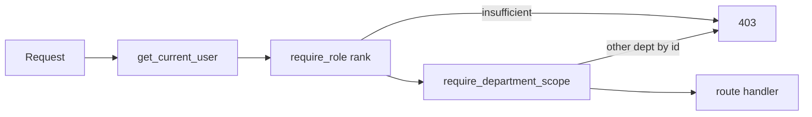

# Platform – Roles and Permissions - Reference Solution

## Purpose

This reference solution describes the expected architecture, implementation scope, and validation evidence for a complete submission. Exact role names, department codes, seed users, and scoped records **must** come from the assigned file in `content/contexts/roles-permissions/` — not from a generic RBAC template.

## Solution Structure

- `app/models/` — `Role`, `Department`, `User` (with independent FKs), `InternalReport` (canonical department-scoped collection).
- `app/services/` — assignment updates that change role **or** department without touching the other axis.
- `app/core/permissions.py` (or equivalent) — **one** place for rank checks and department scope. Routes declare dependencies; they do not re-implement `if user.role == ...`.
- `app/routes/` — `/roles`, `/departments`, `/users/{id}/assignment`, `/internal-reports`, plus existing business routes classified by minimum role.
- `tests/` — wrong-role 403, cross-department 403, independent-axis PATCH.



## Required Coverage (From README + CONTEXT)

- At least three roles with an explicit rank: `employee` < `supervisor` < `admin` (codes from CONTEXT).
- Department as its own entity; user can change department without losing role, and vice versa.
- Centralized permission dependency (not per-endpoint copies).
- Role restriction on every sensitive endpoint; department restriction on scoped data.
- Insufficient role → **403**, never `200` with empty/silenced data.
- Automated tests: wrong role **and** wrong department cannot access a restricted resource.
- Backoffice: hide/disable disallowed actions; show only own-department data; Admin-only roles/departments administration view.

## Expected API Surface

- `GET /auth/me` — includes `role` and `department`
- `GET /roles`, `POST /roles`, `GET /roles/{id}`, `PUT /roles/{id}` — Admin
- `GET /departments`, `POST /departments`, `GET /departments/{id}`, `PUT /departments/{id}` — Admin
- `PATCH /users/{id}/assignment` — Admin; body may include `role_id` and/or `department_id`
- `GET /internal-reports` — filtered to caller department unless Admin
- `GET /internal-reports/{id}` — 403 if Employee/Supervisor and record is another department
- `POST /internal-reports` — Employee+; `department_id` forced to caller department unless Admin
- `PUT /internal-reports/{id}` — Supervisor+ in own department (Admin: any)
- `DELETE /internal-reports/{id}` — Admin

Map existing supplier/incident/inventory writes onto the same `require_role` / `require_department_scope` dependencies.

## Key Implementation Decisions

- **Two axes, two tables.** Role is capability + rank. Department is data scope. Do not encode department inside a permissions bitfield.
- **Admin still has a department.** Cross-department visibility is a rank privilege (`admin`), not a null `department_id`.
- **403 vs filter.** Missing capability or fetching another department's record by id → 403. List endpoints may filter to own department.
- **Centralize rank comparison** (`user.role.rank >= required.rank`) so adding a fourth role later does not fork every route.
- Seed **exactly** the CONTEXT users and the two-department report pair used in evaluation.

## Indicative Examples

### Example: GET /auth/me (Brasaland supervisor)

```json
{
  "id": "…",
  "email": "felipe.ops@brasaland.example",
  "role": { "code": "supervisor", "name": "Supervisor", "rank": 2 },
  "department": {
    "code": "restaurant_operations",
    "name": "Restaurant Operations"
  }
}
```

### Example: Employee hits Supervisor-only update

```http
PUT /internal-reports/{id}
Authorization: Bearer <employee-token>
```

```json
{ "detail": "Forbidden" }
```

Status: **403**.

### Example: Same role, other department, GET by id

Felipe (`supervisor` + `restaurant_operations`) requests Lucía's procurement report:

```http
GET /internal-reports/{procurement-report-id}
Authorization: Bearer <felipe-token>
```

```json
{ "detail": "Forbidden" }
```

Status: **403** — not `200` with `null`, not `404` used to hide the record.

### Example: Independent assignment PATCH

```http
PATCH /users/{lucia-id}/assignment
Authorization: Bearer <admin-token>
Content-Type: application/json

{ "department_id": "<marketing-department-id>" }
```

Lucía remains `supervisor`. Only `department_id` changes.

## Validation Notes

- Login as CONTEXT Employee, Supervisor (dept A), Supervisor (dept B), and Admin.
- Direct API call (not only UI): Employee → Supervisor route = 403; Supervisor → `GET /roles` = 403.
- Supervisor A cannot `GET` Supervisor B's report by id.
- Assignment PATCH of one axis leaves the other unchanged (assert both fields).
- Admin UI route is unreachable for non-Admin (API 403; UI hidden/disabled).
- Grep the codebase: role checks should resolve to the shared dependency, not duplicated `if` blocks in each handler.
