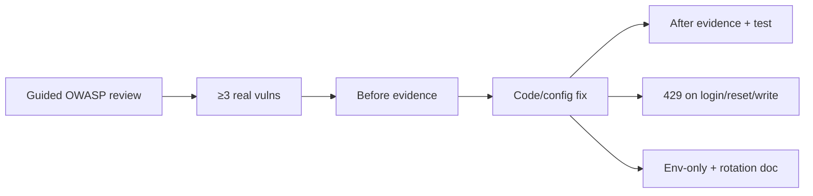

# Platform – Security Hardening - Reference Solution

## Purpose

Reference for an **application-level** security audit on the company monorepo fork: real findings in _your_ code, before/after proof, rate limits on sensitive routes, secrets hygiene, rotation runbook.

Not the same as **Web Vulnerability Audit (OWASP Top 10)** (`ai-eng-cybersecurity-vulnerabilities`) — that module adds **server hardening** (SSH, firewall, non-root) and agent-lane CONTEXT. This Platform ticket scopes **your app only** — no third-party infra you don't control.

## Solution Structure

- `docs/SECURITY_AUDIT_REPORT.md` — OWASP Top 10 applicability matrix + ≥3 real findings with impact
- `docs/SECRET_ROTATION.md` — step-by-step rotate one secret without downtime
- `app/core/rate_limit.py` — middleware/dependency for sensitive endpoints
- `tests/security/` — rate-limit 429 test, regression tests proving fixes
- `.env.example` — all secrets via env; no literals in repo



## Required Coverage (From README)

- Review current OWASP Top 10 categories; document applies / N/A per category for your app
- ≥3 **real** vulnerabilities in your fork with reproducible steps (request, payload, or flow)
- Impact statement per finding (what attacker gains)
- Rate limits on login, password recovery, critical write endpoints → **429**, not ambiguous 500
- No secrets in source or git history (scan + fix if found)
- Secret rotation mechanism documented (dual-key window or staged reload acceptable)
- Fix every reported vuln; each with before + after evidence (screenshot, log, or automated test)

## Expected Deliverables

| Artifact                   | Content                                                         |
| -------------------------- | --------------------------------------------------------------- |
| `SECURITY_AUDIT_REPORT.md` | OWASP matrix, 3+ findings, impact, before/after per fix         |
| `SECRET_ROTATION.md`       | Rotate `SECRET_KEY` or API key without breaking active sessions |
| Code changes               | Fixes + rate limit middleware                                   |
| Tests                      | Trigger 429; prove vuln no longer exploitable                   |

## Key Implementation Decisions

- **Real > generic.** "Missing CSP header" alone is weak unless you show exploit path or measurable risk on your routes. Prefer broken access control, IDOR, verbose errors leaking data, missing auth on write, etc.
- **Before evidence first.** Capture curl/httpie output or test that fails _before_ patch; same test passes after.
- **Rate limit example:** 5 login attempts / minute / IP → 429 with `Retry-After` header.
- **Secrets:** `git log -S 'sk-'` or `trufflehog` scan; move to env; document rotation: deploy new key → accept both → revoke old.
- **Scope boundary:** Don't audit AWS/Vercel/Supabase console — only code and config in your fork.

## Indicative Examples

### Example: Finding — IDOR on profile update

**Before (vulnerable):**

```http
PUT /profiles/OTHER_USER_ID
Authorization: Bearer <attacker-token-for-own-account>
```

```json
{ "name": "Attacker changed your name" }
```

Status: **200** — attacker modified another user's profile.

**After (fixed):** same request → **403**; test `test_cannot_update_other_users_profile` passes.

### Example: Rate limit on login

Send 6 failed login attempts in 60s from same IP:

```http
POST /auth/login
```

6th response:

```json
{ "detail": "Too many requests" }
```

Status: **429**, header `Retry-After: 42`.

### Example: Secret rotation procedure (excerpt)

```markdown
1. Generate NEW_SECRET_KEY in secrets manager.
2. Set both OLD and NEW in env (app accepts JWT signed with either).
3. Deploy; verify new logins use NEW.
4. Wait token TTL (e.g. 60 min).
5. Remove OLD; redeploy.
```

## Validation Notes

- PR includes full audit report — CTO sign-off requires reproducible evidence, not checklist ticks.
- Each finding: steps to reproduce, impact, fix commit ref, after proof.
- Automated test for rate limit and for at least one fixed vuln.
- Confirm no `.env` or API keys committed; `.gitignore` covers local secrets.
