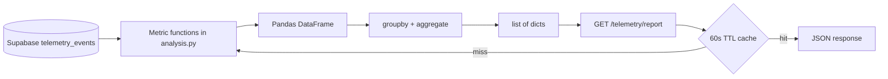

# Company's Telemetry – Technical Report — Reference Solution

This reference solution defines the expected quality bar for Phase 4 in the student's company monorepo fork. Students transform stored `telemetry_events` rows into **technical/operational** metrics via a Pandas pipeline and expose them through `GET /telemetry/report`.

This is **not** a business report. Sales, conversion, and revenue metrics belong to the Data Pipelines milestone. Examples below are indicative.

## Alignment with company context

Metric functions must use `event_type` values and `tags` dimensions from the student's approved `telemetry-plan.md` / capture catalogue (grounded in **CONTEXT-company.md** under `content/contexts/06-telemetry-data-pipelines/telemetry/`). Grade against **operational** questions — volume, errors, latency, availability — not business KPIs.

Prerequisite data: ≥20 real rows including **at least one technical event** (error, failed login, etc.) besides business events.

---

## Architecture overview



**Separation rule:** analysis logic lives in `services/telemetry/analysis.py`; the endpoint orchestrates and caches — it does not embed Pandas transforms inline per request without cache.

---

## Expected file layout

| Path                                           | Purpose                      |
| ---------------------------------------------- | ---------------------------- |
| `services/telemetry/analysis.py`               | Independent metric functions |
| `services/telemetry/router.py` (or equivalent) | `GET /telemetry/report`      |
| `services/telemetry/cache.py` (optional)       | In-memory TTL cache helper   |
| `uis/backoffice/.../telemetry` (optional)      | Minimal visual dashboard     |

---

## Phase 1 — Analysis pipeline (`analysis.py`)

### Required pattern per metric function

```
load (SQL: event_type + timestamp) → refine (Pandas: tags + row filters) → convert types → groupby → aggregate → to_dict records
```

**SQL push-down (mandatory):** `event_type` (including `IN (...)` for ratio metrics) and `timestamp` range (`>= start`, `< end`, UTC).

**Pandas refine (after load):** extract `tags` dimensions, drop null dimension rows, derived columns (`is_error`), optional `tags` predicates. Do not re-apply the date window here.

### Function signature (indicative)

```python
def events_per_day(
    start_date: datetime,
    end_date: datetime,
) -> list[dict]:
    ...
```

### Load from Supabase (filter in query, not full table scan)

```python
rows = repository.fetch_events(
    event_types=["api_latency_recorded", "frontend_error_caught"],  # or load needed types
    start_date=start_date,
    end_date=end_date,
)
df = pd.DataFrame(rows)
```

### Type conversion (mandatory before temporal groupby)

```python
df["timestamp"] = pd.to_datetime(df["timestamp"], utc=True)
df["date"] = df["timestamp"].dt.date
```

### Group and aggregate (no Python loops for metrics)

```python
result = (
    df.groupby("date")["id"]
    .count()
    .reset_index()
    .rename(columns={"id": "event_count"})
    .to_dict(orient="records")
)
return result
```

### Minimum three metric functions

Each must:

- Answer a **technical/operational** question (not sales/conversion/revenue)
- Accept `start_date` and `end_date` from the endpoint
- Return grouped data (not a single global number)
- Be pure (same inputs → same outputs, no side effects)
- Use only Pandas aggregations — no `for` loops over rows to compute counts

### Indicative metric examples

| Function key         | Operational question                   | Grouping               | Aggregation                                     |
| -------------------- | -------------------------------------- | ---------------------- | ----------------------------------------------- |
| `events_per_day`     | Which events occur, and how often?     | `date`, `event_type`   | `.count()`                                      |
| `error_rate_by_type` | Where do failures concentrate?         | `date` or `event_type` | rate from `level='error'` / failure types       |
| `latency_per_day`    | How fast does a measured path respond? | `date`                 | `.mean()` / percentile on `value` or tags field |

Reject disguised business dashboards (revenue, conversion, sales volume as CEO KPIs).

### Additional activity — `auth_failure_rate`

Load `user_login_failed` and `user_login_succeeded` with `event_type IN (...)` in SQL. Daily ratio per day in Pandas:

```
failed / (failed + succeeded)
```

Grouped by `date`, values in `[0.0, 1.0]`. Include under `metrics.auth_failure_rate` when auth events were instrumented in capture.

### Additional activity — simple visual dashboard

Optional page under `uis/backoffice/` (e.g. `/telemetry`) that fetches `GET /telemetry/report` and renders charts/tables for the **same** operational metrics — show `period.from` / `period.to`. Not a business dashboard.

---

## Phase 2 — `GET /telemetry/report`

### Query parameters

| Param        | Required | Default                      |
| ------------ | -------- | ---------------------------- |
| `start_date` | no       | now − 7 days (ISO 8601, UTC) |
| `end_date`   | no       | now (ISO 8601, UTC)          |

Bounds passed to SQL: **inclusive start, exclusive end**. Endpoint resolves defaults; metric functions do not.

### Response shape

```json
{
  "period": {
    "from": "2026-06-08T00:00:00Z",
    "to": "2026-06-15T12:00:00Z"
  },
  "metrics": {
    "events_per_day": [
      {
        "date": "2026-06-14",
        "event_type": "outbound_order_created",
        "event_count": 12
      }
    ],
    "error_rate_by_type": [{ "date": "2026-06-14", "error_rate": 0.08 }],
    "latency_per_day": [{ "date": "2026-06-14", "avg_ms": 142.5 }]
  }
}
```

### Cache requirement

- In-memory cache keyed by `(start_date, end_date)` (or normalized period string)
- TTL: **60 seconds**
- On cache hit: return stored JSON without re-running Pandas pipeline

```python
@lru_cache or custom dict with expiry timestamp
```

---

## Prerequisites

- `telemetry_events` has **≥20 rows** with varied `event_type` values from real backoffice activity
- At least one technical event present in the dataset

---

## PR deliverables

- Names of ≥3 metrics + **operational** question each answers
- Sample JSON from `GET /telemetry/report` with real data
- Note if `auth_failure_rate` and/or visual dashboard were implemented
- PR title: `[W17D49] Telemetry Report`

---

## Common mistakes (incomplete submissions)

- Business KPIs (sales, conversion, revenue) instead of technical metrics
- `groupby()` on string timestamps → silent wrong buckets
- Loading entire `telemetry_events` table into memory
- Filtering `event_type` or `timestamp` in Pandas instead of SQL
- Global scalar counts without date dimension
- Pandas logic copy-pasted inside endpoint handler on every request (no cache)
- Loops over DataFrame rows to sum/count
- Metric functions with DB writes or mutation side effects
- Fewer than three metric functions

---

## Evaluation checklist

- [ ] `services/telemetry/analysis.py` with ≥3 independent metric functions
- [ ] Pipeline order: load (SQL) → refine (Pandas) → convert → group → aggregate
- [ ] `pd.to_datetime(..., utc=True)` before temporal groupby
- [ ] Pandas-only aggregation (no metric loops)
- [ ] Returns `list[dict]` JSON-serialisable
- [ ] `GET /telemetry/report` with optional dates, default 7 days
- [ ] Response `{ period, metrics }` structure
- [ ] 60-second in-memory cache
- [ ] Each metric answers a technical/operational question — not business
- [ ] Grouped metrics with temporal (or other) dimension

---

## Reviewer notes

- Metric names/keys may differ per catalogue — grade operational framing, not business KPIs.
- Accept equivalent cache implementations if TTL and keying are correct.
- Empty periods should return `[]` for metrics, not errors, when no events match filters.
- Visual dashboard is bonus unless cohort rubric marks it required.
