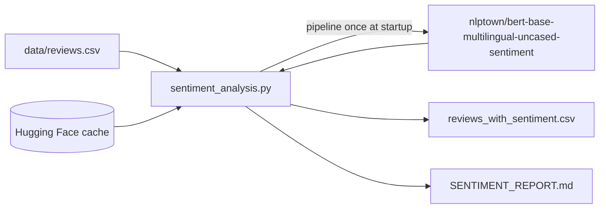

# Sentiment Analysis on Customer Reviews — WeLoveReviews — Reference Solution

This reference solution describes the expected architecture, deliverables, and validation evidence for a complete submission. Students integrate an existing Hugging Face model — they do **not** train or fine-tune one.

---

## Expected file layout

| File                                    | Purpose                                                                |
| --------------------------------------- | ---------------------------------------------------------------------- |
| `requirements.txt` or `pyproject.toml`  | Pinned dependencies (`transformers`, `torch`, `pandas`, etc.)          |
| `data/reviews.csv`                      | Input dataset (500 reviews with `review_id`, `rating`, `review_text`)  |
| `sentiment_analysis.py` (or equivalent) | Loads model once, runs inference, writes outputs                       |
| `output/reviews_with_sentiment.csv`     | Each review with predicted stars, sentiment band, and confidence score |
| `SENTIMENT_REPORT.md`                   | Client-ready report for the account manager                            |

---

## Architecture overview



**Critical rule:** Load the model **once** before the inference loop. Never call `pipeline()` or `from_pretrained()` inside the per-review loop.

---

## Model integration

Pin the model identifier as a constant:

```python
MODEL_NAME = "nlptown/bert-base-multilingual-uncased-sentiment"
```

Load via `transformers.pipeline`:

```python
from transformers import pipeline

classifier = pipeline("text-classification", model=MODEL_NAME)
```

> **Note:** This model was fine-tuned on **product reviews** (English, Dutch, German, French, Spanish, Italian). The project dataset contains **service reviews** (café/hospitality). Students must use this model first and document false negatives caused by the domain mismatch — that is the core learning objective.

The model outputs labels like `1 star`, `2 stars`, … `5 stars`. Map to sentiment bands:

```python
def stars_to_sentiment(label: str) -> str:
    star = int(label.split()[0])
    if star <= 2:
        return "NEGATIVE"
    if star == 3:
        return "NEUTRAL"
    return "POSITIVE"
```

First run downloads weights to `~/.cache/huggingface`. Do **not** commit model binaries to the repository.

---

## Processing pipeline

1. Read `data/reviews.csv` with pandas or the stdlib `csv` module.
2. Load the classifier once.
3. For each `review_text`, run inference and store:
   - `predicted_stars` (1–5, parsed from model label)
   - `predicted_sentiment` (NEGATIVE / NEUTRAL / POSITIVE via mapping above)
   - `confidence` score if available
4. Write enriched CSV to `output/reviews_with_sentiment.csv`.
5. Compute breakdown: count and percentage per sentiment band.
6. Compare against the 4.5-star average:
   - Calculate mean star rating from the `rating` column.
   - Map star ratings to expected sentiment bands (e.g. 4–5 → mostly positive, 3 → neutral, 1–2 → negative).
   - Identify gaps (e.g. high star average but significant negative sentiment labels).
7. **Find false negatives:** reviews where `rating >= 4` but `predicted_stars <= 2`, or where manual reading contradicts the model. Document the cases found with pattern analysis.

---

## False negatives analysis (required)

A **false negative** here means: the review reads positive (or carries a high human star rating) but the model predicts low sentiment (1–2 stars).

Students should filter and inspect:

```python
false_negatives = df[(df["rating"] >= 4) & (df["predicted_stars"] <= 2)]
```

Common patterns in service reviews that trip up a product-review model:

| Pattern                               | Example snippet                                   | Why the model fails                                                 |
| ------------------------------------- | ------------------------------------------------- | ------------------------------------------------------------------- |
| Mixed sentiment                       | "staff seemed annoyed… food made up for it"       | Product models weight complaint phrases heavily                     |
| Service complaints in positive review | "waited 25 minutes for water, but food was great" | Wait-time language reads negative to product-trained weights        |
| Backhanded compliments                | "polite but a bit slow, overall solid"            | Qualifiers ("slow", "average") dominate                             |
| Domain vocabulary                     | "server", "brunch", "ambiance"                    | Training data focused on product attributes (battery, fit, quality) |

Document false negatives in `SENTIMENT_REPORT.md` with `review_id`, human rating, predicted stars, and a one-line explanation.

---

## Manual validation (required)

Students must inspect **at least 15–20 reviews** by hand and document findings in `SENTIMENT_REPORT.md`:

| review_id | rating | review_text (truncated)                              | predicted_stars | manual_sentiment | match?  | notes                               |
| --------- | ------ | ---------------------------------------------------- | --------------- | ---------------- | ------- | ----------------------------------- |
| 9         | 3      | "Average sandwiches, nothing to write home about..." | 2               | NEUTRAL          | partial | Model over-weighted "slow"          |
| 10        | 5      | "staff seemed annoyed... food made up for it"        | 2               | POSITIVE         | no      | False negative — mixed service text |
| 22        | 5      | "waited 25 minutes... food made up for it"           | 2               | POSITIVE         | no      | Wait-time phrase triggered model    |

This table is evidence the student did not blindly trust model output.

---

## Report structure (`SENTIMENT_REPORT.md`)

A complete report includes:

1. **Executive summary** — one paragraph a non-technical account manager can forward.
2. **Dataset overview** — 500 reviews, mean star rating, date/source context.
3. **Sentiment breakdown** — table or bullet list with counts and percentages.
4. **Comparison to star rating** — does sentiment align with 4.5 average? Where does it diverge?
5. **False negatives analysis** — documented examples, shared patterns, link to product-vs-service domain mismatch.
6. **Discrepancy analysis** — hypotheses (sarcasm, mixed reviews, rating inflation, model domain mismatch).
7. **Manual validation sample** — 15–20 reviewed examples with notes.
8. **Recommendation** — what the account manager should tell the client (including model limitations).

---

## Indicative examples

### Example: sentiment breakdown output

```
Total reviews analyzed: 500
Mean star rating: 4.48 / 5

Sentiment breakdown (from nlptown model):
  POSITIVE: 378 (75.6%)
  NEUTRAL:   62 (12.4%)
  NEGATIVE:  60 (12.0%)
```

### Example: false negative finding

> The business averages 4.5 stars, but the product-review model flags 12% of reviews as negative — higher than expected. Manual inspection of false negatives (human rating 4–5, model prediction 1–2 stars) shows a pattern: service-related complaints embedded in otherwise positive reviews (e.g. review_id 10, 22, 28). The model was trained on product reviews where complaint language typically indicates a bad purchase, not a minor service hiccup in an otherwise great visit.

### Example: enriched CSV row

```csv
review_id,rating,review_text,predicted_stars,predicted_sentiment,confidence
1,5,"Visited Harbor House Café last weekend...",5,POSITIVE,0.94
10,5,"The pastries were incredible. The staff seemed annoyed...",2,NEGATIVE,0.71
```

---

## Validation checklist

- [ ] Model loaded via `pipeline()` / `from_pretrained()` — no weights in repo
- [ ] `MODEL_NAME` pinned as constant — not resolved to "latest"
- [ ] Model instantiated once, reused for all 500 reviews
- [ ] All 500 reviews have a star prediction and mapped sentiment band
- [ ] Sentiment breakdown calculated with percentages
- [ ] Explicit comparison to 4.5-star average
- [ ] False negatives documented with pattern analysis
- [ ] 15–20 manually reviewed examples documented
- [ ] `SENTIMENT_REPORT.md` is client-ready (non-technical language)
- [ ] Dependencies pinned in `requirements.txt`

---

## Optional extension: find a better model

Not graded, but recommended for students who want to go further.

### Suggested alternative: `tabularisai/multilingual-sentiment-analysis`

One model worth comparing against the mandatory product-review model is [`tabularisai/multilingual-sentiment-analysis`](https://huggingface.co/tabularisai/multilingual-sentiment-analysis). Unlike `nlptown/bert-base-multilingual-uncased-sentiment`, it returns **five labeled sentiment states** directly — no star-to-band mapping required:

| Label         | Typical use in report |
| ------------- | --------------------- |
| Very Positive | Strong positive       |
| Positive      | Positive              |
| Neutral       | Neutral               |
| Negative      | Negative              |
| Very Negative | Strong negative       |

Load it the same way:

```python
ALTERNATIVE_MODEL = "tabularisai/multilingual-sentiment-analysis"

alt_classifier = pipeline("text-classification", model=ALTERNATIVE_MODEL)
result = alt_classifier("Great food but the wait was long")
# e.g. {"label": "Positive", "score": 0.82}
```

When comparing models, students can collapse the five labels into three bands for a fair breakdown (e.g. Very Positive + Positive → positive, Neutral → neutral, Negative + Very Negative → negative) or keep all five for finer-grained analysis.

### Comparison workflow

1. Run `tabularisai/multilingual-sentiment-analysis` (or search Hugging Face for other service/hospitality/restaurant models) on the same 500 reviews.
2. Compare false-negative rates side by side with `nlptown/bert-base-multilingual-uncased-sentiment`.
3. Note which reviews still fail under both models — those may need human review regardless of model choice.
4. Add a recommendation addendum to the report: should WeLoveReviews switch models for this client, and why?

---

## Key implementation decisions

- **Separation of concerns:** Keep data loading, inference, aggregation, and report generation in distinct functions for clarity and testability.
- **Load model once:** Instantiate the classifier before the review loop — never call `pipeline()` or `from_pretrained()` inside the per-review loop.
- **Pin model version:** Constant `MODEL_NAME = "nlptown/bert-base-multilingual-uncased-sentiment"` — not `"latest"`.
- **Map stars to bands:** The model outputs 1–5 stars; students must define and apply a consistent mapping to negative/neutral/positive.
- **Cache:** First run downloads to `~/.cache/huggingface`; subsequent runs reuse cache.
- **Report in repo:** `SENTIMENT_REPORT.md` committed — not only stdout.
