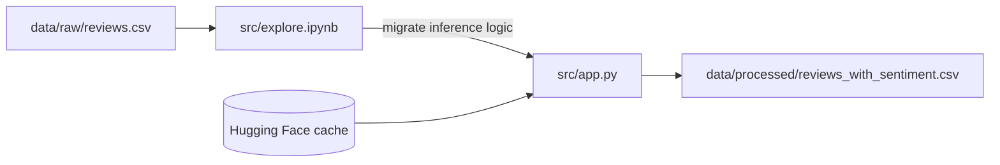

# Sentiment Analysis on Customer Reviews — WeLoveReviews — Reference Solution

This reference solution describes the expected architecture, deliverables, and validation evidence for a complete submission. Students fork the [machine-learning-python-template](https://github.com/4GeeksAcademy/machine-learning-python-template), integrate an existing Hugging Face model — they do **not** train or fine-tune one — and communicate findings in an executed notebook, not a separate client report.

---

## Expected file layout

| File                                        | Purpose                                     |
| ------------------------------------------- | ------------------------------------------- |
| `requirements.txt`                          | Pinned deps (template + transformers/torch) |
| `data/raw/reviews.csv`                      | Input (500 reviews: `review_id`, `rating`, `review_text`) |
| `src/explore.ipynb`                         | Narrative analysis **with outputs**         |
| `src/app.py`                                | Production inference                        |
| `data/processed/reviews_with_sentiment.csv` | Enriched output                             |
| `PROMPT.md` / `PROMPT.es.md`                | Provided EDA prompts (syllabus)             |

Staff reference implementation: `.learn/solution/app.py` (same API as student `src/app.py`).

---

## Architecture overview


```mermaid
flowchart LR
  CSV[data/raw/reviews.csv] --> NB[src/explore.ipynb]
  NB -->|migrate inference logic| APP[src/app.py]
  HF[(Hugging Face cache)] --> APP
  APP --> OUT[data/processed/reviews_with_sentiment.csv]
```

**Critical rule:** Load the model **once** before the inference loop. Never call `pipeline()` or `from_pretrained()` inside the per-review loop.

**Separation of concerns:** Notebook carries the story (EDA, breakdown, false negatives, manual validation, conclusions). `src/app.py` runs the production inference path only.

---

## Model integration

Pin the model identifier as a constant:

```python
MODEL_NAME = "nlptown/bert-base-multilingual-uncased-sentiment"
```

Load via `transformers.pipeline`:

```python
from transformers import pipeline

classifier = pipeline("text-classification", model=MODEL_NAME)
```

> **Note:** This model was fine-tuned on **product reviews** (English, Dutch, German, French, Spanish, Italian). The project dataset contains **service reviews** (café/hospitality). Students must use this model first and document false negatives caused by the domain mismatch — that is the core learning objective.

The model outputs labels like `1 star`, `2 stars`, … `5 stars`. Map to sentiment bands:

```python
def stars_to_sentiment(label: str) -> str:
    star = int(str(label).split()[0])
    if star <= 2:
        return "NEGATIVE"
    if star == 3:
        return "NEUTRAL"
    return "POSITIVE"
```

First run downloads weights to `~/.cache/huggingface`. Do **not** commit model binaries to the repository.

---

## Reference `src/app.py` API

The production script should expose these responsibilities (see `.learn/solution/app.py`):

| Function / constant | Role |
| ------------------- | ---- |
| `MODEL_NAME` | Pinned Hugging Face model id (`nlptown/bert-base-multilingual-uncased-sentiment`) |
| `stars_to_sentiment(label)` | Map model star label (1–5) → `NEGATIVE` / `NEUTRAL` / `POSITIVE` |
| `load_reviews(path="data/raw/reviews.csv")` | Read input CSV |
| `run_inference(df, classifier)` | Loop reviews; add `predicted_stars`, `predicted_sentiment`, `confidence` |
| `write_output(df, path="data/processed/reviews_with_sentiment.csv")` | Persist enriched CSV |
| `main()` | Load once → infer all → write → print breakdown |

---

## Notebook narrative arc (`src/explore.ipynb`)

A complete submission follows this arc **with executed outputs**:

1. **Objectives** — business question: written sentiment vs 4.5-star average.
2. **EDA / insights / cleaning** — agent prompt output; short markdown between steps.
3. **Action plan + model rationale** — commit to `nlptown` model and star-to-band mapping.
4. **Inference on all 500 reviews** — load model once; store predictions per review.
5. **Breakdown vs 4.5-star average** — % positive / neutral / negative; explain gaps.
6. **False negatives** — examples and shared patterns (see below).
7. **Manual sample (15–20 reviews)** — inspect predictions by hand.
8. **Conclusions** — plain-language takeaway for the account manager.

Short transitional markdown between major code blocks is expected. The notebook must stand alone — no separate client-facing markdown report.

---

## Processing pipeline (`src/app.py`)

1. Read `data/raw/reviews.csv` with pandas.
2. Load the classifier once.
3. For each `review_text`, run inference and store:
   - `predicted_stars` (1–5, parsed from model label)
   - `predicted_sentiment` (NEGATIVE / NEUTRAL / POSITIVE via mapping above)
   - `confidence` score if available
4. Write enriched CSV to `data/processed/reviews_with_sentiment.csv`.
5. Print or log sentiment breakdown (counts / percentages).

Breakdown, star-average comparison, false negatives, and manual validation belong in **`src/explore.ipynb`**, not in the production script.

---

## False negatives analysis (required)

A **false negative** here means: the review reads positive (or carries a high human star rating) but the model predicts low sentiment (1–2 stars).

Students should filter and inspect:

```python
false_negatives = df[(df["rating"] >= 4) & (df["predicted_stars"] <= 2)]
```

Common patterns in service reviews that trip up a product-review model:

| Pattern                               | Example snippet                                   | Why the model fails                                                 |
| ------------------------------------- | ------------------------------------------------- | ------------------------------------------------------------------- |
| Mixed sentiment                       | "staff seemed annoyed… food made up for it"       | Product models weight complaint phrases heavily                     |
| Service complaints in positive review | "waited 25 minutes for water, but food was great" | Wait-time language reads negative to product-trained weights        |
| Backhanded compliments                | "polite but a bit slow, overall solid"            | Qualifiers ("slow", "average") dominate                             |
| Domain vocabulary                     | "server", "brunch", "ambiance"                    | Training data focused on product attributes (battery, fit, quality) |

Document false negatives in **`src/explore.ipynb`** with `review_id`, human rating, predicted stars, and a one-line explanation.

---

## Manual validation (required)

Students must inspect **at least 15–20 reviews** by hand and document findings in **`src/explore.ipynb`**:

| review_id | rating | review_text (truncated)                              | predicted_stars | manual_sentiment | match?  | notes                               |
| --------- | ------ | ---------------------------------------------------- | --------------- | ---------------- | ------- | ----------------------------------- |
| 9         | 3      | "Average sandwiches, nothing to write home about..." | 2               | NEUTRAL          | partial | Model over-weighted "slow"          |
| 10        | 5      | "staff seemed annoyed... food made up for it"        | 2               | POSITIVE         | no      | False negative — mixed service text |
| 22        | 5      | "waited 25 minutes... food made up for it"           | 2               | POSITIVE         | no      | Wait-time phrase triggered model    |

This table is evidence the student did not blindly trust model output.

---

## Indicative examples

### Example: sentiment breakdown output

```
Total reviews analyzed: 500
Mean star rating: 4.48 / 5

Sentiment breakdown (from nlptown model):
  POSITIVE: 378 (75.6%)
  NEUTRAL:   62 (12.4%)
  NEGATIVE:  60 (12.0%)
```

### Example: false negative finding

> The business averages 4.5 stars, but the product-review model flags 12% of reviews as negative — higher than expected. Manual inspection of false negatives (human rating 4–5, model prediction 1–2 stars) shows a pattern: service-related complaints embedded in otherwise positive reviews (e.g. review_id 10, 22, 28). The model was trained on product reviews where complaint language typically indicates a bad purchase, not a minor service hiccup in an otherwise great visit.

### Example: enriched CSV row

```csv
review_id,rating,review_text,predicted_stars,predicted_sentiment,confidence
1,5,"Visited Harbor House Café last weekend...",5,POSITIVE,0.94
10,5,"The pastries were incredible. The staff seemed annoyed...",2,NEGATIVE,0.71
```

---

## Validation checklist

- [ ] **`src/explore.ipynb`** submitted with executed outputs and full narrative arc (objectives → EDA → plan/model → results → conclusions)
- [ ] Short transitional markdown between major code blocks
- [ ] Model loaded via `pipeline()` / `from_pretrained()` — no weights in repo
- [ ] `MODEL_NAME` pinned as constant — not resolved to "latest"
- [ ] Model instantiated once, reused for all 500 reviews
- [ ] All 500 reviews have a star prediction and mapped sentiment band
- [ ] Sentiment breakdown calculated with percentages (in notebook)
- [ ] Explicit comparison to 4.5-star average (in notebook)
- [ ] False negatives documented with pattern analysis (in notebook)
- [ ] 15–20 manually reviewed examples documented (in notebook)
- [ ] **`src/app.py`** runs production inference and writes **`data/processed/reviews_with_sentiment.csv`**
- [ ] Dependencies pinned in **`requirements.txt`**

---

## Optional extension: find a better model

Not graded, but recommended for students who want to go further.

### Suggested alternative: `tabularisai/multilingual-sentiment-analysis`

One model worth comparing against the mandatory product-review model is [`tabularisai/multilingual-sentiment-analysis`](https://huggingface.co/tabularisai/multilingual-sentiment-analysis). Unlike `nlptown/bert-base-multilingual-uncased-sentiment`, it returns **five labeled sentiment states** directly — no star-to-band mapping required:

| Label         | Typical use in report |
| ------------- | --------------------- |
| Very Positive | Strong positive       |
| Positive      | Positive              |
| Neutral       | Neutral               |
| Negative      | Negative              |
| Very Negative | Strong negative       |

Load it the same way:

```python
ALTERNATIVE_MODEL = "tabularisai/multilingual-sentiment-analysis"

alt_classifier = pipeline("text-classification", model=ALTERNATIVE_MODEL)
result = alt_classifier("Great food but the wait was long")
# e.g. {"label": "Positive", "score": 0.82}
```

When comparing models, students can collapse the five labels into three bands for a fair breakdown (e.g. Very Positive + Positive → positive, Neutral → neutral, Negative + Very Negative → negative) or keep all five for finer-grained analysis.

### Comparison workflow

1. Run `tabularisai/multilingual-sentiment-analysis` (or search Hugging Face for other service/hospitality/restaurant models) on the same 500 reviews.
2. Compare false-negative rates side by side with `nlptown/bert-base-multilingual-uncased-sentiment`.
3. Note which reviews still fail under both models — those may need human review regardless of model choice.
4. Add a recommendation addendum **inside `src/explore.ipynb`**: should WeLoveReviews switch models for this client, and why?

---

## Key implementation decisions

- **Template:** [machine-learning-python-template](https://github.com/4GeeksAcademy/machine-learning-python-template) — `data/raw/`, `data/processed/`, `src/`.
- **Separation of concerns:** Notebook for story; `src/app.py` for production inference only.
- **Load model once:** Instantiate the classifier before the review loop — never call `pipeline()` or `from_pretrained()` inside the per-review loop.
- **Pin model version:** Constant `MODEL_NAME = "nlptown/bert-base-multilingual-uncased-sentiment"` — not `"latest"`.
- **Map stars to bands:** The model outputs 1–5 stars; students must define and apply a consistent mapping to negative/neutral/positive.
- **Cache:** First run downloads to `~/.cache/huggingface`; subsequent runs reuse cache.
- **No separate report file:** Findings live in executed **`src/explore.ipynb`**, not a standalone markdown report.
